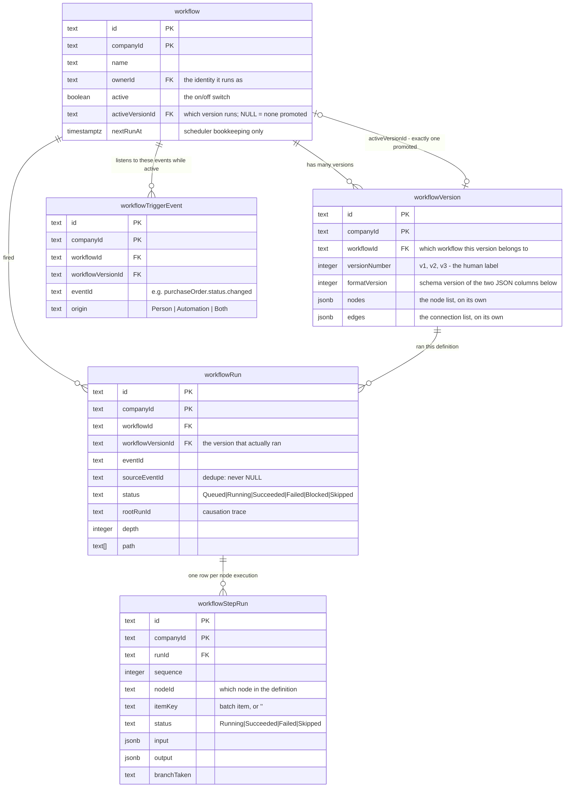

# Workflows — Phase 1 Foundation: data model and the shared definition contract

> Status: draft
> Author: aashu
> Date: 2026-07-30
> Phase doc: `/Users/aashu/work/carbon/plans/automations-engine/phases/phase-1-foundation.md`
> PRD: `/Users/aashu/work/carbon/plans/automations-engine/prd.md`
> Technical decisions: `/Users/aashu/work/carbon/plans/automations-engine/technical-decisions.md`
> Research: `/Users/aashu/work/carbon/plans/automations-engine/research/` (`research.md`, `01-current-architecture.md`, `02-what-we-need-to-build.md`, `04-brainstorm-open-items.md`)
> Siblings: phases 2-9 in `/Users/aashu/work/carbon/plans/automations-engine/phases/`

## TLDR

Carbon Workflows lets a customer build "when this happens, do that" rules on a canvas instead of
filing an engineering ticket. This spec covers **only the foundation**: five database tables (the
workflow, its versions, a derived trigger-event index, and two run-log tables) plus a new
`packages/workflows` workspace package holding the zod schema, read-time normaliser and validator for
the workflow definition. One schema, one place where raw database JSON becomes the typed model, one
format version stamped on the row — so the builder, the activation gate and the engine can never
disagree about what is valid. No engine, no matcher, no UI, no event wiring: the deliverable is the
contract plus its tests.

**Vocabulary.** A **workflow** is the thing a customer builds and names. It has **versions**, exactly
one of which is active. A version holds a **definition** — its **nodes** and its **edges** (the
connections between nodes) — stored in two separate JSON columns, never mixed together. A **run** is one
firing of a workflow, and a **step run** is one node executing within it.

## Problem Statement

Every customer has small automation needs — tell the buyer's manager when a purchase order over
$10,000 goes out, open a non-conformance when a receipt fails inspection, create the job when a
made-to-order sales order is confirmed. Today each one is an engineering ticket for us. Odoo,
NetSuite, Salesforce and SAP all ship this as an ordinary feature.

Phases 2 through 9 build the event catalog, matcher, engine, action catalogs, scheduler and the
builder UI. Every one of them reads or writes the tables and the definition schema defined here. Two
concrete failure modes make this the right thing to settle first:

1. **A disagreement about validity is a data-corruption bug.** If the builder thinks a definition is
   valid and the engine does not, a customer can activate something broken and it will act on real
   records. In an ERP a wrong write is not cosmetic — one bad ledger entry can corrupt a ledger.
2. **A shape that changes later is rework in four places at once.** Adding a column or a definition
   field after phases 3, 4 and 7 exist means reopening the matcher, the engine, the save path and every
   definition a customer has already saved.

There is no bare `workflow` table in the schema today, and no `workflow*` table other than the
unrelated, domain-prefixed `nonConformanceWorkflow` (`20250327140050_ncr.sql:130`). The event system's
`handlerType = 'WORKFLOW'` value and its `handlerConfig.workflowId` contract have existed since the
event system landed and were **reserved for this feature** — `packages/jobs/src/inngest/functions/events/workflow.ts`
is a live handler that parses its payload, logs it and stops. So the name aligns with plumbing that is
already waiting.

## Proposed Solution

Three deliverables, in dependency order.

### A. Five tables in one migration

| Table | Purpose | Written by |
|---|---|---|
| `workflow` | the workflow itself: name, owner, on/off, which version is active, next scheduled due time | the builder (phase 7) |
| `workflowVersion` | one version's nodes and edges, in two separate JSON columns, plus its format version | the builder (phase 7) |
| `workflowTriggerEvent` | derived index: one row per (active workflow, event id) so the matcher can find subscribers with one indexed read | the promote path (phase 7) |
| `workflowRun` | one row per firing: status, the event that fired it, the causation trace, timings | the engine (phase 4) |
| `workflowStepRun` | one row per node execution: resolved input, output, branch taken, item key | the engine (phase 4) |

Phase 1 creates the tables and their constraints. It does **not** write to them — there is no service
layer and no UI in this phase. The two unique constraints below are the whole of the PRD's "a node
never runs twice", which is why they belong in schema rather than in prose.



**How versions are grouped.** Ten versions of one workflow are **one** row in `workflow` and **ten**
rows in `workflowVersion`, each carrying the same `workflowId`. That column is the answer to "which
workflow does this version belong to" — a real foreign key, so the database itself refuses an orphan
version, and deleting the workflow cascades all ten away.

This is deliberately **not** how item revisions work. There, a revision *is* a full `item` row and the
siblings are grouped only by a shared `readableId` text code, with no parent row and no foreign key
between them (`.claude/rules/revision-system.md`; the old `*.itemId` FK columns were dropped in
`20250519122022_revisions.sql`). Items also have no active-revision flag — the list views pick the
latest named revision with a `DISTINCT ON` query. That shape suits items, where every revision is
itself a real, orderable, buyable thing. A workflow version is not independently meaningful — it only
exists as one candidate definition of its parent — so a parent row plus a promoted pointer is both
stricter and simpler here.

**Why nodes and edges are two columns, not two tables.** They live in `workflowVersion.nodes` and
`workflowVersion.edges` — two separate JSON columns on the version row, so the two lists are never
mixed together and either can be read without the other. What they are *not* is a `workflowNode` and
`workflowEdge` table with a row per node. `technical-decisions.md` weighs that explicitly and rejects
it: the definition is only ever read and written whole and versioned as a unit, so per-row storage
would turn every canvas save into a delete-and-reinsert of many rows and buy referential integrity we
do not need. Two columns keep one row read and one row write per save. Precedent in-repo is
`documentTemplate`, which splits `blocks`, `theme` and `settings` into their own columns for exactly
this reason.

The trade-off accepted: we cannot query "find every workflow containing a notify node" in SQL — which is
exactly why `workflowTriggerEvent` exists, since that one question (trigger events) *is* asked on the
hot path.

### B. `packages/workflows` — the shared definition contract

```
packages/workflows/
├── package.json          # private, no build, exports raw src/*.ts
├── tsconfig.json         # extends @carbon/config/tsconfig/base.json
├── vitest.config.ts      # export { default } from "@carbon/config/vitest"
├── AGENTS.md
└── src/
    ├── index.ts          # barrel
    └── definition/
        ├── types.ts      # value types, variable references, schedule
        ├── schema.ts     # zod node/edge/definition schemas + CURRENT_DEFINITION_FORMAT_VERSION
        ├── normalize.ts  # readWorkflowVersion (row -> typed) + migrateDefinition seam
        ├── nodes.ts      # NODE_KINDS — per-node-type handles/refs/outputs/checks
        ├── issues.ts     # WorkflowIssueCode + WorkflowIssue
        ├── catalog.ts    # the WorkflowCatalog interface + a fixture implementation
        ├── validate.ts   # validateDefinition(definition, catalog) -> WorkflowIssue[]
        ├── schema.test.ts
        ├── normalize.test.ts
        └── validate.test.ts
```

Modelled directly on `packages/documents/src/template/` — the in-repo precedent for a versioned JSON
document validated at the boundary (`schema.ts` + a `resolveTemplate`/`migrateBlocks` read-time seam,
with `formatVersion` as its own database column rather than a key inside the blob).

### C. The `Workflows` permission module

The five tables' row-level security needs a permission to gate on, so the module enum value ships in
the same migration.

### Design Decisions

| Decision | Choice | Rationale |
|----------|--------|-----------|
| Vocabulary | `workflow` end to end — tables, package, permission module and the customer-facing screen | "Workflow" is the word customers and the team already use out loud, where "graph" is jargon. It also matches the reserved `handlerType = 'WORKFLOW'` and `handlerConfig.workflowId` contract in the existing event system, so nothing needs translating between layers. The PRD says "automation" throughout — that wording drifts from the build and the PRD should be updated to match |
| Where the definition lives | Two JSON columns on the version row: `workflowVersion.nodes` and `workflowVersion.edges` | Nodes and edges stay separate lists, each readable on its own, but the definition is still read and written whole in one row — it is only ever versioned as a unit. Per-row node/edge tables would turn every canvas save into a multi-row delete-and-reinsert for referential integrity we do not need. Precedent: `documentTemplate` splits `blocks` / `theme` / `settings` into their own columns |
| Format version | Its own `INTEGER` column on the version row, not a key inside either JSON column | Queryable without opening a blob, so a deploy check can ask "how many rows are still on v1", and one version applies to both columns together. Copies `documentTemplate.formatVersion` |
| Forward compatibility | `migrateDefinition(definition, fromVersion)` seam called on read, pass-through at v1 | A definition saved today still opens after we add node kinds. Copies `migrateBlocks` in `packages/documents/src/template/defaults.ts` |
| Where the schema lives | A shared package used by builder, activation gate and engine | If the builder and the engine can disagree about validity, a customer can activate something broken |
| Package shape | Private, `version: 0.0.0`, no build step, `exports` pointing at raw `src/*.ts` | Universal in this repo — only `@carbon/config` and `@carbon/documents` have a build script, and nothing consumes `dist/`. Needs no `apps/erp/vite.config.ts` alias as long as every entry point is declared in `exports` |
| Validator's catalog dependency | A `WorkflowCatalog` interface the validator receives as an argument; phase 1 ships a fixture implementation | Type-checking node inputs needs the event/action/operation catalogs, which arrive in phases 2 and 5. An interface settles the full contract now so phases 2 and 5 plug in without changing the validator or any of its three callers |
| Variable references | Structured paths (`{ nodeId, output, path[] }`), never typed-in expressions | Type-checkable while the customer draws, renderable back into a picker, resolvable with no parser and no sandbox. The PRD's builder is "type a dot and pick a property", which is a picker over the registry |
| Value model | Primitive, entity (`{type, id}`), or list of either — never a list of lists | Straight from the PRD. Encoded in the schema so `list<part>` cannot be wired into a single-`part` input by accident |
| One active version | Nullable pointer `workflow.activeVersionId`, plus a separate `active` boolean switch | Promotion is a single-column UPDATE, so two-active is structurally impossible with no race to lose. The separate `active` flag is the on/off kill switch, so turning a workflow off and on again does not forget which version was promoted |
| Finding subscribers | Derived `workflowTriggerEvent` table, rewritten when a version is promoted or the workflow is toggled | The matcher must answer "which active workflows listen to this event id?" on every record change — a 500-row import is 500 lookups. Walking every workflow's definition JSON in TypeScript is correct but would read ~1MB per announcement for a 50-workflow company. It also answers "which customers use this event?" before we rename or retire one, which the run log cannot (it misses workflows that have never fired) |
| Causation trace storage | Three columns (`rootRunId`, `depth`, `path TEXT[]`) rather than one `trace JSONB` | `technical-decisions.md` sketches it as JSON, but the matcher reads `depth` and `path` on the hot path to derive the next hop, the shape is fixed at three fields, and columns are indexable without JSON digging. Same reasoning as the trigger-event table |
| Run dedupe key | `sourceEventId TEXT NOT NULL`; a schedule supplies a deterministic key derived from its due timestamp | Postgres treats NULLs as all-distinct, so a nullable column would silently stop `UNIQUE (workflowId, companyId, workflowVersionId, sourceEventId)` from protecting scheduled runs. One rule, one constraint, correct for every trigger kind |
| Step idempotency key | `itemKey TEXT NOT NULL DEFAULT ''` | Same NULL trap. Empty string for non-batch nodes; the entity's own id when batching over records; a hash of the resolved input where there is no id. Position in the list is deliberately not the key — a retry can re-read a list in a different order |
| Origin filter home | On the trigger node in the definition, copied into `workflowTriggerEvent.origin` | The definition stays the single source of truth for everything the customer configured, and the matcher still gets it from its one indexed read |
| Schedule config home | In the trigger node (`freq`/`hour`/`minute`/`weekdays`/`day`/`tz`); only `workflow.nextRunAt` is a column | Customer settings live in the definition like every other node's config; only the scheduler's own bookkeeping needs to be queryable and claimable. Wall time plus zone name is stored, never a UTC instant plus 24 hours, which would leave every US and EU schedule an hour off after a clock change |
| Run-log audit columns | `workflowRun` / `workflowStepRun` / `workflowTriggerEvent` omit `createdBy` / `updatedBy` / `updatedAt` | These rows are machine-written and never edited by a person; `createdBy TEXT NOT NULL REFERENCES "user"` is a fiction for a scheduler-started run. Precedent: `auditLog` and `eventSystemSubscription` both skip them. `workflowRun.ownerId` records the identity it actually ran as, which is the fact worth keeping |
| Run status representation | Inline `CHECK` constraint, not a Postgres enum | Follows `printJob` (`20260326000000_print-manager.sql`), the closest and newest in-repo run-log precedent |
| Permission | A new `Workflows` module enum value | `technical-decisions.md` settles that this gets its own permission rather than a corner of Settings: a workflow can act across every module, so gating it on Settings would let anyone with Settings access build something that writes to Sales. This is a deliberate exception to the `.ai/lessons.md` rule "features live inside existing permission modules" — no existing domain module fits a feature that acts across all of them |
| Realtime | Enabled on `workflowRun` and `workflowStepRun` | The builder watches one run stream live, which means step rows appearing as they happen. Precedent: `printJob` |

### What this phase deliberately does not build

- No engine, matcher, scheduler or action execution (phases 3, 4, 5, 6).
- No event, action or entity-operation catalogs — only the interface the validator reads them through
  (phases 2, 5).
- No UI, no `apps/erp/app/modules/workflows/`, no service layer, no route (phases 7, 8, 9).
- No `eventSystemSubscription` management (phase 3). The `handlerType` CHECK constraint already allows
  `'WORKFLOW'`, so it needs no change.
- No compaction or purge job (phase 9). The `compactedAt` columns exist so phase 9 needs no
  migration, but nothing writes them yet.
- No suggestion logic — `technical-decisions.md` defers it to the front-end phases by name.

## Data Model Changes

One migration: `packages/database/supabase/migrations/20260730142317_workflows-foundation.sql`.
The timestamp is later than `20260727183030` (the newest on this branch) with a randomised `HHMMSS`,
not `000000`, per `.claude/rules/workflow-database-migration.md`. Re-check against `main` immediately
before merge.

Conventions applied throughout: every identifier double-quoted, camelCase names, composite primary key
`("id", "companyId")`, `companyId` FK to `company` with `ON DELETE CASCADE`, child tables FK on the
parent's composite key, `id('prefix')` defaults, no precision on `NUMERIC`.

New id prefixes (all verified free across every existing migration): `wf`, `wfv`, `wfe`, `wfr`, `wfs`.

### 1. The `Workflows` module (first block of the migration)

```sql
ALTER TYPE "module" ADD VALUE IF NOT EXISTS 'Workflows';

COMMIT;  -- required: a new enum value is unusable in the transaction that adds it

DROP VIEW IF EXISTS "modules";
CREATE VIEW "modules" AS
    SELECT unnest(enum_range(NULL::module)) AS name;

INSERT INTO "employeeTypePermission" ("employeeTypeId", "module", "create", "delete", "update", "view")
SELECT et.id, 'Workflows'::module,
       ARRAY[et."companyId"], ARRAY[et."companyId"], ARRAY[et."companyId"], ARRAY[et."companyId"]
FROM "employeeType" et
WHERE et.name IN ('Admin', 'Management')
ON CONFLICT ("employeeTypeId", "module") DO NOTHING;

UPDATE "userPermission"
SET "permissions" = "permissions" || jsonb_build_object(
  'workflows_view',   COALESCE("permissions"->'settings_view',   '[]'::jsonb),
  'workflows_create', COALESCE("permissions"->'settings_create', '[]'::jsonb),
  'workflows_update', COALESCE("permissions"->'settings_update', '[]'::jsonb),
  'workflows_delete', COALESCE("permissions"->'settings_delete', '[]'::jsonb)
);
```

Copies `20260326000000_print-manager.sql:1-31` exactly. Seeding from `settings_*` is the same choice
Printing made: whoever administers the company gets it, nobody else. New companies pick the module up
for free — `seed-company/index.ts` reads the `modules` view and inserts a row per module.

Note `packages/auth/src/services/users.ts` splits a permission key on the **first** underscore, so the
module name must contain none: `workflows_view` is safe.

### 2. `workflow`

```sql
CREATE TABLE "workflow" (
    "id" TEXT NOT NULL DEFAULT id('wf'),
    "companyId" TEXT NOT NULL,
    "name" TEXT NOT NULL,
    "description" TEXT,
    "ownerId" TEXT NOT NULL REFERENCES "user"("id"),
    "active" BOOLEAN NOT NULL DEFAULT FALSE,
    "activeVersionId" TEXT,
    "nextRunAt" TIMESTAMP WITH TIME ZONE,
    "createdBy" TEXT NOT NULL REFERENCES "user"("id"),
    "createdAt" TIMESTAMP WITH TIME ZONE NOT NULL DEFAULT NOW(),
    "updatedBy" TEXT REFERENCES "user"("id"),
    "updatedAt" TIMESTAMP WITH TIME ZONE,

    PRIMARY KEY ("id", "companyId"),
    FOREIGN KEY ("companyId") REFERENCES "company"("id") ON DELETE CASCADE,
    CONSTRAINT "workflow_name_companyId_key" UNIQUE ("companyId", "name")
);
```

- `ownerId` is the identity the workflow acts as (PRD: "an automation acts as the person who owns it,
  with exactly their permissions"). Separate from `createdBy`, which is history — ownership can be
  reassigned when someone leaves.
- `active` is the on/off switch; `activeVersionId` is which version runs. A workflow fires only when
  `active = TRUE AND "activeVersionId" IS NOT NULL`. Keeping them separate means toggling off and on
  again does not forget the promoted version.
- `activeVersionId` FK is added by `ALTER TABLE` after `workflowVersion` exists (the reference is
  circular) and is nullable so insert order works: create the workflow, create a version, point at it.
  `ON DELETE SET NULL` is deliberate — if the active version row is ever deleted the workflow becomes
  inactive rather than pointing at nothing.
- `nextRunAt` is the scheduler's claimable bookkeeping only. The customer's schedule settings live in
  the trigger node.

### 3. `workflowVersion`

```sql
CREATE TABLE "workflowVersion" (
    "id" TEXT NOT NULL DEFAULT id('wfv'),
    "companyId" TEXT NOT NULL,
    "workflowId" TEXT NOT NULL,
    "versionNumber" INTEGER NOT NULL,
    "formatVersion" INTEGER NOT NULL DEFAULT 1,
    "nodes" JSONB NOT NULL DEFAULT '[]'::jsonb,
    "edges" JSONB NOT NULL DEFAULT '[]'::jsonb,
    "createdBy" TEXT NOT NULL REFERENCES "user"("id"),
    "createdAt" TIMESTAMP WITH TIME ZONE NOT NULL DEFAULT NOW(),
    "updatedBy" TEXT REFERENCES "user"("id"),
    "updatedAt" TIMESTAMP WITH TIME ZONE,

    PRIMARY KEY ("id", "companyId"),
    FOREIGN KEY ("companyId") REFERENCES "company"("id") ON DELETE CASCADE,
    FOREIGN KEY ("workflowId", "companyId")
        REFERENCES "workflow"("id", "companyId") ON DELETE CASCADE,
    CONSTRAINT "workflowVersion_workflowId_versionNumber_key"
        UNIQUE ("workflowId", "companyId", "versionNumber")
);

ALTER TABLE "workflow"
    ADD CONSTRAINT "workflow_activeVersionId_fkey"
    FOREIGN KEY ("activeVersionId", "companyId")
    REFERENCES "workflowVersion"("id", "companyId")
    ON DELETE SET NULL ("activeVersionId");
```

`SET NULL` **must name the column**. A bare `ON DELETE SET NULL` on a composite foreign key nulls
*every* referencing column, so deleting the active version would try to null `companyId` too and
fail with `null value in column "companyId" ... violates not-null constraint`. The column-list form
is Postgres 15+; the local stack runs 15.14. Caught by the acceptance criterion below during
implementation.

`versionNumber` is the human-facing label ("v3"); `id` is what everything references. Versions are not
drafts — per the PRD they "simply sit there" and any can be promoted.

`nodes` and `edges` both default to `'[]'` (an empty list), so a freshly created version is a valid
empty canvas rather than something the normaliser has to repair. `formatVersion` covers both columns:
they are always written together in one row update, so they can never be at different versions.

### 4. `workflowTriggerEvent` (derived)

```sql
CREATE TABLE "workflowTriggerEvent" (
    "id" TEXT NOT NULL DEFAULT id('wfe'),
    "companyId" TEXT NOT NULL,
    "workflowId" TEXT NOT NULL,
    "workflowVersionId" TEXT NOT NULL,
    "eventId" TEXT NOT NULL,
    "origin" TEXT NOT NULL DEFAULT 'Both'
        CHECK ("origin" IN ('Person', 'Automation', 'Both')),
    "createdAt" TIMESTAMP WITH TIME ZONE NOT NULL DEFAULT NOW(),

    PRIMARY KEY ("id", "companyId"),
    FOREIGN KEY ("companyId") REFERENCES "company"("id") ON DELETE CASCADE,
    FOREIGN KEY ("workflowId", "companyId")
        REFERENCES "workflow"("id", "companyId") ON DELETE CASCADE,
    FOREIGN KEY ("workflowVersionId", "companyId")
        REFERENCES "workflowVersion"("id", "companyId") ON DELETE CASCADE,
    CONSTRAINT "workflowTriggerEvent_workflowId_eventId_key"
        UNIQUE ("workflowId", "companyId", "eventId")
);

CREATE INDEX "workflowTriggerEvent_dispatch_idx"
    ON "workflowTriggerEvent" ("companyId", "eventId");
```

**Invariant, stated here because phase 7 must uphold it:** a row exists if and only if the workflow is
active, has a promoted version, and that version's trigger nodes list that event id. Promoting a
version, editing a trigger node on the active version, and toggling `active` all rewrite the
workflow's rows — delete-then-insert inside one transaction with the promotion itself. Because rows
exist only for live workflows, the matcher's subscriber lookup is a single indexed equality read on
`(companyId, eventId)` with no join for activeness, which is what `technical-decisions.md` costs the
matcher at.

The unique constraint is on `(workflowId, companyId, eventId)` rather than on the version, since only
one version is ever indexed at a time; `workflowVersionId` is carried so the rows are self-describing
and a drift check can verify them against the definition.

`origin` keeps the value `'Automation'` rather than `'Workflow'`: it describes *who made the change
being watched* — a person or the system acting on its own — which reads correctly regardless of what we
call the feature.

### 5. `workflowRun`

```sql
CREATE TABLE "workflowRun" (
    "id" TEXT NOT NULL DEFAULT id('wfr'),
    "companyId" TEXT NOT NULL,
    "workflowId" TEXT NOT NULL,
    "workflowVersionId" TEXT NOT NULL,
    "eventId" TEXT NOT NULL,
    "sourceEventId" TEXT NOT NULL,
    "triggerTable" TEXT,
    "triggerRecordId" TEXT,
    "ownerId" TEXT NOT NULL REFERENCES "user"("id"),
    "status" TEXT NOT NULL DEFAULT 'Queued'
        CHECK ("status" IN ('Queued', 'Running', 'Succeeded', 'Failed', 'Blocked', 'Skipped')),
    "statusReason" TEXT,
    "rootRunId" TEXT,
    "causedByRunId" TEXT,
    "depth" INTEGER NOT NULL DEFAULT 0,
    "path" TEXT[] NOT NULL DEFAULT ARRAY[]::TEXT[],
    "startedAt" TIMESTAMP WITH TIME ZONE,
    "completedAt" TIMESTAMP WITH TIME ZONE,
    "durationMs" INTEGER,
    "error" TEXT,
    "compactedAt" TIMESTAMP WITH TIME ZONE,
    "createdAt" TIMESTAMP WITH TIME ZONE NOT NULL DEFAULT NOW(),

    PRIMARY KEY ("id", "companyId"),
    FOREIGN KEY ("companyId") REFERENCES "company"("id") ON DELETE CASCADE,
    FOREIGN KEY ("workflowId", "companyId")
        REFERENCES "workflow"("id", "companyId") ON DELETE CASCADE,
    FOREIGN KEY ("workflowVersionId", "companyId")
        REFERENCES "workflowVersion"("id", "companyId") ON DELETE CASCADE,
    CONSTRAINT "workflowRun_dedupe_key"
        UNIQUE ("workflowId", "companyId", "workflowVersionId", "sourceEventId")
);
```

- `workflowRun_dedupe_key` is the run-level idempotency guarantee: a double-delivered announcement
  finds the existing row and stops.
- `sourceEventId` is the pgmq message id for a record change, the moment's delivery id for a business
  moment, and `schedule:<workflowId>:<dueAtIso>` for a scheduled run — always present, so the
  constraint always bites.
- `Blocked` means a loop guard stopped it (cycle in `path`, or `depth` reached 10) and `causedByRunId`
  links back to the run that caused it, so a stopped chain is visible rather than silent. `Skipped`
  means it started cleanly and did nothing — missing data, or a schedule whose previous run was still
  going — with the reason in `statusReason`. That distinction is what makes "why did my workflow do
  nothing" answerable.
- `rootRunId` / `causedByRunId` are intentionally plain columns with no FK: the run they point at may
  have been purged by the 90-day header retention while a descendant is still readable.
- `ownerId` records the identity the run actually executed as, which is not necessarily
  `workflow.ownerId` today if ownership was reassigned since.

### 6. `workflowStepRun`

```sql
CREATE TABLE "workflowStepRun" (
    "id" TEXT NOT NULL DEFAULT id('wfs'),
    "companyId" TEXT NOT NULL,
    "runId" TEXT NOT NULL,
    "sequence" INTEGER NOT NULL,
    "nodeId" TEXT NOT NULL,
    "nodeType" TEXT NOT NULL,
    "itemKey" TEXT NOT NULL DEFAULT '',
    "status" TEXT NOT NULL
        CHECK ("status" IN ('Running', 'Succeeded', 'Failed', 'Skipped')),
    "statusReason" TEXT,
    "input" JSONB,
    "output" JSONB,
    "branchTaken" TEXT,
    "startedAt" TIMESTAMP WITH TIME ZONE,
    "completedAt" TIMESTAMP WITH TIME ZONE,
    "durationMs" INTEGER,
    "error" TEXT,
    "compactedAt" TIMESTAMP WITH TIME ZONE,
    "createdAt" TIMESTAMP WITH TIME ZONE NOT NULL DEFAULT NOW(),

    PRIMARY KEY ("id", "companyId"),
    FOREIGN KEY ("companyId") REFERENCES "company"("id") ON DELETE CASCADE,
    FOREIGN KEY ("runId", "companyId")
        REFERENCES "workflowRun"("id", "companyId") ON DELETE CASCADE,
    CONSTRAINT "workflowStepRun_idempotency_key"
        UNIQUE ("runId", "companyId", "nodeId", "itemKey")
);
```

`workflowStepRun_idempotency_key` is the node-level guarantee — the PRD's "every node records that it
ran for a given event and refuses to repeat". `branchTaken` records which condition path was taken.
Entities are stored in `input`/`output` as a type plus an id, never a record snapshot, so a list of 100
parts is 100 ids rather than 100 copies of rows.

### 7. Indexes

```sql
CREATE INDEX "workflow_companyId_idx" ON "workflow" ("companyId");
CREATE INDEX "workflow_ownerId_idx" ON "workflow" ("ownerId");
CREATE INDEX "workflow_createdBy_idx" ON "workflow" ("createdBy");
CREATE INDEX "workflow_due_idx" ON "workflow" ("nextRunAt")
    WHERE "active" = TRUE AND "nextRunAt" IS NOT NULL
      AND "activeVersionId" IS NOT NULL;

CREATE INDEX "workflowVersion_workflowId_idx"
    ON "workflowVersion" ("workflowId", "companyId", "versionNumber" DESC);
CREATE INDEX "workflowVersion_createdBy_idx" ON "workflowVersion" ("createdBy");

CREATE INDEX "workflowTriggerEvent_workflowId_idx"
    ON "workflowTriggerEvent" ("workflowId", "companyId");

CREATE INDEX "workflowRun_companyId_workflowId_idx"
    ON "workflowRun" ("companyId", "workflowId", "createdAt" DESC);
CREATE INDEX "workflowRun_companyId_status_idx" ON "workflowRun" ("companyId", "status");
CREATE INDEX "workflowRun_rootRunId_idx" ON "workflowRun" ("rootRunId");
CREATE INDEX "workflowRun_purge_idx" ON "workflowRun" ("status", "completedAt");
CREATE INDEX "workflowRun_eventId_idx" ON "workflowRun" ("companyId", "eventId");

CREATE INDEX "workflowStepRun_runId_idx"
    ON "workflowStepRun" ("runId", "companyId", "sequence");
```

`workflow_due_idx` is the scheduler's read. `workflowRun_purge_idx` supports phase 9's compaction and
purge, which filter on a terminal status and never on age alone — while a run is in flight its step
rows *are* the idempotency ledger.

### 8. Row-level security

`has_role` and `has_company_permission` are deprecated and must not be used. Current helpers are
`get_companies_with_employee_role()` and `get_companies_with_employee_permission('<module>_<action>')`,
schema-qualified on the policy and cast `::text[]`.

`workflow` and `workflowVersion` get all four policies:

```sql
ALTER TABLE "workflow" ENABLE ROW LEVEL SECURITY;

CREATE POLICY "SELECT" ON "public"."workflow"
FOR SELECT USING (
  "companyId" = ANY ((SELECT get_companies_with_employee_permission('workflows_view'))::text[])
);

CREATE POLICY "INSERT" ON "public"."workflow"
FOR INSERT WITH CHECK (
  "companyId" = ANY ((SELECT get_companies_with_employee_permission('workflows_create'))::text[])
);

CREATE POLICY "UPDATE" ON "public"."workflow"
FOR UPDATE USING (
  "companyId" = ANY ((SELECT get_companies_with_employee_permission('workflows_update'))::text[])
);

CREATE POLICY "DELETE" ON "public"."workflow"
FOR DELETE USING (
  "companyId" = ANY ((SELECT get_companies_with_employee_permission('workflows_delete'))::text[])
);
```

`workflowTriggerEvent` gets SELECT gated on `workflows_view`, plus INSERT and DELETE gated on
`workflows_update`. It is derived, but it is rewritten by the promote path in phase 7, which runs as
the signed-in user — so it needs real write policies rather than none. There is no UPDATE policy
because a rewrite is always delete-then-insert. It has no audit columns, so whatever writes it must not
go through the shared audit-stamping helper.

`workflowRun` and `workflowStepRun` get **SELECT only**, gated on `workflows_view`. They are written
solely by the engine as service-role, which bypasses row security, so omitting the write policies
means no authenticated user can forge or alter a run log. Omitting policies a table does not need is
accepted practice (`agentMessage` has no DELETE policy).

Writes are gated on the write permission, never on a view predicate — that was a fixed
privilege-escalation bug (`20260614092317_picking-tracked-entity-rls.sql`).

### 9. Realtime

```sql
DO $$
BEGIN
  IF NOT EXISTS (
    SELECT 1 FROM pg_publication_tables
    WHERE pubname = 'supabase_realtime' AND schemaname = 'public' AND tablename = 'workflowRun'
  ) THEN
    ALTER PUBLICATION supabase_realtime ADD TABLE "workflowRun";
  END IF;
END $$;
```

Same block for `workflowStepRun`. The idempotent form survives re-runs and branch merges. Default
replica identity is enough — `useRealtime` only revalidates, it does not read old row values.

### 10. Post-migration

`pnpm db:migrate` (user-applied; never rebuild the database to test), then `pnpm run generate:types`
before any typechecking. Both `packages/database/src/types.ts` and
`packages/database/supabase/functions/lib/types.ts` are regenerated — never hand-edited.

## API / Service Changes

None in this phase — no service functions, no route loaders or actions. The public surface is the
`@carbon/workflows` package.

### `src/definition/types.ts`

```ts
/** A value flowing between nodes: a primitive, an entity reference, or a list of either. */
export const primitiveKindSchema = z.enum(["boolean", "string", "number", "date", "null"]);

export const valueTypeSchema: z.ZodType<ValueType> = z.discriminatedUnion("kind", [
  z.object({ kind: z.literal("primitive"), of: primitiveKindSchema }),
  z.object({ kind: z.literal("entity"), of: z.string() }),
  // list<list<T>> is unrepresentable by construction, per the PRD
  z.object({
    kind: z.literal("list"),
    of: z.discriminatedUnion("kind", [
      z.object({ kind: z.literal("primitive"), of: primitiveKindSchema }),
      z.object({ kind: z.literal("entity"), of: z.string() })
    ])
  })
]);

/** A structured reference to an upstream node's output, plus a dotted property path. */
export const variableRefSchema = z.object({
  kind: z.literal("ref"),
  nodeId: z.string(),
  output: z.string(),
  path: z.array(z.string()).default([])
});

export const literalSchema = z.object({
  kind: z.literal("literal"),
  type: valueTypeSchema,
  value: z.unknown()
});

export const valueOrRefSchema = z.discriminatedUnion("kind", [literalSchema, variableRefSchema]);

export const scheduleSchema = z.object({
  freq: z.enum(["Daily", "Weekly", "Monthly"]),  // PascalCase, like maintenanceFrequency
  hour: z.number().int().min(0).max(23),
  minute: z.number().int().min(0).max(59),
  weekdays: z.array(z.number().int().min(0).max(6)).optional(),   // weekly only
  day: z.union([z.number().int().min(1).max(31), z.literal("last")]).optional(), // monthly only
  tz: z.string()   // IANA zone name; wall time + zone, never a UTC instant
});
```

### `src/definition/schema.ts`

```ts
export const CURRENT_DEFINITION_FORMAT_VERSION = 1;

export const MAX_LIST_ITEMS = 100;   // PRD cap; batch mode cannot run away
export const MAX_CHAIN_DEPTH = 10;   // PRD hop cap, shared with the matcher

export const originSchema = z.enum(["Person", "Automation", "Both"]);

const nodeBase = { id: z.string().min(1), position: z.object({ x: z.number(), y: z.number() }) };

const triggerNode = z.object({
  ...nodeBase,
  type: z.literal("trigger"),
  data: z.object({
    events: z.array(z.string()).default([]),
    origin: originSchema.default("Both"),
    schedule: scheduleSchema.optional()
  })
});

export const nodeSchema = z.discriminatedUnion("type", [
  triggerNode, conditionNode, entityNode, lookupNode, filterNode, actionNode
]);
export type WorkflowNode = z.infer<typeof nodeSchema>;
export type WorkflowNodeType = WorkflowNode["type"];
export type TriggerNode = Extract<WorkflowNode, { type: "trigger" }>;
// ...one Extract<> narrower per kind, per the documents/template precedent

export const edgeSchema = z.object({
  id: z.string().min(1),
  source: z.string(),
  sourceHandle: z.string(),
  target: z.string(),
  targetHandle: z.string()
});
```

The six node kinds and what each one's `data` holds — straight from `technical-decisions.md` problem 5,
plus the two fields resolved in this spec's open questions (`origin` and `schedule` on the trigger):

| Kind | `data` fields | Handles |
|---|---|---|
| `trigger` | `events: string[]`, `origin`, `schedule?` | one |
| `condition` | `paths: [{ id, kind: "if" \| "elseIf" \| "else", combinator: "and" \| "or", clauses: [{ left, operator, right }] }]` | one per path |
| `entity` | `operation: string`, `inputs: Record<string, ValueOrRef>` | one |
| `lookup` | `entity: string`, `returns: "one" \| "list"`, `match: Clause[]` | success, failure |
| `filter` | `source: VariableRef`, `combinator`, `clauses: Clause[]` | one |
| `action` | `action: string`, `inputs: Record<string, ValueOrRef>`, `batch: boolean` | success, failure |

A clause is `{ left: ValueOrRef, operator: string, right: ValueOrRef }` — the same shape in condition,
lookup and filter nodes, so one form component serves all three in phase 8. `operator` is validated
against the left side's type by the validator ("compare like with like"), not by the schema, because
which operators are legal depends on the catalog.

```ts
export const workflowDefinitionSchema = z.object({
  formatVersion: z.number().int().default(CURRENT_DEFINITION_FORMAT_VERSION),
  nodes: z.array(nodeSchema),
  edges: z.array(edgeSchema)
});
export type WorkflowDefinition = z.infer<typeof workflowDefinitionSchema>;
```

Node `position` is stored and never validated for meaning.

### `src/definition/normalize.ts`

The one place raw database JSON becomes the typed model:

```ts
/** The stored row shape. `nodes` and `edges` are separate untyped JSON columns. */
export interface StoredWorkflowVersionRow {
  formatVersion?: number | null;
  nodes?: unknown;
  edges?: unknown;
}

/** Pass-through at v1 — the single seam where future shape changes upgrade on read. */
function migrateDefinition(d: WorkflowDefinition, _from: number): WorkflowDefinition { return d; }

/** Assembles the two columns into one typed in-memory definition. */
export type WorkflowVersionRead =
  | { ok: true; definition: WorkflowDefinition }
  | { ok: false; failure: "unreadable" | "future-format" | "invalid"; message: string };

export function readWorkflowVersion(row: unknown): WorkflowVersionRead;
export function parseWorkflowDefinition(value: unknown): z.SafeParseReturnType<...>;
export function emptyDefinition(): WorkflowDefinition;
```

### `src/definition/catalog.ts`

What the validator needs to look up, and nothing more. Phases 2 and 5 satisfy this from the generated
`EVENTS` and hand-curated `ACTIONS` catalogs; phase 1 ships `createFixtureCatalog()` for tests.

```ts
export interface CatalogEvent { id: string; outputs: Record<string, ValueType> }
export interface CatalogInput { type: ValueType; required: boolean }
export interface CatalogAction {
  id: string; inputs: Record<string, CatalogInput>;
  outputs: Record<string, ValueType>; batchable: boolean;
}
export interface CatalogOperation {
  id: string; entity: string; inputs: Record<string, CatalogInput>; output: ValueType;
}
export interface CatalogEntity { name: string; properties: Record<string, ValueType> }

export interface WorkflowCatalog {
  getEvent(id: string): CatalogEvent | undefined;
  getAction(id: string): CatalogAction | undefined;
  getOperation(id: string): CatalogOperation | undefined;
  getEntity(name: string): CatalogEntity | undefined;
}
```

### `src/definition/validate.ts`

```ts
export type WorkflowIssueCode =
  | "MALFORMED_DEFINITION" | "NO_TRIGGER" | "MULTIPLE_TRIGGERS" | "EMPTY_TRIGGER"
  | "CONFLICTING_TRIGGER"
  | "INVALID_SCHEDULE" | "DANGLING_EDGE" | "UNKNOWN_HANDLE" | "CYCLE"
  | "UNREACHABLE_NODE" | "MISSING_INPUT" | "TYPE_MISMATCH" | "LIST_INTO_SINGLE"
  | "UNKNOWN_VARIABLE" | "REF_NOT_UPSTREAM" | "UNKNOWN_EVENT" | "UNKNOWN_ACTION"
  | "UNKNOWN_OPERATION" | "UNKNOWN_ENTITY" | "INCOMPLETE_CONFIG";

export interface WorkflowIssue {
  code: WorkflowIssueCode;
  message: string;      // customer-facing, via the translation macro
  nodeId?: string;
  edgeId?: string;
  field?: string;
}

export function validateDefinition(
  definition: WorkflowDefinition, catalog: WorkflowCatalog
): WorkflowIssue[];
```

An empty result means activatable. The activation gate in phase 7 checks that directly rather than
through a wrapper, so there is exactly one entry point.

Checks, in the order they run (each layer assumes the previous passed):

1. **Shape** — `workflowDefinitionSchema` parses.
2. **Trigger** — exactly one trigger node; it has either at least one event id or a schedule, never
   both and never neither; a schedule's `weekdays` is present only for `weekly` and `day` only for
   `monthly`; `tz` is a resolvable IANA zone.
3. **Edges** — both endpoints exist; the handle exists on the source node (a condition's handles are
   its paths; success and failure handles only on nodes that can fail, which in v1 means action and
   lookup nodes — the webhook is one of the four actions, not a separate kind).
4. **Reachability and acyclicity** — no cycle; every non-trigger node is reachable from the trigger.
5. **References** — every variable reference names an existing node that is genuinely upstream, an
   output that node declares, and a property path that resolves against the catalog's entity
   properties.
6. **Types** — every required input is supplied; the supplied value's type matches the declared input
   type; a `list<T>` never feeds a single-`T` input unless the node is an action in batch mode.
7. **Config completeness** — the referenced event, action, operation and entity ids all exist in the
   catalog; no node left with an unset required setting.

## UI Changes

N/A for this phase — the builder canvas is phase 7 and node configuration is phase 8. No route, no
navigation entry, and deliberately no `useModules.tsx` entry yet: adding a nav item for a screen that
does not exist would ship a dead link. Phase 7 adds it alongside the route.

## Acceptance Criteria

Schema:

- [ ] `pnpm db:migrate` applies the migration cleanly, and `pnpm run generate:types` produces
      `Workflow`, `WorkflowVersion`, `WorkflowTriggerEvent`, `WorkflowRun` and `WorkflowStepRun` row
      types in `packages/database/src/types.ts` with no hand edits.
- [ ] `'Workflows'` appears in the `module` enum and in `SELECT name FROM "modules"`, and an Admin
      employee type in an existing company has `workflows_view/create/update/delete`.
- [ ] Inserting two `workflowVersion` rows with the same `(workflowId, companyId, versionNumber)`
      fails with a unique violation.
- [ ] Inserting two `workflowRun` rows with the same
      `(workflowId, companyId, workflowVersionId, sourceEventId)` fails with a unique violation —
      including when both rows represent scheduled firings of the same due time.
- [ ] Inserting two `workflowStepRun` rows with the same `(runId, companyId, nodeId, itemKey)` fails
      with a unique violation, and this still holds for two non-batch rows where `itemKey` defaults to
      `''`.
- [ ] A `workflowVersion` inserted without `nodes` or `edges` gets `'[]'` in both, and
      `readWorkflowVersion` reports `{ok: false, failure: "invalid"}` — never a blank canvas, which
      the builder would save over.
- [ ] Deleting a `workflow` cascades away its versions, trigger-event rows, runs and step runs.
- [ ] Deleting the version a workflow points at leaves the workflow with `activeVersionId IS NULL`
      rather than a dangling pointer.
- [ ] A user with `workflows_view` in company A cannot select any `workflow` row belonging to company
      B, and a user with only `workflows_view` cannot insert, update or delete a `workflow`.
- [ ] An authenticated user cannot insert into `workflowRun` or `workflowStepRun` at all.
- [ ] `workflowRun` and `workflowStepRun` are both present in `pg_publication_tables` for
      `supabase_realtime`.

Package:

- [ ] `pnpm exec turbo run typecheck --filter=@carbon/workflows` passes, and `--filter=erp` and
      `--filter=@carbon/jobs` still pass after adding the dependency.
- [ ] `pnpm --filter @carbon/workflows test` passes with real assertions (not `passWithNoTests`).
- [ ] `pnpm exec biome check packages/workflows` reports zero errors.
- [ ] `readWorkflowVersion(null)` and `readWorkflowVersion({})` both return an empty canvas rather
      than throwing.
- [ ] A row stored with `formatVersion: 1` and no fields we later add still parses, and
      `migrateDefinition` is the only place a version upgrade happens.
- [ ] `validateDefinition` returns `NO_TRIGGER` for a definition with no trigger node, and
      `MULTIPLE_TRIGGERS` for one with two.
- [ ] `validateDefinition` returns `EMPTY_TRIGGER` for a trigger with neither events nor a schedule
      and `CONFLICTING_TRIGGER` for one carrying both,
      and `INVALID_SCHEDULE` for a `weekly` schedule with no `weekdays` and for a `daily` schedule
      carrying `day`.
- [ ] `validateDefinition` returns `CYCLE` for a three-node definition whose edges form a loop, and
      `UNREACHABLE_NODE` for an action node with no path from the trigger.
- [ ] `validateDefinition` returns `DANGLING_EDGE` for an edge naming a node id that does not exist,
      and `UNKNOWN_HANDLE` for an edge off a condition path handle the node does not declare.
- [ ] `validateDefinition` returns `REF_NOT_UPSTREAM` when node B on the `else` branch references an
      output of node C on the `if` branch.
- [ ] `validateDefinition` returns `LIST_INTO_SINGLE` when a `list<part>` output is wired into an
      action input declared as a single `part`, and returns no issue for the same wiring when the
      action node has `batch: true`.
- [ ] `validateDefinition` returns `TYPE_MISMATCH` when a `string` literal is supplied to a `number`
      input, and `MISSING_INPUT` when a required action input is absent.
- [ ] `validateDefinition` returns `UNKNOWN_EVENT` / `UNKNOWN_ACTION` / `UNKNOWN_OPERATION` for ids the
      supplied catalog does not know.
- [ ] `validateDefinition` returns an empty array for a fixture definition representing the PRD's "when
      a purchase order over $10,000 is sent, notify the buyer's manager", built against the fixture
      catalog.
- [ ] The same fixture definition validated against a catalog missing the notify action returns exactly
      one `UNKNOWN_ACTION` issue — proving the catalog is genuinely injected, not baked in.

## Risks

| Risk | Severity | Mitigation |
|------|----------|------------|
| The derived `workflowTriggerEvent` rows drift from the definition, so a workflow silently stops firing or fires when it should not | High | The invariant is stated in this spec and in `packages/workflows/AGENTS.md`. Phase 7 must rewrite the rows in the same transaction as the promotion/toggle. Phase 2's catalog check script gains a drift check: for every active workflow, the rows must equal the event ids in its active version's trigger nodes |
| Adding a deep zod discriminated union tips `erp` over TypeScript's instantiation budget (TS2589), breaking typecheck in unrelated files | Medium | Known chronic issue on this repo (`.ai/lessons.md`). Keep the union flat, avoid recursive generics, prefer explicit `z.ZodType<T>` annotations on the one self-referential schema. Verify with `tsgo` directly rather than trusting the turbo cache, and if it surfaces use `@ts-ignore` not `@ts-expect-error` (the latter flips used/unused as files are added) |
| The circular FK between `workflow` and `workflowVersion` blocks inserts or deletes in some order | Medium | `activeVersionId` is nullable and its FK is added after both tables exist; `ON DELETE SET NULL` on that side and `ON DELETE CASCADE` on the version's parent FK, so deleting a workflow cascades without the pointer blocking it. Covered by two acceptance criteria |
| Adding the `module` enum value needs a mid-migration `COMMIT`, which makes the migration non-atomic — a later failure leaves the enum added but the tables absent | Medium | Unavoidable (Postgres will not let a new enum value be used in the transaction that adds it) and precedented twice (Quality, Printing). All later blocks use `IF NOT EXISTS` / `DO $$ ... EXCEPTION WHEN duplicate_object` forms so re-running is safe |
| Seeding `workflows_*` from `settings_*` grants it to more people than intended, or to fewer | Medium | Exactly what Printing did. Non-protected employee types needed two follow-up migrations for Quality (`20250904222822_quality-admin-permissions.sql`, `20250904230803_add-quality-to-non-protected-employee-types.sql`) — expect the same, and check the seeded set on a real company before phase 7 exposes a UI |
| "Workflow" now means both this feature and the generic word used in `.claude/rules/workflow-*.md` procedure files | Low | Those files are developer procedures ("workflow" = dev process) and are named `workflow-database-migration.md`, `workflow-event-system.md`, etc. No rename needed, but the new `packages/workflows/AGENTS.md` should say plainly which sense it means |
| `packages/workflows` becomes a dependency of `packages/jobs`, and a version-mismatched transitive dep breaks the SSR bundle | Low | Its only runtime dependency is `zod`, pinned by the catalog at `3.25.76` — the same version every app and package already uses, so there is no dual-major hazard. No `ssr.noExternal` entry needed |
| Biome does not lint the new package because its path is outside the linted globs | Low | `packages/*/src/**` is already covered by `packages/biome.jsonc`; verify with `pnpm exec biome check --reporter=summary packages/workflows` before calling it done |
| The migration timestamp lands behind `main`, breaking remote deploys | Low | Must be later than `20260727183030`; use today's date with a randomised `HHMMSS`, and re-check against `main` immediately before merge |
| A turbo run regenerates `@carbon/database` artifacts as ride-along churn and they get committed | Low | After any turbo run, check `git status` for `packages/database/src/types.ts`, `src/swagger-docs-schema.ts` and `supabase/functions/lib/types.ts`, and `git checkout --` them unless the regeneration was deliberate |

## Open Questions

All resolved with the user on 2026-07-30, before this spec was written. Recorded as an audit trail.

- [x] Do workflows get their own permission module, or live inside an existing one? — **Answer:** a new
      module of its own. This was already settled in `technical-decisions.md`; the user asked whether it
      conflicted with the MCP-style act-as-owner decision, and it does not — they are two different
      layers. `workflows_*` governs *who may build a workflow*; the owner's own per-module permissions
      govern *what it may do when it runs*, enforced by minting a short-lived token as the owner
      (`getUserScopedClient`, `packages/auth/src/lib/supabase/client.server.ts:14`, as used by
      `apps/erp/app/routes/api+/mcp+/_index.ts:81`) plus an explicit `get_claims` check that phase 4
      adds so a permission loss reads as "the owner no longer has access to Sales" rather than an empty
      result. Accepted as a deliberate exception to the `.ai/lessons.md` rule about not inventing
      permission modules.
- [x] How is "exactly one active version" enforced? — **Answer:** a nullable
      `workflow.activeVersionId` pointer on the parent. Promotion is a single-column UPDATE, so
      two-active is structurally impossible with no race. A separate `active` boolean is the on/off
      switch, so toggling off does not forget the promoted version. Rejected: an `isActive` flag on
      version rows with a partial unique index (promotion becomes two writes needing a transaction).
- [x] Do the run-log tables follow the full house audit-column convention? — **Answer:** no. They omit
      `createdBy` / `updatedBy` / `updatedAt`, because the rows are machine-written and
      `createdBy NOT NULL REFERENCES "user"` is a fiction for a scheduler-started run. They keep
      composite PK, `companyId`, row-level security and indexes, and use `startedAt` / `completedAt` /
      `status`. `workflowRun.ownerId` records the identity it actually ran as. Precedent: `auditLog`
      and `eventSystemSubscription` both skip audit columns.
- [x] How does the system answer "which of this company's active workflows listen to event X?" —
      **Answer:** the derived `workflowTriggerEvent` table, added now rather than deferred. The user
      first proposed walking every workflow's trigger nodes in TypeScript, which is logically correct;
      the table is that same filter precomputed at save time instead of recomputed on every record
      change, which matters because a 500-row import means 500 lookups and a 50-workflow company would
      read roughly 1MB of definition JSON per announcement. It also answers "which customers use this
      event?" before we rename or retire one, including for workflows that have never fired — something
      the run log cannot do. Rejected: a GIN index on the `nodes` column (least readable, still touches
      whole node lists) and deferring to phase 3.
- [x] A scheduled run has no source event, but the run dedupe key includes `sourceEventId`, and
      Postgres treats NULLs as all-distinct — so the constraint would silently stop protecting
      scheduled runs. — **Answer:** `sourceEventId TEXT NOT NULL`, with a schedule supplying a
      deterministic key derived from its due timestamp (`schedule:<workflowId>:<dueAtIso>`). One rule,
      one constraint, correct for every trigger kind. The same trap is why `workflowStepRun.itemKey` is
      `NOT NULL DEFAULT ''`.
- [x] Where does the origin filter live — fire for changes made by people, by automations, or both? —
      **Answer:** on the trigger node in the definition, copied into `workflowTriggerEvent.origin`. The
      definition stays the single source of truth for customer configuration and the matcher still gets
      the answer from its one indexed read. Rejected: a plain column on the workflow row (splits one
      trigger's config across two places) and deferring it (the PRD calls this the customer-facing loop
      guard, so it would need a schema change after customers have saved definitions).
- [x] The validator must type-check node inputs, but the event/action/operation catalogs do not exist
      until phases 2 and 5. How does phase 1 handle that? — **Answer:** define the catalog as a
      plug-in interface (`WorkflowCatalog`) that `validateDefinition` receives as an argument, with a
      fixture implementation for tests. Phases 2 and 5 plug the real catalogs in without changing the
      validator or any of its three callers. Rejected: structure-only validation now (the validator's
      signature and all three callers would change in phase 5, which is the exact disagreement this
      phase exists to prevent) and hand-writing a starter catalog (a second source of truth phase 2
      would then have to reconcile).
- [x] Where do a scheduled trigger's settings live? — **Answer:** in the trigger node, like every other
      node's configuration; only `workflow.nextRunAt` is a column, because the scheduler needs to query
      and atomically claim it. Phase 1 creates the column and the schema; phase 6 builds the scheduler.
      Wall time plus IANA zone name is stored, never a UTC instant.
- [x] What do we call the thing a customer draws, and what do we call the record that holds it? —
      **Answer:** `workflow` everywhere. The first draft used `automation` for the record and `graph`
      for the drawing; the user rejected `graph` as jargon and pointed out that if a workflow has
      versions then the workflow is the top-level record, not something nested inside a version. My
      initial objection — that `workflow` collides with the existing `handlerType = 'WORKFLOW'` — was
      wrong: that value and the `handlerConfig.workflowId` contract were reserved for this feature, so
      the name aligns with plumbing that already exists. The one word runs through tables, package,
      permission module and screen. The drawing itself is a version's `definition`. Consequence: the
      PRD's "automation" wording now drifts from the build and should be updated.

## Cross-phase dependencies this phase creates

Recorded so later phases inherit them rather than rediscovering them:

- **Phase 2** must satisfy `WorkflowCatalog` from the generated `EVENTS` file, and should add a drift
  check comparing `workflowTriggerEvent` rows against active versions' trigger nodes.
- **Phase 3** reuses the existing `handlerType = 'WORKFLOW'` value (no CHECK-constraint change) and
  must supply `sourceEventId` from the pgmq message id. Open seam it must resolve: the current dispatch
  path passes a single `handlerConfig.workflowId`
  (`packages/jobs/src/inngest/functions/events/queue.ts:124-138`), which does not fit a per-table
  subscription serving many workflows. Also note `workflow.ts`'s stub has `concurrency.limit: 0`, which
  looks like a bug and should be checked before it is relied on.
- **Phase 4** must mint the owner-scoped client per step (the token lives 5 minutes, so once per run is
  not enough) and add the explicit `get_claims` permission check that turns a permission loss into a
  message rather than silence.
- **Phase 6** must write `workflow.nextRunAt` from the trigger node's schedule and use `Skipped` +
  `statusReason` for a run whose predecessor is still going.
- **Phase 7** must uphold the `workflowTriggerEvent` invariant transactionally, and adds the navigation
  entry and `path.to` routes.
- **Phase 9** must filter compaction and purge on a terminal status, never on age alone, and writes
  `compactedAt`.

## Changelog

- 2026-07-30: Created. Nine open questions resolved with the user before writing (see Open Questions).
  Two deliberate deviations from `technical-decisions.md`, both recorded in Design Decisions with
  rationale: the causation trace is three columns rather than one `trace JSONB`, and a fifth table
  (`workflowTriggerEvent`) is added beyond the four the phase document names. One deviation from the
  PRD: the feature, entity and permission are named **Workflows**, not Automations — the PRD should be
  updated to match.
- 2026-07-30: Storage of the definition split from a single `definition JSONB` column into two —
  `workflowVersion.nodes` and `workflowVersion.edges` — at the user's request, so the two lists are
  never mixed. Still one row read and one row write per save; per-row node/edge tables were considered
  and declined. Added an ER diagram of all five tables to section A, and a note on how version grouping
  here differs from item revisions.
