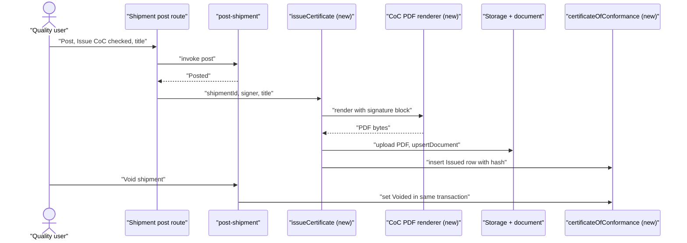
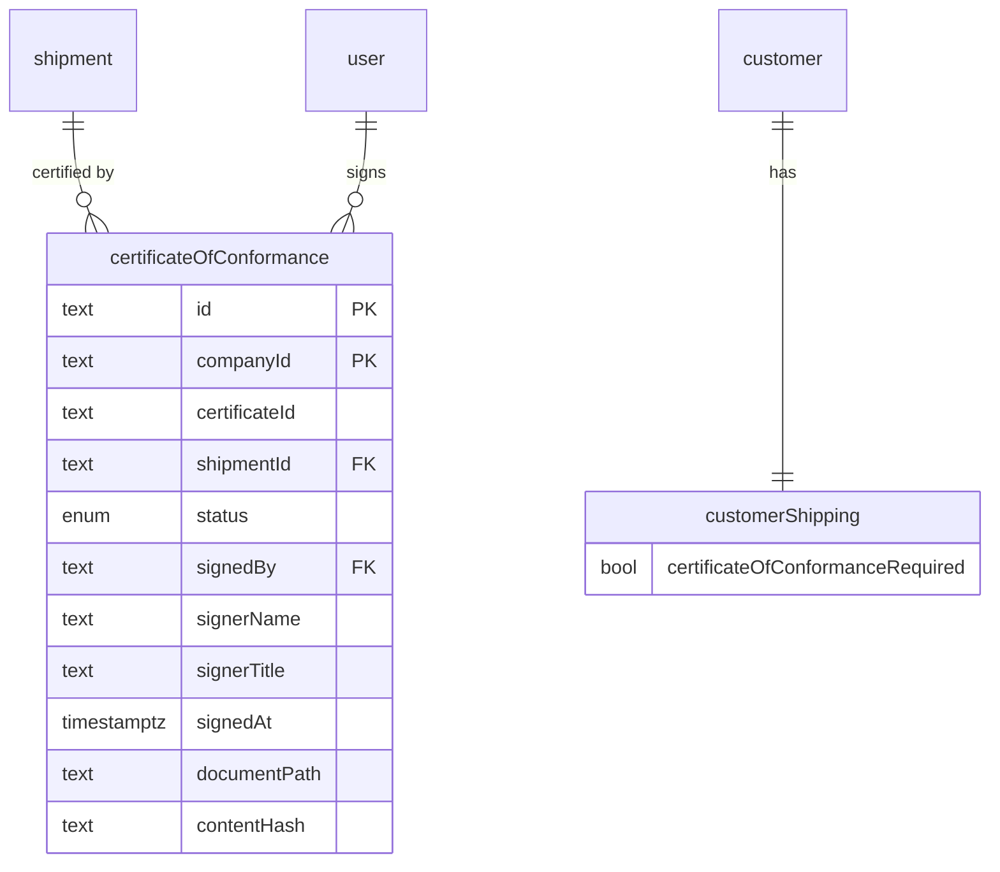

# Certificate of Conformance

> Status: draft — all open questions resolved; ready for plan approval
> Author: naveenkash
> Date: 2026-10-04

## TLDR

Carbon gets an outbound **Certificate of Conformance** (CoC). A CoC is a signed statement that the parts in a posted Sales Order shipment conform to the purchase order, the drawing and the specifications. An authorized quality user issues it from the shipment, or from the post modal when the shipment is posted. Carbon renders the CoC through the document template customizer, freezes the signed PDF in storage, and stores a `certificateOfConformance` row.

The row holds the certificate number, the signer snapshot, the signed time and a content hash. A customer can carry a "CoC required" flag. The flag pre-checks the issue option in the post modal and shows a warning when a shipment has no CoC. Voiding the shipment voids its CoC. Research: [`.ai/research/certificate-of-conformance.md`](../research/certificate-of-conformance.md).

## Overview diagram



## Problem Statement

Aerospace, defense and medical customers require a CoC with every shipment. Lockheed Martin Appendix QX §1.5, Boeing PO terms and RTX flowdowns all require one. AS9100D / ISO 9001 clause 8.6 also requires a record of who authorized release. Carbon has no CoC today:

- Users type CoCs in Word. They copy part numbers, revisions, lot numbers and the customer PO by hand. A typo in a lot number breaks traceability.
- Carbon keeps no record of who signed which CoC, or when. An auditor cannot trace a shipment to the person who authorized release.
- No customer setting tells the shipping clerk that a customer needs a CoC. Today the clerk learns of a missing CoC only when the customer rejects the delivery.

The demo datasets already describe this gap. The precision dataset's final-inspection procedure says "attach the CMM report to the certificate of conformance", but Carbon cannot produce that certificate.

## Proposed Solution

1. Add a new document type, `certificateOfConformance`, to the template customizer. It has six blocks: header, details, parties, line items, statement and signature. The default statement uses unqualified AS9100 wording.
2. Add a `certificateOfConformance` table in the quality module. One row is one issued certificate for one shipment.
3. Add a "Certificate of Conformance required" switch to the customer's shipping settings (`customerShipping`).
4. On a posted Sales Order shipment, a user with `quality_create` can **Issue** a CoC. Carbon renders the PDF with the signature block and uploads it. Then it inserts the row.
5. `ShipmentPostModal` gets an "Issue Certificate of Conformance" section. The customer flag pre-checks it. The route issues the CoC right after a successful post.
6. Any user who can view the shipment can **Preview** the CoC at any status. In the preview, the signature block shows a "PREVIEW — NOT ISSUED" banner and no signature.
7. A user with `quality_delete` can **Void** a CoC with a reason. Then the user can issue a new one. Voiding the shipment voids its CoC in the same transaction.
8. A new list page, Quality → Certificates, shows every CoC with filters for customer, status and date.

### Design Decisions

| Decision | Choice | Rationale |
|----------|--------|-----------|
| What a CoC is keyed to | One shipment. One section per shipment line. | SAP keys a certificate to the delivery item. ProShop keys it to the packing slip. Lockheed asks for one CoC per shipment. Shipped quantity and shipped lots are the truth, not ordered quantity. |
| Source documents in v1 | `Sales Order` shipments only | Only a customer shipment needs a CoC. Purchase returns and transfers do not go to a customer. |
| When a CoC can be issued | Only when the shipment is `Posted` | Before posting, a user can still edit shipped quantity and tracking on the lines, so the CoC could go stale. After posting, nobody can edit the lines. The PDF matches them for good. |
| Stored record vs. live render | Freeze the signed PDF in storage. Store the row with a SHA-256 hash of the PDF. | AS9100 8.6 requires retained evidence and the name of the authorizer. A live render drifts when the template, the statement or a user name changes. SAP archives its output for the same reason. The hash follows the precedent of `itarCertification.docHash`. |
| Status lifecycle | `Issued` → `Voided` (enum `certificateOfConformanceStatus`). No Draft. | The preview replaces a draft. A Draft row would need its own edit flow and adds no value. |
| Certificate number | Sequence `certificateOfConformance`, prefix `COC`, size 6 (`COC000001`) | Customers and auditors quote the CoC number. Inventory counts use the same sequence pattern (`20260627143041_inventory-count.sql`). |
| One live CoC per shipment | Partial unique index on `(companyId, shipmentId)` WHERE `status = 'Issued'` | Reissue means: void the old CoC, then issue a new number. The voided row stays as the audit trail. |
| Who can sign | A user with the `quality_create` permission. Name = `user.fullName`, read-only. Title = `employeeJob.title` by default, editable. Attestation checkbox is required. | AS9100 requires an *authorized* quality representative. The existing permission is the authorization, so no RBAC change is needed. A read-only name stops a user from signing as somebody else. Lockheed and Boeing accept an e-signature. Fulcrum uses this in-app signing pattern. |
| Signature image | Not in v1. The signature block prints "Electronically signed by {name}, {title}" and the signed date and time. | Lockheed QX accepts an electronic signature next to the printed name. Image capture needs its own storage and UI. |
| Statement text | One company statement: the rich-text `content` of the template's `statement` block, with merge fields. No per-customer statement in v1. | Paperless Parts uses one company statement. Research found no verified per-customer statement field in any product. The customizer already stores rich text with merge fields, so this needs no new column. |
| Where the requirement lives | Customer level: `customerShipping.certificateOfConformanceRequired`. Item level is deferred. | E2 uses a customer flag. A CoC is a shipping document, and `customerShipping` holds the other per-customer shipping defaults. Item-level overrides (ProShop) need a column on `item`, a production-critical table. They wait for demand. |
| Enforcement | Warn, never block. The post modal pre-checks "Issue CoC". The shipment page shows a "CoC required, not issued" badge. | A CoC can be issued only after posting, so a CoC cannot block posting. A user who is not authorized to sign must still be able to ship. |
| Issue at post — failure handling | Post first. Then issue. If issue fails, the shipment stays Posted and the route shows an error toast. The user issues again from the shipment page. | The packing slip PDF uses the same pattern in `$shipmentId.post.tsx`: a PDF failure never blocks posting. |
| Atomicity of issue | Allocate the number, render, upload, then **one** insert with every column. No update afterwards. | The Supabase client has no transaction. One insert means a half-issued row cannot exist. A failed insert leaves an unreferenced file and a sequence gap, and both are harmless. |
| Void on shipment void | `post-shipment` `type: "void"` sets the shipment's Issued CoC to `Voided` inside its Kysely transaction | A void that commits without its CoC void would leave an Issued certificate for parts that never shipped. |
| Storage path | `${companyId}/opportunity/${opportunityId}/${certificateId}.pdf`, or `${companyId}/certificate-of-conformance/${certificateId}.pdf` when the sales order has no opportunity; plus a `document` row with `sourceDocument = 'Shipment'` | The packing slip PDF uses this path, so the CoC appears in the sales order's files next to the packing slip. |
| Licensing | Community (AGPL), not `packages/ee` | Inspections, issues and every other quality feature are community features. Customers often need a CoC to sell at all, so it is basic, not an upgrade. |
| Module home | Quality module: `quality.service.ts`, `quality.models.ts`, new `certificate-of-conformance.server.ts` | It is a quality release record. The shipment page only hosts the actions. |
| Multi-tenancy (heuristic 1) | `companyId` + composite PK `("id","companyId")` + `id('coc')` | House convention. |
| Service shape (heuristic 2) | `getCertificatesOfConformance`, `getCertificateOfConformanceByShipment` and `voidCertificateOfConformance` take `client` first and return `{data, error}`. Issue is in a `.server.ts` file because it renders PDFs and uses the service-role storage client. | `conventions-services.md`. A `.service.ts` file is bundled for the browser. |
| RLS (heuristic 3) | `certificateOfConformance: company("quality")` in `authz/manifest.ts`. No policy SQL in the migration. | `authz-manifest.md`. |
| Permission scoping (heuristic 4) | Preview: `view: "inventory"`. Issue: `create: "quality"` + `view: "inventory"`. Void: `delete: "quality"`. List: `view: "quality"`. Customer flag: the existing `update: "sales"` on the customer shipping route. | Each action matches the module that owns the data it changes. |
| Form pattern (heuristic 5) | Issue modal and void modal use `ValidatedForm` + `validator(zod)` + a route action | `conventions-forms.md`. |
| Module layout (heuristic 6) | No new module. Add to the existing quality service, models and barrel. Add the issue renderer to a new `quality/certificate-of-conformance.server.ts`, not barrel-exported. | `module-conventions.md`. A `.server` file must not reach the client graph. |
| Backward compatibility (heuristic 7) | Additive only: a new table, a new enum, a new nullable-default column, a new template type. `documentTemplateTypeSchema` grows from 11 to 12 values. | Old template rows still resolve. `resolveTemplate` falls back to the default for an unknown type. |

## Data Model Changes



One migration, created with `pnpm db:migrate:new certificate-of-conformance`:

```sql
CREATE TYPE "certificateOfConformanceStatus" AS ENUM ('Issued', 'Voided');

CREATE TABLE "certificateOfConformance" (
    "id" TEXT NOT NULL DEFAULT id('coc'),
    "companyId" TEXT NOT NULL,
    "certificateId" TEXT NOT NULL,                -- COC000001, from the sequence
    "shipmentId" TEXT NOT NULL,
    "customerId" TEXT NOT NULL,                   -- denormalized from the shipment, for the list filter
    "status" "certificateOfConformanceStatus" NOT NULL DEFAULT 'Issued',
    "signedBy" TEXT NOT NULL REFERENCES "user"("id"),
    "signerName" TEXT NOT NULL,                   -- snapshot of user.fullName at signing
    "signerTitle" TEXT NOT NULL,
    "signedAt" TIMESTAMP WITH TIME ZONE NOT NULL,
    "documentPath" TEXT NOT NULL,                 -- frozen PDF in the private bucket
    "contentHash" TEXT NOT NULL,                  -- SHA-256 hex of the PDF bytes
    "voidedBy" TEXT REFERENCES "user"("id"),
    "voidedAt" TIMESTAMP WITH TIME ZONE,
    "voidReason" TEXT,
    "createdBy" TEXT NOT NULL REFERENCES "user"("id"),
    "createdAt" TIMESTAMP WITH TIME ZONE NOT NULL DEFAULT NOW(),
    "updatedBy" TEXT REFERENCES "user"("id"),
    "updatedAt" TIMESTAMP WITH TIME ZONE,
    PRIMARY KEY ("id", "companyId"),
    FOREIGN KEY ("companyId") REFERENCES "company"("id") ON DELETE CASCADE,
    FOREIGN KEY ("shipmentId") REFERENCES "shipment"("id") ON DELETE RESTRICT,   -- shipment_pkey is ("id") alone
    FOREIGN KEY ("customerId") REFERENCES "customer"("id") ON DELETE RESTRICT,   -- customer_pkey is ("id") alone
    CONSTRAINT "certificateOfConformance_void_check" CHECK (
      ("status" = 'Voided') = ("voidedAt" IS NOT NULL AND "voidedBy" IS NOT NULL)
    )
);

CREATE INDEX "certificateOfConformance_companyId_idx" ON "certificateOfConformance" ("companyId");
CREATE INDEX "certificateOfConformance_shipmentId_idx" ON "certificateOfConformance" ("shipmentId", "companyId");
CREATE INDEX "certificateOfConformance_customerId_idx" ON "certificateOfConformance" ("customerId", "companyId");
CREATE INDEX "certificateOfConformance_signedBy_idx" ON "certificateOfConformance" ("signedBy");
CREATE INDEX "certificateOfConformance_voidedBy_idx" ON "certificateOfConformance" ("voidedBy");
CREATE INDEX "certificateOfConformance_createdBy_idx" ON "certificateOfConformance" ("createdBy");
CREATE INDEX "certificateOfConformance_updatedBy_idx" ON "certificateOfConformance" ("updatedBy");

ALTER TABLE "certificateOfConformance"
  ADD CONSTRAINT "certificateOfConformance_companyId_certificateId_key" UNIQUE ("companyId", "certificateId");
CREATE UNIQUE INDEX "certificateOfConformance_one_issued_per_shipment"
  ON "certificateOfConformance" ("companyId", "shipmentId") WHERE "status" = 'Issued';

ALTER TABLE "customerShipping"
  ADD COLUMN "certificateOfConformanceRequired" BOOLEAN NOT NULL DEFAULT FALSE;

INSERT INTO "sequence" ("table", "name", "prefix", "suffix", "next", "size", "step", "companyId")
SELECT 'certificateOfConformance', 'Certificate of Conformance', 'COC', NULL, 0, 6, 1, "id"
FROM "company"
ON CONFLICT DO NOTHING;
```

Other changes the migration needs:

- `shipment_pkey` (`20250209170952_shipment.sql`) and `customer_pkey` (`20230123004612_suppliers-and-customers.sql`) are `("id")` alone, so the FKs use one column. Re-check the newest migration for both tables before you write the FKs.
- Add the sequence to `packages/database/src/seed-data.ts`, next to `inventoryCount`, so new companies get it.
- Add `certificateOfConformance: company("quality")` to `packages/database/src/authz/manifest.ts`. Then ship it with `pnpm --filter @carbon/database authz migration certificate-of-conformance`.
- Run `pnpm run generate:types` after `pnpm db:migrate`.

## API / Service Changes

| Where | Function / route | What it does |
|-------|------------------|--------------|
| `quality.models.ts` | `certificateOfConformanceStatus`, `issueCertificateOfConformanceValidator` (`shipmentId`, `signerTitle` min 1, `attest` must be `true`), `voidCertificateOfConformanceValidator` (`id`, `voidReason` min 1) | zod validators |
| `quality.service.ts` | `getCertificatesOfConformance(client, companyId, args)` | List with search, filters and paging. Embeds the customer name and the shipment's `shipmentId`. |
| `quality.service.ts` | `getCertificateOfConformanceByShipment(client, companyId, shipmentId)` | Returns the Issued row and the voided rows, newest first |
| `quality.service.ts` | `voidCertificateOfConformance(client, {id, companyId, userId, voidReason})` | UPDATE WHERE `status = 'Issued'`. Sets `status`, `voidedBy`, `voidedAt`, `voidReason`, `updatedBy`, `updatedAt`. |
| `quality/certificate-of-conformance.server.ts` (new) | `loadCertificateData(client, companyId, shipmentId)` | One read of the shipment, its lines with item `readableIdWithRevision` + description, `customerPartToItem` for the customer, tracking (`getShipmentTracking`), `salesOrder.customerReference` + `opportunityId`, the customer, the company and the template. Refuses a shipment that is not a `Sales Order` shipment. |
| same | `renderCertificatePdf(data, { mode: "preview" \| "issued", signer? })` | `renderToStream(<CertificateOfConformancePDF/>)`, collected into a `Buffer` as `file+/shipment+/$id[.]pdf.tsx` does at lines 224-233. In preview mode, the signature block renders the "PREVIEW — NOT ISSUED" banner and no signer. The CoC does not use the template `watermark` block, because that block draws the company logo, not text. |
| same | `issueCertificateOfConformance({ client, serviceRole, companyId, userId, shipmentId, signerTitle })` | 1. Refuse unless the shipment is `Posted`, is a Sales Order shipment, and has no Issued CoC. 2. Allocate `certificateId` with `getNextSequence`. 3. Take `signedAt` from `now(companyTimeZone)` (`@internationalized/date`). 4. Render in issued mode. 5. Compute SHA-256 with `node:crypto`. 6. Upload to storage. 7. `upsertDocument`. 8. Insert the row. Return `{data: {id, certificateId}, error}`. |
| `packages/server-functions/src/post-shipment` | void branch | In the existing transaction: `UPDATE "certificateOfConformance" SET status='Voided', voidedBy, voidedAt=now(), voidReason='Shipment voided', updatedBy, updatedAt WHERE shipmentId AND companyId AND status='Issued'` |
| `routes/x+/shipment+/$shipmentId.post.tsx` | action | Reads the optional `issueCertificate`, `signerTitle` and `attest` fields. After a successful post, if `issueCertificate` is set and the user has `quality_create`, it calls `issueCertificateOfConformance`. On failure it flashes an error and keeps the post. |
| `routes/x+/shipment+/$shipmentId.certificate.tsx` (new) | action | Issue from the shipment page. Permission `create: "quality"`. |
| `routes/x+/shipment+/$shipmentId.certificate.void.tsx` (new) | action | Void. Permission `delete: "quality"`. |
| `routes/file+/shipment+/$id.certificate-preview[.]pdf.tsx` (new) | loader | Streams the preview PDF. Permission `view: "inventory"`. |
| `routes/file+/certificate-of-conformance+/$id[.]pdf.tsx` (new) | loader | Streams the **stored** PDF of an issued or voided CoC from storage. It never re-renders. Permission `view: "inventory"`. Pins the row to the user's company. |
| `routes/x+/quality+/certificates.tsx` (new) | loader | The list page |
| `packages/documents` | `certificateOfConformance` in `documentTemplateTypeSchema`, `BLOCK_META`, `DEFAULT_TEMPLATES`, `DOCUMENT_CATALOG`; `MERGE_FIELDS.certificateOfConformance`; `pdf/CertificateOfConformancePDF.tsx`; `pdf/blocks/certificateOfConformance/` (`types`, `vars`, `registry`, one component per block); `certificateOfConformance.samples.ts`; a `DOCUMENT_PDFS` entry | The new document type, with the customizer and the preview working as for every other type |
| `path.ts` | `certificateOfConformancePdf(id)`, `shipmentCertificate(id)`, `shipmentCertificateVoid(id)`, `shipmentCertificatePreviewPdf(id)`, `qualityCertificates` | Typed paths |

**Default blocks** (in order):

1. `header` — the shared header section.
2. `details` — certificate number, date, shipment number, sales order number, customer PO, tracking number.
3. `parties` — the seller (company name and address) and the customer ship-to.
4. `lineItems` — line number, part number + revision, description, customer part number, shipped quantity + unit, lots or serials.
5. `statement` — rich text.
6. `signature` — signer name, title, signed date and time, certificate number.

**Merge fields** for the statement: `{{company.name}}` (shared), `{{customerPo}}`, `{{salesOrderId}}`, `{{shipmentId}}`, `{{certificateId}}`, `{{customer.name}}`.

**Default statement:** "{{company.name}} certifies that the items listed above were manufactured, inspected and tested in accordance with the requirements of purchase order {{customerPo}}, the applicable drawings and specifications, and conform to those requirements. Supporting records are on file and available upon request."

## UI Changes

| Surface | Change |
|---------|--------|
| Shipment page (`$shipmentId.tsx` loader + details) | A new "Certificate of Conformance" card under the lines, shown only for Sales Order shipments. The card has four states: <br>1. **Required, not issued** — a warning badge, a Preview button and an Issue button. <br>2. **Not issued** — a Preview button and an Issue button. <br>3. **Issued** — the number, the signer, the title and the signed date, plus Download and a Void button. <br>4. **Voided history** — a collapsed list. <br>Until the shipment is Posted, the card disables Issue and shows a tooltip. The card hides Issue and Void from a user without the permission. |
| `ShipmentPostModal` | For a Sales Order shipment with `quality_create`, a section with three controls: <br>1. an "Issue Certificate of Conformance" checkbox, pre-checked when the customer flag is set; <br>2. a Title input, pre-filled from `employeeJob.title`; <br>3. an attestation checkbox: "I am authorized to certify these parts conform." <br>Without the permission, the modal shows only a warning line when the flag is set. |
| Issue modal (new, `quality/ui/CertificateOfConformance/IssueCertificateModal.tsx`) | The read-only signer name, the Title input, the attestation checkbox and a Preview link. It submits to `shipmentCertificate`. |
| Void modal (new) | A destructive `Alert` and a required reason. It submits to `shipmentCertificateVoid`. Copy it from `ShipmentVoidModal`. |
| `CustomerShippingForm.tsx` | A "Certificate of Conformance required" `Boolean` field |
| Quality → Certificates (new, `quality+/certificates.tsx`, `CertificatesOfConformanceTable.tsx`) | A table with these columns: number, status, customer, shipment (link), signer, signed at, and a download action. It has filters for status and customer. Add it to `useQualitySubmodules`. |
| Templates (`x+/templates+/$type`) | "Certificate of Conformance" appears in the document catalog through `DOCUMENT_CATALOG`. No editor code changes. |

Every new string goes through Lingui. Every date goes through `formatDate`.

## Acceptance Criteria

- [ ] A user switches on "Certificate of Conformance required" on customer ACME's shipping settings. The value saves and reloads.
- [ ] A user posts a Sales Order shipment for ACME with 2 lines. One line is batch-tracked with lot `L-100`. The other line is serial-tracked with serials `S1`, `S2`. The post modal shows "Issue Certificate of Conformance" pre-checked. After the post, the shipment shows an Issued CoC `COC000001` signed by the user.
- [ ] The downloaded CoC PDF shows these values:
  - the customer PO from `salesOrder.customerReference`
  - both part numbers with their revisions
  - the shipped quantities
  - lot `L-100`, and serials `S1` and `S2`
  - the default statement with the PO number filled in
  - the signer name, the title and the signed date
- [ ] The SHA-256 of the downloaded PDF equals `contentHash` on the row.
- [ ] A user changes the company's CoC statement in Templates, then downloads `COC000001` again. The PDF is unchanged, byte for byte.
- [ ] On a Draft shipment, Preview opens a PDF whose signature block shows "PREVIEW — NOT ISSUED" and no signer. The card disables Issue.
- [ ] A user without `quality_create` posts a shipment for ACME. The post succeeds, the modal shows the warning line, and the shipment card shows "Required, not issued".
- [ ] The issue action refuses a second Issue on a shipment with an Issued CoC. The partial unique index in the database also refuses it.
- [ ] A user voids `COC000001` with reason "Wrong title". Then the user issues `COC000002`. The card shows `COC000002` as Issued and `COC000001` as voided history.
- [ ] A user voids the shipment. Its Issued CoC becomes Voided with reason "Shipment voided", in the same transaction.
- [ ] A CoC PDF route request for a CoC of another company returns 404.
- [ ] Quality → Certificates lists both CoCs and filters by status and customer.
- [ ] `pnpm exec turbo run typecheck --filter=erp --filter=@carbon/documents`, `pnpm run lint`, the quality and documents unit tests, `pnpm db:check:datasets` and `pnpm db:check:backups` pass.

## Risks

| Risk | Severity | Mitigation |
|------|----------|------------|
| Render or upload fails after posting, so the customer flag is set but no CoC exists | Med | Posting never depends on issue. The card shows "Required, not issued" and an Issue button. |
| A sequence number is used, but the insert fails | Low | The gap is harmless. Customers do not expect gap-free CoC numbers. |
| An orphaned PDF stays in storage when the insert fails | Low | The file has no `document` row, so no user sees it. Upload uses `upsert: true`, keyed by `certificateId`. |
| `$shipmentId.post.tsx` already calls a PDF loader with `@ts-expect-error` | Low | The CoC uses a typed `renderCertificatePdf`, not the loader hack. |
| A new template type breaks every block registry | Med | `document-template-customizer.md`: add the key to every registry, `BLOCK_META` and `DEFAULT_TEMPLATES` in the same task. Typecheck catches a missing key. |
| Backup and restore of the new table, plus its storage files | Med | `wipe.ts` and backup discover tables by their `companyId` column. Run `pnpm db:check:backups`. Files under `opportunity/` already travel with backups. |
| A user signs with a misleading title | Low | The read-only name and the stored `signedBy` identify the person. The title is a stated claim, as on paper. |
| `customerShipping` is a customer table (Ask-First) | Med | The change is additive only: one `BOOLEAN NOT NULL DEFAULT FALSE` column. See Q1. |

## Open Questions

> HARD STOP: Do not start implementation until every question has an answer.

An autonomous `/feature` run resolved Q2–Q11. The user reviews these answers at plan approval. Q1 is Ask-First territory, so a human answered it.

- [x] **Q1 — Can we add `certificateOfConformanceRequired` to `customerShipping`?** — **Answer (human, 2026-10-04):** Yes. Add the `BOOLEAN NOT NULL DEFAULT FALSE` column. Root `AGENTS.md` says to ask before a schema change to a production-critical table. *Recommended:* yes. It is one additive boolean with a default. The alternative is a new 1:1 table `customerQuality`, which adds a join and a form route for a single flag. A second alternative drops the flag from v1, which removes the warning that a CoC is required.
- [x] **Q2 — Can a CoC be issued before the shipment is posted?** — **Autonomous:** No. Issue requires `Posted`, and Preview is available at any status. Before posting, the lines are still editable and the CoC would go stale. Lockheed wants a copy in the box, which the post-modal option covers: post, then print the packing slip and the CoC together.
- [x] **Q3 — Block posting, or warn, when a CoC is required?** — **Autonomous:** Warn. A CoC cannot exist before posting (Q2), so a block would deadlock. ProShop and E2 also only print, they do not block.
- [x] **Q4 — Community or commercial?** — **Autonomous:** Community. Every existing quality feature (inspections, issues, gauges, risks) is community. A CoC is often a precondition for selling to a customer at all.
- [x] **Q5 — Per-customer statement?** — **Autonomous:** Not in v1. One company statement lives in the template. Research found no verified per-customer statement field in any product. Add a `customerShipping.certificateOfConformanceStatement` override when a customer asks.
- [x] **Q6 — Item-level requirement?** — **Autonomous:** Deferred. It needs a column on `item`, a production-critical table. The customer flag covers aerospace and defense customers, who require a CoC on every shipment.
- [x] **Q7 — Signature image?** — **Autonomous:** Not in v1. The typed name, title and date with "Electronically signed" are acceptable to Lockheed and Boeing. An image needs a storage and upload flow per user.
- [x] **Q8 — Cert package (material certs, inspection reports, FAI attached)?** — **Autonomous:** Out of scope for v1. Carbon has no material-cert entity yet, and Carbon does not key outbound inspection data to a shipment. A follow-up spec can add a `certificateOfConformanceAttachment` table.
- [x] **Q9 — Email the CoC to the customer?** — **Autonomous:** Not in v1. The stored PDF is a `document` on the shipment and in the sales order files, so a user can attach it by hand. Today Carbon does not email the packing slip at shipment either.
- [x] **Q10 — Retention period?** — **Autonomous:** No setting. Carbon never deletes a `certificateOfConformance` row or its document. A void keeps both. The `ON DELETE RESTRICT` FK to the shipment stops a cascade delete. That covers the 3-, 7- and 10-year customer requirements.
- [x] **Q11 — Seed CoCs in the demo datasets?** — **Autonomous:** Not in v1. The datasets bundle assets in the app but cannot write a frozen PDF to storage. A seeded row would point at a missing file. The Certificates list stays empty in a demo company until a user issues a CoC.

## Changelog

- 2026-10-04: Q1 answered by the human: yes, add the column to `customerShipping`.
- 2026-10-04: Corrections made while planning:
  - Carbon has 11 template types today, not 9.
  - The preview marker is a banner in the signature block. The `watermark` block draws a logo.
  - Render with `renderToStream`. Carbon has no `renderToBuffer` precedent.
- 2026-10-04: Created in autonomous mode from `.ai/research/certificate-of-conformance.md`. 10 autonomous resolutions (Q2–Q11). Q1 stays Ask-First for a human.
- 2026-10-04: Prose rewritten to STE-80; no design change.
