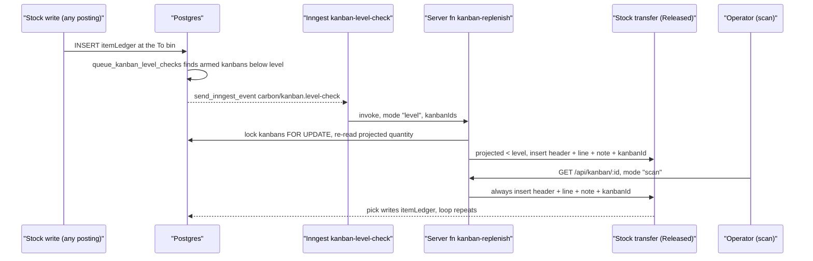

# Kanban Internal Replenishment with a Replenishment Level

> Status: implemented (uncommitted, browser-tested 2026-10-09)
> Author: Carbon team (drafted by Claude in an autonomous `/feature` run)
> Date: 2026-10-06
> Research: `.ai/research/kanban-internal-replenishment-level.md`
> Run record: `.ai/runs/2026-10-06-kanban-internal-replenishment-level.md`

## TLDR

A `Transfer` kanban already moves stock from one storage unit to another inside a location. A scan creates a Released stock transfer for the kanban's quantity. This spec adds a second trigger: a **replenishment level** on the kanban. When the projected quantity at the destination storage unit falls below that level, Carbon creates the same Released stock transfer with no scan. Both triggers write the transfer through one new server function, `kanban-replenish`. The transfer records its origin in a new `stockTransfer.kanbanId` column and in a "Kanban replenishment" note. A user can tell it from a manual transfer. The level check runs when an `itemLedger` row lands on the destination bin, when a kanban is saved, and on an hourly backstop sweep. Open inbound transfers count as supply, so one shortfall creates one transfer.

## Overview diagram



## Problem Statement

A `Transfer` kanban today fires only when a person scans it. Nothing watches the destination bin. If the card is lost, nobody scans. If backflush consumes the bin with nobody at it, nobody scans. The lineside bin runs dry and the job stops. The user asked for a kanban that also fires when the quantity in the "To" storage unit drops below a level.

Three gaps block that today. Facts are from the code, with file and line.

| Gap | Where | Fact |
|---|---|---|
| No threshold | `kanban` table (`packages/database/src/types.ts:27507-27527`) | The row holds `quantity`, `storageUnitId` (To) and `fromStorageUnitId` (From). It has no level column. |
| No origin on the transfer | `stockTransfer` (`20251007014240_stock-transfers.sql:75-97`) | No `kanbanId`, `source` or reference column. `notes` is Tiptap JSON, default `{}`. The scan writes no note (`api+/kanban.$id.tsx:402-416`). The list shows no source column (`StockTransfersTable.tsx`). |
| No per-bin watcher | `itemLedger` attachments (`packages/database/src/event-system/attachments.ts:112-114`) | `itemLedger` runs `apply_item_stock_quantities` and `broadcast_table_changes` only. It has no `events: true`. `itemStockQuantities` is per location, not per bin (`20260812002454…sql:68-77`). |

Two more facts shape the design:

- The scan path creates the transfer with the user's RLS client through `insertStockTransfer` (`inventory.service.ts:4248-4350`), an ERP service. An Inngest function cannot import it. A shared write must live in `packages/server-functions` (root `AGENTS.md`, "Never chain Supabase-client writes and call it a transaction").
- The destination bin's on-hand rises only when a picker posts the transfer line (`post-stock-transfer/index.ts:192-215` writes −qty at From and +qty at To). Between creation and pick, a naive check fires again on every stock movement. The wizard RPC already nets open inbound transfers (`20260923134421…sql:81-93, 194`).

## Background: what exists today

Read `.claude/rules/kanban-system.md` first. In short:

| Surface | Today |
|---|---|
| Enum `kanbanReplenishmentSystem` | `Buy`, `Make`, `Transfer` (`20260908143722_kanban-transfer.sql:13`) |
| `Transfer` fields | `fromStorageUnitId` (From), `storageUnitId` (To), `quantity`, `locationId` |
| Validator | `kanbanValidator` requires both bins for `Transfer` and refuses From = To (`inventory.models.ts:292-316`) |
| Scan | `api+/kanban.$id.tsx:351-428`: validates both bins belong to the company and location, reads `itemTrackingType`, calls `insertStockTransfer`, redirects to the transfer |
| Transfer created | status `Released`, one line, `createdBy` = the scanner, no note, no link to the kanban |
| Collision rule | none for `Transfer`; every scan makes a new transfer |
| Label | prints `From -> To` and `QTY: {quantity}` (`KanbanLabelPDF.tsx:194-201`) |
| Demo data | one `Transfer` kanban per dataset (`data/*/inventory.ts`) |

## Proposed Solution

### Vocabulary

One term per concept, used in code, UI and docs:

| Term | Meaning | Not called |
|---|---|---|
| **Transfer kanban** | a kanban with `replenishmentSystem = 'Transfer'` | internal kanban (see Open Question 1) |
| **From storage unit** | `kanban.fromStorageUnitId`, the bulk bin | source bin |
| **To storage unit** | `kanban.storageUnitId`, the point-of-use bin | destination bin, lineside |
| **Quantity** | `kanban.quantity`, the fixed amount one signal moves | reorder quantity, lot size |
| **Replenishment level** | `kanban.replenishmentLevel`, the strict minimum for the To storage unit | reorder point (that term is `itemPlanning.reorderPoint`, per location) |
| **Projected quantity** | on-hand at the To storage unit + outstanding quantity of open transfers into it | available, forecast |
| **Signal** | one event that creates one transfer: a scan or a level breach | trigger |
| **Kanban replenishment** | a stock transfer with `kanbanId` set | auto transfer |

### The rule

A Transfer kanban gains one optional field, **Replenishment level**:

- `NULL` means scan-only. The kanban behaves exactly as today.
- A number ≥ 0 arms the level signal. When projected quantity < level, Carbon creates one transfer for `quantity`.

The level applies to `Transfer` kanbans only in this version. The column is generic so a later spec can arm `Buy` and `Make` kanbans the same way (see Out of scope).

### Signal A — scan (existing, re-routed)

The scan keeps its behaviour: every scan creates a transfer, with no level test. Two changes:

1. The route calls the new server function `kanban-replenish` with `mode: "scan"` instead of `insertStockTransfer`.
2. The transfer carries `kanbanId` and the note.

### Signal B — level

**Projected quantity** at the To storage unit for the kanban's item:

```
projected = SUM(item_ledger_on_hand_contribution(il.quantity, il.trackedEntityStatus))
              WHERE il.itemId = k.itemId AND il.storageUnitId = k.storageUnitId
                AND il.locationId = k.locationId AND il.companyId = k.companyId
          + SUM(stl.outstandingQuantity)
              FROM stockTransferLine stl JOIN stockTransfer st
              WHERE st.status IN ('Released','In Progress')
                AND stl.itemId = k.itemId AND stl.toStorageUnitId = k.storageUnitId
                AND st.companyId = k.companyId
```

Rules:

- The on-hand term uses `item_ledger_on_hand_contribution`, the same function `itemStockQuantities` uses (`20260812002454…sql:36-49`). Rejected tracked stock does not count. The wizard RPC counts it; this spec does not copy that.
- The inbound term counts every open transfer into the bin, manual or kanban. A manual transfer that is already on its way fills the bin too.
- The condition is strict: `projected < replenishmentLevel`. A bin at exactly the level does not fire. This follows NetSuite "less than" and Epicor "below" (research, Pattern 5), and the user's words "dropping below".
- One signal creates one transfer for exactly `quantity`. If the level is above `quantity`, the kanban catches up one transfer per pick (research, Pattern 5; see Open Question 3).
- The level check never evaluates a kanban whose From storage unit or To storage unit is `NULL`, or whose `replenishmentLevel` is `NULL`.

**When the check runs.** Three paths wake it. Each sends one Inngest event, `carbon/kanban.level-check`, with `{ companyId, kanbanIds }`.

| Path | Mechanism | Covers |
|---|---|---|
| Stock movement | New statement handler `queue_kanban_level_checks` on `itemLedger` (declared in `attachments.ts`, body in `event-system/handlers/`). It joins the touched rows (`batched_new`, or `batched_old` on DELETE) to `kanban` on (`companyId`, `itemId`, `storageUnitId` = To) where `replenishmentSystem = 'Transfer'` and `replenishmentLevel IS NOT NULL`. It keeps only the kanbans below their level and sends one event per company with their ids. | every posting that changes the To bin: backflush, issue, picking, counts, adjustments, the kanban's own transfer pick |
| Kanban saved | New `after` row interceptor `sync_kanban_level_check` on `kanban` (INSERT, or UPDATE when `replenishmentLevel`, `quantity`, `itemId`, `locationId`, `storageUnitId`, `fromStorageUnitId` or `replenishmentSystem` changed). It sends the event for that one kanban when it is below its level. | arming a kanban, raising its level |
| Backstop sweep | `util.kanban_level_breaches()` + `util.sweep_kanban_levels()`, pg_cron `kanban-level-sweeper` at `7 * * * *` (hourly). The breaches function returns one row per company: the armed kanbans below their level. The sweep sends one event per row, with `companyId` and `kanbanIds`. | a deleted Released transfer, a transfer completed short, a lost event, a missing Vault secret at write time |

Both trigger bodies return at once when `app.sync_in_progress` is set. A seed, a restore and a test fixture write in bulk under that flag; the hourly sweep covers them.

The handler and the sweep follow the pattern of `20261004183512_scheduled-jobs-from-database.sql:156-193`. `util.send_inngest_event` never raises and no-ops when `inngest_event_url` is unset (`20261002170250…sql:60-86`), so an OLTP write never fails on this path.

**The Inngest function** `kanbanLevelCheckFunction` (`packages/jobs/src/inngest/functions/tasks/kanban-level-check.ts`):

- Trigger: event `carbon/kanban.level-check`, data `{ companyId, kanbanIds }`. Every sender sets both.
- Flow control: `concurrency: { limit: 1, scope: "env", key: '"kanban-level:" + event.data.companyId' }`. No `debounce` (lesson: the local Inngest dev server cannot run it, `.ai/lessons.md:541`).
- Body: one `step.run("replenish")` that calls `serverFns.system({ db: getJobDatabaseClient(), companyId, userId: "system" }).invokeOrThrow("kanban-replenish", { mode: "level", kanbanIds })`. A thrown error makes Inngest retry.
- It logs each created transfer and each invalid kanban. An invalid kanban is an outcome in the result list, not a throw.

**The server function** `kanban-replenish` (`packages/server-functions/src/kanban-replenish/index.ts`) is the only writer of a kanban replenishment. Input:

```ts
{ mode: "scan", kanbanId: string }
| { mode: "level", kanbanIds?: string[] }   // undefined = every armed kanban of the company
```

`permissions: "system"`: both callers elevate. The scan route does it after `requirePermissions`; the job has no user.

Behaviour, in one Kysely transaction per call:

1. Lock the kanbans: `SELECT … FROM kanban WHERE companyId = $1 AND id IN (…) ORDER BY id FOR UPDATE`. The lock serialises two concurrent signals for one kanban. The order stops two calls from deadlocking.
2. If `replenishmentSystem <> 'Transfer'`, a storage unit is missing, or (level mode) the level is NULL, the outcome is `{ kanbanId, outcome: "invalid", reason }`.
3. Read the storage units in one query. Check both belong to `companyId` and `kanban.locationId` (the CWE-639 guard from `api+/kanban.$id.tsx:362-383`, moved here).
4. If `mode = "level"`: read projected quantity on `trx` in one query with `get_kanban_projected_quantities(company_id, kanban_ids)`. If `projected >= replenishmentLevel`, the outcome is `{ outcome: "at-level", projectedQuantity }` and nothing is written for that kanban.
5. Read the items in one query. Build the lines with the pure helper `expandSerialTrackedLines`. The helper is new in `@carbon/database/stock-transfer`, extracted from `insertStockTransfer`. Both writers then split a serial line of qty > 1 into qty-1 lines the same way.
6. Take one `stockTransferId` per new transfer from `getNextSequence(trx, "stockTransfer", companyId)`.
7. Insert every header in one statement. Set `status = 'Released'`, `locationId`, `companyId`, `kanbanId`, `notes` (the Tiptap document below), and `createdBy = userId`: the scanner in scan mode, `"system"` in level mode.
8. Insert every line in one statement: `itemId`, `fromStorageUnitId`, `toStorageUnitId`, `quantity`, `requiresSerialTracking`, `requiresBatchTracking`.
9. Return `{ results }`, one outcome per locked kanban. A created outcome carries `{ outcome: "created", stockTransferId, id }`.

The note is a Tiptap document with one paragraph:

> Kanban replenishment — {item readableIdWithRevision}, {From storage unit name} → {To storage unit name}, {quantity} {uom}. Signal: scan by {user name} | level {replenishmentLevel} (projected {projected}).

The text is English only. `notes` is free text the user may edit; the durable origin is `kanbanId`. The Tiptap shape is `{ type: "doc", content: [{ type: "paragraph", content: [{ type: "text", text }] }] }`, the shape `StockTransferNotes.tsx` reads.

**Idempotency.** The transaction's `FOR UPDATE` lock plus the inbound term of projected quantity make a second signal a no-op while the first transfer is open. After the pick posts, the To bin's on-hand rises by the picked amount and the outstanding term falls by the same amount. Projected quantity does not change, so no new transfer fires. Only a further draw-down fires one.

**Storage rules.** Storage rules on the `stockTransfer` surface run in two places today: the manual wizard at creation (`x+/stock-transfer+/new.tsx:42-71`) and the status route at Released and Completed (`$id.status.tsx:53-93`). The scan path runs none (`kanban-system.md:70`). The line pick routes (`$id.line.quantity.tsx`, `$id.scan.$lineId.tsx`) run none. The level path runs none, like the scan path. See Open Question 7.

**Source bin shortage.** The function creates the transfer even when the From storage unit holds less than `quantity`. The picker sees the shortage at pick time, as today. See Open Question 8.

### The created stock transfer

| Field | Scan | Level |
|---|---|---|
| `status` | `Released` | `Released` |
| `createdBy` | the scanner | `"system"` (`EmployeeAvatar.tsx:27` renders it) |
| `kanbanId` | the kanban | the kanban |
| `notes` | "Kanban replenishment … Signal: scan by …" | "Kanban replenishment … Signal: level …" |
| line | item, From → To, `quantity`, tracking flags | same |
| `assignee` | null | null |

A transfer with `kanbanId` set is a **kanban replenishment**. The stock transfer header shows a "Kanban" badge that links to the kanban. The stock transfers list gains a **Source** column, `Manual` or `Kanban`, filterable.

### Design Decisions

| Decision | Choice | Rationale |
|---|---|---|
| Where the rule lives | one new column on `kanban`, no new table | The row already holds item, From, To, quantity and location (research, Pattern 1). A new table would split one rule across two rows. |
| Name of the threshold | `replenishmentLevel`, UI "Replenishment Level" | The user's term. "Reorder point" is taken by `itemPlanning.reorderPoint` (per location). One word, one meaning. |
| Comparison | strict `projected < level` | NetSuite "less than", Epicor "below", the user's "dropping below". |
| Quantity per signal | the fixed `quantity`, one transfer | A kanban is a container; the label prints the quantity (research, Pattern 5). Order-up-to-max is Odoo's model, not kanban's. |
| Supply netting | open Released and In Progress transfers into the To bin count as supply | Odoo, Fishbowl and D365 WMS all net pending supply (Pattern 2). The wizard RPC is the Carbon precedent. |
| On-hand function | `item_ledger_on_hand_contribution` | Same definition as `itemStockQuantities`. Rejected tracked stock must not satisfy a lineside level. |
| Primary trigger | `itemLedger` statement handler → Inngest event | Every on-hand change writes `itemLedger`. SAP's quantity signal and Epicor fire on the posting (Pattern 4). A daily batch is too slow for a lineside bin. |
| Backstop | hourly pg_cron sweep with a has-work check | Covers deleted transfers and lost events. Same pattern as the notification digest sweeper. |
| Writer | server function `kanban-replenish`, Kysely transaction | Apps and jobs share the write (root `AGENTS.md`). An Inngest function cannot import `~/modules`. |
| Serialisation | `FOR UPDATE` on the kanban row + Inngest concurrency 1 per company | Two events for one kanban within a second must create one transfer. The DB lock is the real guard; Inngest flow control is a cost saver. |
| Origin marking | `stockTransfer.kanbanId` column + Tiptap note | Column for filters and the back-link (Pattern 3); note because the user asked for it and it is what the picker reads. |
| From = To | DB CHECK on `kanban` | The zod refine exists; an API write bypasses it. A self-feeding kanban loops forever under the level signal (Pattern 6). |
| Scope of the level | `Transfer` only, column generic | The user asked for internal replenishment. Buy and Make need a collision model this spec does not design. |
| Multi-tenancy (heuristic 1) | no new table; new columns on tables with composite PK `("id","companyId")` | `kanban` and `stockTransfer` already comply. |
| Service shape (heuristic 2) | server function returns `{ data, error }`; ERP services unchanged | `defineServerFn` contract. |
| RLS (heuristic 3) | no new table; `kanbanId` inherits `stockTransfer` policies | The level path writes through Kysely as `system`, which bypasses RLS by design, like `dispatch.ts` and `mrp.ts`. |
| Permissions (heuristic 4) | scan stays `role: "employee"`; kanban CRUD stays `inventory_*`; the server function is system-mode in both callers | The scan already writes with `role: employee`. The function needs no new scope. |
| Form (heuristic 5) | `ValidatedForm` + `kanbanValidator` + existing route actions | One new `Number` field. |
| Module layout (heuristic 6) | models in `inventory.models.ts`, services in `inventory.service.ts`, UI in `ui/Kanbans/` | No new files in the module except the badge component. |
| Backward compatibility (heuristic 7) | additive columns, nullable; the enum is unchanged | Existing kanbans and transfers are untouched. The API gains optional fields. |
| Realtime | none added | `stockTransfer` already has `broadcast_table_changes`; the list refreshes when the system creates a transfer. |
| Notifications | none in this version | Not requested. The Source column and realtime list make the transfer visible. See Out of scope. |

## Data Model Changes

One migration, `pnpm db:migrate:new kanban-replenishment-level`.

```sql
-- 1. The level on the kanban
ALTER TABLE "kanban"
  ADD COLUMN "replenishmentLevel" NUMERIC
    CONSTRAINT "kanban_replenishmentLevel_check" CHECK ("replenishmentLevel" IS NULL OR "replenishmentLevel" >= 0);

COMMENT ON COLUMN "kanban"."replenishmentLevel" IS
  'Transfer kanbans only. When projected quantity at the To storage unit is below this level, Carbon creates a Released stock transfer for "quantity". NULL = scan-only.';

-- A Transfer kanban must not feed itself. The zod refine exists; this stops API writes.
ALTER TABLE "kanban"
  ADD CONSTRAINT "kanban_transfer_distinct_storage_units_check"
  CHECK ("replenishmentSystem" <> 'Transfer'
         OR "fromStorageUnitId" IS NULL OR "storageUnitId" IS NULL
         OR "fromStorageUnitId" <> "storageUnitId");

-- Fast lookup from a ledger row to its armed kanbans
CREATE INDEX "kanban_level_lookup_idx"
  ON "kanban" ("companyId", "itemId", "storageUnitId")
  WHERE "replenishmentSystem" = 'Transfer' AND "replenishmentLevel" IS NOT NULL;

-- 2. The origin on the stock transfer
ALTER TABLE "stockTransfer"
  ADD COLUMN "kanbanId" TEXT,
  ADD CONSTRAINT "stockTransfer_kanbanId_fkey"
    FOREIGN KEY ("kanbanId", "companyId") REFERENCES "kanban" ("id", "companyId")
    ON DELETE SET NULL ON UPDATE CASCADE;

CREATE INDEX "stockTransfer_kanbanId_idx" ON "stockTransfer" ("kanbanId") WHERE "kanbanId" IS NOT NULL;

-- 3. The kanbans view expands k.* when it is created, so recreate it
--    (same body as 20260908143722_kanban-transfer.sql) to expose replenishmentLevel.

-- 4. Projected quantity for the armed kanbans of one company (NULL ids = all).
--    Used by the server function, both trigger bodies, the sweep and the kanbans list.
CREATE OR REPLACE FUNCTION get_kanban_projected_quantities(company_id TEXT, kanban_ids TEXT[] DEFAULT NULL)
RETURNS TABLE ("kanbanId" TEXT, "replenishmentLevel" NUMERIC, "projectedQuantity" NUMERIC)
LANGUAGE sql STABLE SECURITY INVOKER SET search_path = public, pg_temp AS $$
  -- per armed kanban: on-hand at the To bin (item_ledger_on_hand_contribution)
  -- + SUM(outstandingQuantity) of Released / In Progress transfer lines into it
$$;

-- 5. Backstop sweep (same shape as util.sweep_workflow_run_retention)
CREATE OR REPLACE FUNCTION util.kanban_level_breaches()
RETURNS TABLE ("companyId" TEXT, "kanbanIds" TEXT[]) ...;   -- armed kanbans below level, per company

CREATE OR REPLACE FUNCTION util.sweep_kanban_levels() RETURNS void ...;
  -- one util.send_inngest_event('carbon/kanban.level-check', {companyId, kanbanIds}) per breach row

-- cron: unschedule 'kanban-level-sweeper' if it exists, then schedule it at '7 * * * *'.
```

The two trigger bodies live in the event-system source tree, not in the migration (`attachments.ts` doc comment, lines 28-35):

- `packages/database/src/event-system/handlers/queue_kanban_level_checks.sql` — statement handler on `itemLedger`, beside `apply_item_stock_quantities`. It reads `batched_new` (`batched_old` on DELETE), joins `kanban` through `kanban_level_lookup_idx`, keeps the kanbans below their level, and calls `util.send_inngest_event('carbon/kanban.level-check', jsonb_build_object('companyId', c, 'kanbanIds', ids))` once per company. Declare it in `attachments.ts`: `itemLedger: { statement: ["apply_item_stock_quantities", "broadcast_table_changes", "queue_kanban_level_checks"] }`. It must list all three; the helper replaces the whole list.
- `packages/database/src/event-system/handlers/sync_kanban_level_check.sql` — `after` row interceptor on `kanban`. Declare `kanban: { after: ["sync_kanban_level_check"] }`.
- Run `authz migration` to ship the attachment change, as the file's comment instructs.

The `kanbans` view selects `k.*`, but Postgres expands `k.*` when it creates the view. The migration recreates the view so `replenishmentLevel` appears. The `stockTransfer` list and detail read the table directly (`inventory.service.ts:576, 631`), so `kanbanId` needs no view change.

The exact SQL is in the plan, `.ai/plans/2026-10-06-kanban-internal-replenishment-level.md`, Tasks 1 and 2. Verify it with a psql script beside `supabase/tests/scheduled-job-sweeps.test.sql`.

After the migration: `pnpm run generate:types`.

### Index note

`itemLedger_companyId_locationId_itemId_idx` serves the on-hand sub-query; the planner filters `storageUnitId` on the matched rows. Run `EXPLAIN ANALYZE` on `get_kanban_projected_quantities` against a seeded company before deciding whether to add `("companyId","itemId","storageUnitId")`.

## API / Service Changes

### `packages/server-functions`

- New `src/kanban-replenish/index.ts`, registered in `src/invoke.ts` and exported per `packages/server-functions/AGENTS.md`. Input and behaviour as in "Signal B". It reads on `trx` while the transaction is open (AGENTS.md rule, line 86).
- The system-mode caller passes `userId: "system"` for the level path and the scanner's `userId` for the scan path.

### `@carbon/database`

- New pure helpers in `packages/database/src/stock-transfer.ts` (export `@carbon/database/stock-transfer`), with a unit test: `expandSerialTrackedLines(lines)`, `isBelowReplenishmentLevel`, `kanbanReplenishmentNote`. `insertStockTransfer` (`inventory.service.ts:4285-4303`) switches to it so the wizard and the kanban writer split serial lines the same way.

### `@carbon/jobs`

- New `kanbanLevelCheckFunction` in `functions/tasks/`, registered in `packages/jobs/src/inngest/index.ts`.
- New event type `carbon/kanban.level-check` in `packages/lib/src/events.ts`: `{ companyId: string; kanbanIds: string[] }`. Only the database sends it.

### ERP routes and services

| File | Change |
|---|---|
| `api+/kanban.$id.tsx` | The `Transfer` branch calls `serverFns.system({ db: getDatabaseClient(), companyId, userId }).invoke("kanban-replenish", { mode: "scan", kanbanId })` and redirects to `path.to.stockTransfer(result.id)`. The bin-ownership guard moves into the server function. The branch keeps its error strings. |
| `inventory.models.ts` | `kanbanValidator` gains `replenishmentLevel: zfd.numeric(z.number().min(0).optional())`. A new refine: `replenishmentLevel` is only allowed when `replenishmentSystem === "Transfer"` (error on `replenishmentLevel`). |
| `inventory.service.ts` | `upsertKanban` writes `replenishmentLevel` as `null` when the field is blank or the system is not Transfer (zod omits a blank optional field, so a plain spread would keep the old value). `getStockTransfers` and `getStockTransfer` already select `*`, so `kanbanId` arrives; `getStockTransfers` accepts a derived `source` filter (`kanbanId IS NULL` / `IS NOT NULL`), as `getWorkflows` does for its status. |
| `x+/inventory+/kanbans.tsx` | The loader also calls a new `getKanbanProjectedQuantities(client, companyId, kanbanIds)` for the armed kanbans on the page, through `get_kanban_projected_quantities`. One query per page load. |
| `x+/stock-transfer+/$id.tsx` | No change. The header badge reads `kanbanId` from the existing loader data. |

### Docs

- `docs/content/docs/reference/kanban.mdx` is stale: lines 17 and 28 say the form offers only `Buy` and `Make`. Update it for `Transfer`, the Replenishment Level field, the level signal, and the "Kanban replenishment" note. Add the new error strings to its error list.
- Add a glossary entry `kanban-replenishment-level` in `docs/content/src/glossary/terms.ts` and use it as the field's `termId`.

## UI Changes

### `KanbanForm.tsx`

Field order for a `Transfer` kanban, top to bottom:

1. Item
2. Replenishment System (`Transfer`)
3. Location
4. From Storage Unit
5. To Storage Unit
6. Quantity — helper text: "The quantity moved from the From storage unit on each signal."
7. Replenishment Level — new `Number`, `minValue={0}`, optional, `termId="kanban-replenishment-level"`. Helper text: "When the projected quantity in the To storage unit drops below this level, a Released stock transfer for Quantity is created. Leave blank for scan-only."

Rules:

- The level field renders only when `replenishmentSystem === "Transfer"`. Changing the system away from `Transfer` clears it.
- Buy and Make keep their current order (Item, Quantity, System, Buy fields, Location, Storage Unit, Make fields).
- Adjacent fix: `onItemChange` (`KanbanForm.tsx:105-107`) resets the system to `Make` or `Buy` from the item. If the user has already chosen `Transfer`, keep it. Today a user who picks Transfer first and the item second loses the choice.

### `KanbansTable.tsx`

- New column **Replenishment Level** after **Reorder Qty.**; blank for scan-only.
- New column **Projected (To)** for armed Transfer kanbans, from the loader's `getKanbanProjectedQuantities`. Render the number, and a `Below level` status pill when `projected < replenishmentLevel`. Blank for other rows.
- The storage-unit column keeps `from → to`.

### Stock transfers

- `StockTransferHeader.tsx`: when `kanbanId` is set, show a `Kanban` badge that links to `path.to.kanban(kanbanId)`.
- `StockTransfersTable.tsx`: new **Source** column with values `Manual` and `Kanban`, with a filter. Sort and filter run on `kanbanId IS NULL`.
- `StockTransferNotes.tsx`: no change; the note renders as any other note.

### Label

`KanbanLabelPDF.tsx` prints `MIN: {replenishmentLevel}` under `QTY:` when the level is set. Thread the field through both label paths: `labels.$action[.]pdf.tsx` and `print-job/resolvers.ts` + `renderers.tsx` (`kanban-system.md`, Gotchas).

### i18n

Wrap every new UI string in Lingui `t` or `<Trans>`. Run `/translate` at commit time. The note text and the server function's error strings are not translated, like the scan route's strings today.

## Demo datasets

No change in this version. Each dataset's Transfer kanban stays scan-only, with no replenishment level. The new column is nullable, so the datasets apply as they do today.

## Testing

| Layer | Test |
|---|---|
| Unit | `expandSerialTrackedLines` (new): qty 3 serial → 3 lines of 1; batch and untracked unchanged. |
| Unit | `kanbanValidator`: level refused on Buy/Make, allowed on Transfer, negative refused. |
| Server function | `kanban-replenish` with the local database fixture (`local-database-test-fixture.ts`): (a) level mode at level → no write; (b) below level → one transfer with `kanbanId`, `createdBy = system`, note present; (c) a second call while the first is Released → no write; (d) after the line is picked in full → no write; (e) a further draw-down → one more transfer; (f) scan mode at level → still creates; (g) From = To rejected by the CHECK. |
| SQL | psql script beside `scheduled-job-sweeps.test.sql`: projected quantity sums on-hand and outstanding inbound; `util.kanban_level_breaches()` names the kanban below level only, and not while a Released transfer covers the gap; both CHECKs refuse bad rows. |
| Statement handler | No repo test captures a `net.http_post` call, so the browser test proves the send path end to end. The SQL test covers the selection the handler shares with the sweep. |
| Browser (`/test`) | Create a Transfer kanban with level 10 and quantity 5. Issue stock from the To bin until on-hand is 8. Open Stock Transfers: one Released transfer, Source `Kanban`, note present, badge links back. Pick it. No second transfer appears. |

## Acceptance Criteria

- [ ] A user creates a Transfer kanban with From bin A, To bin B, quantity 5, level 10. The kanbans list shows the level and the projected quantity for bin B.
- [ ] On-hand at bin B is 12. A job backflush consumes 3. Within 1 minute one stock transfer exists: status `Released`, one line A → B for 5, `createdBy` `system`, Source `Kanban`, notes start with "Kanban replenishment".
- [ ] While that transfer is Released or In Progress, further consumption at bin B creates no second transfer. A second transfer appears only when projected quantity (on-hand + outstanding) is below 10 again.
- [ ] The picker posts the line in full. On-hand at B rises by 5 and no new transfer appears.
- [ ] Scanning the kanban's order QR code creates a transfer every time, regardless of level. Its `createdBy` is the scanner and its note ends "Signal: scan by …".
- [ ] A kanban with no level never creates a transfer without a scan.
- [ ] A Buy or Make kanban cannot save a level; the form shows the field only for Transfer.
- [ ] Saving a Transfer kanban with From = To fails in the form and at the database.
- [ ] The stock transfers list filters by Source `Kanban` and the header badge opens the kanban.
- [ ] The label prints `MIN: 10` under `QTY: 5` for that kanban.
- [ ] A deleted Released kanban transfer is replaced within 1 hour by the sweep when the bin is still below level.
- [ ] `pnpm db:check:datasets` passes with no dataset change.
- [ ] The docs page for kanban describes Transfer, the level and the note.

## Risks

| Risk | Severity | Mitigation |
|---|---|---|
| The level signal fires on every `itemLedger` statement for an armed bin | Low | The statement handler joins through a partial index and sends one event per company. The server function writes nothing at level. Lesson `.ai/lessons.md:2733` on write cost applies: an event with no work is cheap but not free. |
| Two signals in one second create two transfers | Med | `FOR UPDATE` on the kanban row inside the transaction; the second reads the first's outstanding quantity. Inngest concurrency 1 per company reduces contention. Test (c). |
| `inngest_event_url` is unset in a self-hosted install | Med | `send_inngest_event` no-ops. The hourly sweep also depends on it. Document the secret in `event-system.md` and the kanban docs page; the kanbans list still shows `Below level` so the gap is visible. |
| Level above quantity catches up one transfer per pick | Low | Helper text explains it. Open Question 3 records the alternative. |
| Picking lists also move stock into a lineside To bin | Low | Picking credits unclaimed on-hand at the bin (`supersession-system.md`, Lineside credit). A kanban transfer into a lineside bin becomes unclaimed stock a job's pick credits. No double count; a job may pick less. |
| Automatic transfer bypasses storage rules | Low | Same as the scan today. No rule runs at pick time either, so a kanban transfer never meets a storage rule. Open Question 7. |
| The From bin is empty | Low | The transfer is created; the picker sees the shortage. The sweep does not retry a transfer that exists. Open Question 8. |
| `notes` is editable and the note can be deleted | Low | `kanbanId` is the durable origin; the note is for the reader. |
| Local dev cannot run Inngest `debounce` | Low | The function uses none. |

## Out of scope (this version)

- Arming `Buy` and `Make` kanbans with a level. Needs a collision model: Make has `jobId`, Buy has none.
- A notification when a kanban transfer is created. Add `NotificationEvent.StockTransferCreated` later if asked.
- A workflow moment `inventory.stockTransferCreated` or a `stockTransfer.create` action.
- Order-up-to-maximum quantities.
- Edge-based triggering (fire only when crossing the level), Epicor style. Level-based with supply netting is self-correcting and simpler.
- MES surfaces. The transfer appears in the existing stock transfer screens.
- A replenishment level on the demo datasets' Transfer kanbans.

## Open Questions

> Every question below was resolved autonomously because the session had no human available. Each resolution is marked **Autonomous** and lists the alternative. The user can overturn any of them before `/plan`.

- [x] **1. The user asked for an "Internal" option. Keep the stored value `Transfer`, or rename it?** Why it matters: a rename touches the enum, the route branch, the table filter, the label, the docs and four datasets. — **Autonomous:** keep `Transfer` as the stored value and the UI label. The document it creates is a Stock Transfer, and one concept keeps one name. Alternative A: `ALTER TYPE "kanbanReplenishmentSystem" RENAME VALUE 'Transfer' TO 'Internal'` plus the code and data changes above. Alternative B: a UI-only label "Internal" over the stored `Transfer`. B is rejected: `Enumerable` renders the stored value, and it gives one concept two names.
- [x] **2. Strictly below the level, or at or below?** — **Autonomous:** strictly below (`<`). The user wrote "dropping below"; NetSuite and Epicor use "less than" / "below". Alternative: `<=`, SAP's one-card "reaches or falls below".
- [x] **3. One transfer for `quantity`, or enough transfers to reach the level?** — **Autonomous:** one transfer for the fixed `quantity` per signal. A kanban is a container and the label prints its quantity. Alternative: one transfer of `n × quantity` with `n = ceil((level − projected) / quantity)`, SAP's event-driven split. Easy to add later inside the server function.
- [x] **4. Column, note, or both for the origin?** — **Autonomous:** both. `stockTransfer.kanbanId` for filters and the back-link; the Tiptap note because the user asked for it. Alternative: note only (rejected: not filterable, editable).
- [x] **5. Event-driven, scheduled, or both?** — **Autonomous:** event-driven on `itemLedger` plus an hourly sweep. SAP and Epicor fire on the posting; a lineside bin cannot wait for a daily batch. Alternative: sweep only every 5 minutes (simpler, but 5-minute latency and a has-work scan every 5 minutes).
- [x] **6. Count open inbound transfers as supply?** — **Autonomous:** yes, Released and In Progress. Odoo, Fishbowl and D365 WMS do; the wizard RPC is the precedent. Alternative: edge-based trigger (Epicor). Rejected: a lost or deleted transfer would never re-fire.
- [x] **7. Evaluate storage rules on the level path?** — **Autonomous:** no, same as the scan path. No human can acknowledge a warning. Alternative: evaluate, and on an `error` rule skip the transfer and log. Can be added inside the server function.
- [x] **8. Create the transfer when the From bin is short?** — **Autonomous:** yes. No surveyed system checks the source first; the pick reports the shortage. Alternative: skip and show `Source bin short` on the kanbans list.
- [x] **9. Field order on the form: From before To, or To before From as the user's list reads?** Why it matters: the screenshot the user mentioned did not reach this session. — **Autonomous:** From then To, matching the table's `from → to` and the label. Alternative: To then From.
- [x] **10. Include the `onItemChange` fix that drops `Transfer`?** — **Autonomous:** yes, one guard in a file this spec already edits. Alternative: leave it (a user who picks the item first is unaffected).
- [x] **11. `createdBy` for the level path?** — **Autonomous:** `"system"`, like `mrp.ts` and `dispatch.ts`. The note names the signal. Alternative: the kanban's `createdBy` (misleading in the audit trail).
- [x] **12. Numeric type of the level?** — **Autonomous:** `NUMERIC`, because on-hand is `NUMERIC`. `kanban.quantity` is `INTEGER`; this spec leaves it. Alternative: `INTEGER` to match `quantity`.
- [x] **13. Which on-hand definition at the bin?** — **Autonomous:** `item_ledger_on_hand_contribution`, the `itemStockQuantities` definition that excludes Rejected tracked stock. Alternative: the wizard RPC's raw `SUM(quantity)`.

## Changelog

- 2026-10-09: Implemented (Tasks 1–18). Deviations: the migrations are `20261009142613` / `20261009142615`, named to sort after a `main` migration stamped ahead of UTC; the stock transfer header shows the Kanban badge in its meta line, because the header is now `DocumentPageHeader`; the docs page also gained a "never fires" troubleshooting entry and a screenshot slot.
- 2026-10-09: Demo dataset seeding removed from scope on the user's request. The datasets' Transfer kanbans stay scan-only.
- 2026-10-09: Planned (`.ai/plans/2026-10-06-kanban-internal-replenishment-level.md`). Corrections from the code:
  - The migration recreates the `kanbans` view.
  - One set-returning `get_kanban_projected_quantities` replaces the scalar function.
  - The sweep sends one event per company.
  - The Inngest function lives in `functions/tasks/`.
  - Both trigger bodies live in `event-system/handlers/`. They skip under `app.sync_in_progress` and send only kanbans below level.
  - The DB tests are psql scripts, not pgTAP.
  - `upsertKanban` writes a blank level as `null`.
  - The server function locks all its kanbans in one transaction.
- 2026-10-09: Corrected the storage-rules facts: no rule runs at pick time on a stock transfer line, so a kanban transfer meets no storage rule at all. Risk row updated.
- 2026-10-06: Created. Research in `.ai/research/kanban-internal-replenishment-level.md`. Open Questions 1–13 resolved autonomously (no human in the session); the user reviews them before `/plan`.
