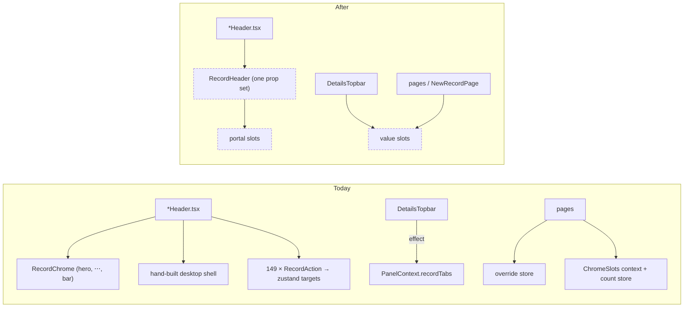

# Mobile chrome: one compact signal, one record header, one slot primitive

> Status: approved
> Author: Claude (with the branch owner)
> Date: 2026-10-07

## TLDR

The mobile redesign works, but its phone chrome is built three times over:
- **The breakpoint:** "is this a phone?" is answered by two hooks and two breakpoint units.
- **Record headers:** every record header writes its desktop header and its phone header separately, and is wired to the phone bar by 149 hand-placed wrappers.
- **Registries:** five separate registries move content into the shell.

This spec merges each of these into one mechanism and keeps behaviour the same:
- one compact signal (B3);
- one `RecordHeader` that renders the desktop row and the phone chrome from one set of props (B1);
- one slot module with two primitives, a portal slot and a value slot, which replaces the five registries (B2).

Research: `.ai/research/2026-10-07-record-header-catalogue.md`.

## Overview diagram



## Problem Statement

Each item below cites the file and line where the problem is.

1. **"Compact" has several sources of truth.**
   - The breakpoint is written twice. JS uses `(max-width: 767px)` (`packages/utils/src/viewport.ts:15-17`). CSS uses `width < 48rem` (`packages/config/tailwind/theme.css:19,33,448`).
   - The opt-in is written twice: the `data-compact-ui` attribute (`apps/erp/app/root.tsx:260`) and `CompactProvider enabled` (`root.tsx:346`).
   - There are two hooks: `useCompact` (built on useSyncExternalStore) and `useIsMobile` (built on useState plus an effect, and seeded through `useCompactSeed`).
   - In the ERP, `isMobile === isCompact` always. That makes the `useIsMobile` branches dead code: the Panels drawer branch at `Panels.tsx:279-327` sits behind `if (isCompact)` at `:268`.
2. **Every record header is built twice.**
   - The duplication: 27 topbar headers render `<RecordChrome hero menu copyValue>` and also a hand-written `compact:hidden` desktop shell, passing the same title, Copy value, ⋯ menu and status to both. The catalogue found no case where the two disagree, which shows they are pure duplication.
   - Stateful titles need `{!isCompact && …}` guards so they don't mount twice (Assembly, Builder).
   - The overflow sheet restyles other components' buttons with CSS selectors such as `[&_button]…` and `[&_.bg-destructive]` (`RecordChrome.tsx:106-117`).
   - The sheet closes through a native capture listener, a `setTimeout` and an `aria-haspopup` heuristic (`RecordChrome.tsx:138-154`).
   - In about 14 actions, the phone slot and the desktop variant disagree, so the bar shows two filled buttons or a main cell styled grey. PO patches this with an `isCompact` branch (`PurchaseOrderHeader.tsx:238-243`).
3. **Five registries do one job.**
   - The five:
     - ChromeSlots, a context holding `useState` targets, plus a separate zustand count store.
     - RecordChrome's zustand target and count store.
     - The app-bar override store.
     - `recordTabs`, pushed into PanelContext from an effect keyed on a hand-serialised `linksKey`.
     - `CompactPanelProvider` / `inert`, which exist only to give phones that registry.
   - On top of that, the app bar marks `/new` routes as pushed with a pathname rule (`useAppBar.ts:34-42`).
   - Two routes copy the app bar's Back button JSX word for word (`issue-workflow+/new.tsx:82`, `inventory+/quantities+/$itemId.tsx:110`).

## Proposed Solution

### B3 — one compact signal

- **The query:** `viewport.ts` exports one query, `COMPACT_QUERY = "(width < 48rem)"`. It is the same string Tailwind and `theme.css` use. `COMPACT_MAX_WIDTH` is deleted, and the inline cookie-hint script keeps using `COMPACT_QUERY`.
- **The hooks:** `Compact.tsx` owns one `subscribe`/`getSnapshot` pair over that query.
  - `useCompact()`: a `CompactProvider` is present and the query matches.
  - `useIsMobile()`: the query alone, with no opt-in. It moves into `Compact.tsx` on the same store:
    - its server snapshot is the provider's `initialCompact`, else `false`, so MES and starter keep getting `false` before hydration, as `!!isMobile` returned before;
    - `useCompact()` is `useIsMobile()` plus the provider check;
    - `hooks/useIsMobile.ts` re-exports it.
  - `useCompactSeed` is deleted.
- **The provider:** `CompactProvider` loses its `enabled` prop. Its presence is the JS opt-in. `root.tsx` sets `data-compact-ui` on the same element tree, with a one-line comment linking the two, and those are the only two opt-in sites.
- **ERP callers of `useIsMobile`:**
  - `Panels.tsx`:
    - the `PanelProvider` collapse effect switches to `isCompact`, which is the same value, so behaviour is identical;
    - the drawer branch and its pathname-collapse effect are deleted.
  - `CollapsibleSidebar.tsx`: its `wasMobile` effect switches to `isCompact` if the stored-open behaviour across the breakpoint is still wanted, and is deleted if it only served the removed drawer. The plan step reads it and records which.
  - `Breadcrumbs.tsx`: its `!isMobile` branches are deleted. Breadcrumbs only renders when `Topbar` is not compact.

### B1 — one record header

**`RecordHeader`** (`apps/erp/app/components/Layout/RecordHeader.tsx`) replaces `RecordChrome` and the hand-built shells.

```tsx
<RecordHeader
  title={id}                  // ReactNode; rendered once per breakpoint
  titleTo={path.to.xDetails(id)} // optional Link
  copyValue={id}              // optional; desktop <Copy> + app-bar "Copy ID"
  menu={menuItems}            // optional; desktop ⋯ + app-bar ⋯
  status={badges}             // optional; desktop row + hero
  subtitle={metaLine}         // optional; hero (and desktop under the title)
  onToggleExplorer={toggleExplorer}   // optional leading IconButton
  onToggleProperties={toggleProperties} // optional trailing IconButton
  aside={<DetailsTopbar links={…} />}  // optional right-hand node (item tabs)
  actions={<>…RecordActions…</>}
/>
```

**Desktop shell**
- It is rendered from the props in one fixed order: leading toggle, title, Copy, ⋯, status, then on the right side the aside, actions and trailing toggle.
- Padding comes from whether there is a toggle:
  - with a toggle at an edge, it is `p-2` at that edge (shell A);
  - otherwise `px-4 py-2` (shell B).
  - So no padding prop is needed.
- **Stays mounted on phones:** the shell is still rendered there, hidden with `compact:hidden`. That keeps its modals, `DetailsTopbar` and the action portals alive.
- **Rendered once:** `title` goes into the shell only on desktop and into the hero only on phones. That replaces the `{!isCompact && …}` guards.

**Phone chrome**
- The hero holds `subtitle` and `status`, in place, with `--header-height` / `--hero-height` published as today. The app bar already names the record, so the hero shows `title` only when the caller sets `titleInHero` (an editable title, such as Assembly's name input).
- The app bar ⋯ holds "Copy ID" and `menu`.
- The bottom bar holds the primary cell, the secondary cell and the ⋯ button for the overflow sheet.
- The hero, bar and sheet move into the `RecordPhoneChrome` part, which `RecordHeader` and the card header share.

**`RecordAction`**
- It keeps `slot: "primary" | "secondary" | "overflow"`, and its children stay JSX. That includes `fetcher.Form`, SplitButton, PrintButton, Suspense/Await and DropdownMenu triggers.
- On phones it fills the matching portal slot (B2) and provides a **presentation context** to what it wraps:
  - `bar-primary`: Button renders as `variant="primary" size="lg" w-full`, whatever `variant` it was given;
  - `bar-secondary`: the same, with `variant="secondary"`;
  - `row`: Button renders as an action-sheet row (`h-12`, start-aligned, transparent, 15px). A `destructive` variant becomes destructive text. After its own `onClick` runs, the Button calls the context's `onSelect()` to close the sheet, unless it is a popup trigger (`aria-haspopup`).
  - `SplitButton` reads the same context: its chevron becomes a 44px cell.
  - This replaces the `[&_button]` / `[&_.bg-destructive]` selector overrides and the native listener.
  - The close is deferred to the next task, so a submit button's form is still mounted when the browser submits it. A comment keeps that reason.
  - Controls that are not a Button render unchanged in the sheet: the Assignee popover trigger, and children that render null.

**Overflow sheet:** each portal slot owns its DOM element, and the slot's `Target` only shows that element. The sheet body is the overflow `Target`. When the sheet closes, the actions stay mounted in the detached element, so a `PrintButton` keeps its Modal. This fixes catalogue hazard 3. (Radix `forceMount` cannot do this: a closed, force-mounted modal Dialog still hides the rest of the app and blocks its pointer events.)

**Card headers**
- `DocumentHeader` (the card variant) takes the same props: `title`, `subtitle`, `status`, `menu`, `actions`, and `copyValue` defaulting to `title`.
- On phones it hides its `CardHeader` and renders the hero through a `recordHero` portal slot.
- The 6 callers, plus `JournalEntryForm`'s hand-rolled copy, replace `<RecordChrome …/>` with `<RecordHeroTarget bleed />`. That keeps the hero where it renders today: outside the Card, full-bleed. The data is passed once.

**Actions-only pages** (InventoryCount, Reimbursement) render `<RecordPhoneChrome />` (the bar only) in place of `<RecordChrome />`.

**Per-header cleanup:** when a header's slot and variant restate one status condition, the condition is named once (`const isDraft = …`) and used for both. Desktop variants do not change. PO's `isCompact` variant branch is deleted, because the bar cell now sets the style.

**Deleted:**
- `RecordChrome` and its zustand store;
- `RevisionSubtitle`: Quote and PO build the `id` + `RevisionSuffix` node once and pass it as `title` and, when the revision is above 0, as `subtitle`. The phone shows the same subtitle as before.
- `WorkflowTitle` keeps its `inHero` styling, because the hero still renders it with hero styles.

### B2 — one slot module

`apps/erp/app/components/Layout/Mobile/slots.tsx` exports two primitives.

```ts
// Content that renders inside the shell: React context is preserved by a portal.
createPortalSlot(): {
  Target: (props: ComponentProps<"div">) => JSX.Element; // stable ref, one target
  Fill: (props: { children: ReactNode }) => ReactPortal | null; // compact only, counted
  useFilled: () => boolean;
}
// Data a page hands the shell; newest provider wins, unmount removes only its own.
createValueSlot<T>(): {
  useProvide: (value: T | null) => void; // caller memoizes `value`
  useValue: () => T | null;
}
```

**Portal slots:**
- **`appBarActions`** replaces `AppBarActions` and `ChromeSlotsProvider`. Its consumers: `New`, `CompactToolbar`, ChartOfAccounts filters and WorkflowBuilder.
- **`bottomBar`**: the tab bar hides while it is filled.
- **The record slots:** `recordPrimary`, `recordSecondary`, `recordOverflow`, `recordHero`.
- **Deleted:** `ChromeSlotsProvider`, `useChromeSlotTargets`, the BottomBar count store, RecordChrome's store and its module-level ref callbacks.

**Value slots:**
- **`appBar`**: the override, typed as `Partial<AppBarState> & { trailing?: ReactNode }`.
  - `AppBarState.kind` gains `"selection"` for list selection mode, which hides the page actions, the section switcher and the subtitle.
  - `MobileAppBar` merges the override over `useAppBar()` and always renders Back from the merged `kind: "pushed"` + `backTo`.
  - **Deleted:** `leading`, both copied Back buttons, and the `useAppBar` `/new` pathname rule.
- **`NewRecordPage`** provides `{ kind: "pushed", backTo: <last crumb's to> }`. The plan audits every full-page `/new` route and moves any that does not render `NewRecordPage` onto it, so none loses its Back button.
- **`recordTabs`**:
  - `DetailsTopbar` provides plain tab data `{ name, to, count, active }`, with `active` computed from the location it already reads, so no closures are stored.
  - `CompactRecordTabs` reads it, and also provides a `recordFrame` value (`true`) that `DetailsTopbar` reads to decide whether to render its own row.
  - This removes `recordTabs`/`setRecordTabs` from `PanelContext`, `CompactPanelProvider`, `PanelProvider`'s `inert`, and the `linksKey` effect. The item routes go back to their `HEAD` providers.

### Design Decisions

| Decision | Choice | Rationale |
|----------|--------|-----------|
| Breakpoint unit | `(width < 48rem)` in JS | Matches Tailwind/theme.css exactly; rem follows the user's default font size like the CSS already does. Range syntax needs Safari 16.4+, which the Tailwind v4 CSS already requires |
| `useIsMobile` semantics | viewport only, no opt-in, `false` before hydration without a provider | The old hook returned `!!isMobile`; keeps MES/starter/`Sidebar`/`FunnelChart` behaviour; ERP gets the seeded first frame as today |
| JS opt-in | provider presence | One flag fewer; the `enabled={false}` case has no caller |
| Header actions API | JSX + `RecordAction slot` + presentation context | User choice: keeps Suspense/Await, forms, PrintButton working; removes CSS reach-in and native listener |
| Slot vs desktop variant | slot stays explicit; phone bar cell decides style; desktop variants untouched | User choice; no desktop change; the 14 mismatches stop showing on phones |
| Desktop element order | title · Copy · ⋯ · status (fixed) | One shell instead of 8 orderings; the reordering is small and visible only on desktop (see Risks) |
| Card forms | `DocumentHeader` + `RecordHeroTarget` placement | Keeps the phone hero full-bleed above the Card and the desktop CardHeader inside it, with data passed once |
| Popup scope | Modal, Drawer, BottomSheet, Popover, HoverCard, DropdownMenu and ContextMenu contents reset the presentation | React context crosses portals: without the reset, a dialog an action opens (PrintButton) would render its buttons as sheet rows. The old CSS selectors never reached portalled content |
| Overflow sheet mount | each portal slot owns its DOM element; `Target` only shows it | Radix cannot keep a closed modal sheet mounted (`hideOthers` and `disableOutsidePointerEvents: true` would block the app, `@radix-ui/react-dialog` 1.1.15 `index.mjs:137,145`). An owned element keeps PrintButton's Modal alive when the sheet closes, with no per-action rules |
| Slot primitives | portal slot + value slot | Portals keep the filler's React context (forms, menus); data slots need no DOM |
| Create pages' Back | `NewRecordPage` declares it | User choice; replaces the `/new` URL rule |
| CSS height vars | unchanged | Moving to pure flex layout is review section C, out of scope |

## Data Model Changes

N/A: this is a UI-only refactor with no tables, columns or migrations.

## API / Service Changes

N/A: no loaders, actions or services change. These public package APIs do change:
- `@carbon/react`:
  - `CompactProvider` loses `enabled`;
  - `useCompactSeed` is removed;
  - `useIsMobile` now comes from `Compact.tsx`, with the same export name;
  - Button and SplitButton read an optional presentation context, so behaviour is unchanged without a provider.
- `@carbon/utils`: `COMPACT_MAX_WIDTH` is removed.

## UI Changes

- **Desktop:** every topbar record header renders the same elements, with one change: in 11 headers the order becomes title · Copy · ⋯ · status. Those headers are the 5 item headers, ChangeNotice, Issue, Maintenance, Procedure, Training and QualityDocument. Variants, actions and modals are unchanged.
- **Phones:**
  - The bar's main cell is always filled and the second cell always outline.
  - Sheet rows look as they do today.
  - The sheet keeps PrintButton's dialog alive.
  - Quote and PO keep `id` + revision as the hero subtitle.
  - Create pages and the quantities/issue-workflow screens keep their Back button.

## Acceptance Criteria

- [ ] `rg "RecordChrome|ChromeSlotsProvider|useChromeSlotTargets|useCompactSeed|CompactPanelProvider|COMPACT_MAX_WIDTH|RevisionSubtitle" apps packages` returns nothing (code only; docs excluded).
- [ ] `rg 'endsWith\("/new"\)' apps/erp/app/components/Layout` returns nothing, and `useAppBar.ts` has no pathname rule.
- [ ] `rg "\[&_button\]|\[&_\.bg-destructive\]" apps/erp/app/components/Layout` returns nothing.
- [ ] `rg "useIsMobile" apps/erp` returns nothing.
- [ ] At 390px on a Sales Order in "To Ship and Invoice", the bar shows Ship filled, Invoice outline and ⋯. On desktop the same order shows both Ship and Invoice as primary, as before.
- [ ] At 390px on a Receipt, ⋯ → Print → the print dialog stays open after the sheet closes.
- [ ] At 390px on a Purchase Order, tapping ⋯ → Cancel Order closes the sheet and opens the cancel dialog. Tapping ⋯ → Preview opens its menu and keeps the sheet.
- [ ] At 390px, `/x/customer/new` shows Back to Customers, and a list in selection mode shows "N selected" with Cancel and no page actions.
- [ ] At 390px on a Part, the record tab row shows Details/Purchasing/… plus Properties. At desktop width, the Part's DetailsTopbar renders as before.
- [ ] At 390px an Assembly Instruction's name input appears once (in the hero) and saves on blur.
- [ ] `pnpm exec turbo run typecheck --filter=erp --filter=@carbon/react --filter=@carbon/utils` passes. Biome is clean on the changed files. The erp `Layout`/`Table` tests, the react tests and `viewport.test.ts` pass. `appBar.test.ts` covers the merged override and the `selection` kind.
- [ ] Every new user-facing string uses Lingui, and `pnpm lingui:extract` has been run.

## Risks

| Risk | Severity | Mitigation |
|------|----------|------------|
| Desktop order change in 11 headers is unwanted | Low | Called out here for review at the spec gate. If it is rejected, a `statusPlacement` prop is the fallback |
| A Button-like control in the sheet that is not a `Button` (Assignee) doesn't close the sheet | Low | It is a popup trigger, which keeps the sheet open today too; listed in the plan's browser checks |
| Range-syntax media query on old iOS (< 16.4) | Low | The compact CSS already uses range syntax; JS now fails the same way the CSS does, rather than differently |
| A full-page `/new` route without `NewRecordPage` loses its Back button | Med | The plan audits every `routes/**/new.tsx` and its siblings; acceptance check at `/x/customer/new` |
| 38 call sites migrated in one pass | Med | Migrate in batches by shell kind, with typecheck after each; desktop and 390px screenshots of one header per batch (needs the user's go-ahead to drive the browser) |

## Open Questions

- [x] Does "all" cover the C/D review sections too? — **Answer:** No. B1–B3 now, and C/D in a later pass, because several depend on B.
- [x] How are header actions written? — **Answer:** As JSX with a presentation context: one `RecordHeader` owns both layouts, and Button reads the context to render as a bar cell or a sheet row.
- [x] How does a create page declare that it shows Back? — **Answer:** `NewRecordPage` declares it, and the `/new` URL rule is deleted. Full-page create routes are audited and moved onto it.
- [x] Phone slot and desktop variant disagree in about 14 actions: which wins? — **Answer:** Phone styling only. The slot stays, the bar cell decides the phone style, and desktop variants don't change.

## Changelog

- 2026-10-07: Draft written after the four questions above were resolved.
- 2026-10-07: Implemented (uncommitted). Changes from the draft:
  - `useIsMobile` returns `false` before hydration, as the old hook did.
  - Portal slots own their DOM element, in place of Radix `forceMount` (see Design Decisions).
  - Popup contents reset the action presentation.
  - The hero title is opt-in (`titleInHero`).
  - Selection mode shows no Back button.
  - A create page whose app bar was already pushed now goes Back to its list (its last crumb), not to the module.
  - The `/new` audit found no full-page route outside `NewRecordPage` (`.ai/runs/2026-10-07-new-route-audit.txt`).
- 2026-10-07: The inline `<head>` cookie script is removed. `CompactProvider` writes the compact hint cookie on mount and on each breakpoint crossing (`compactHintCookie` in `viewport.ts`), so one place watches the width per app.
