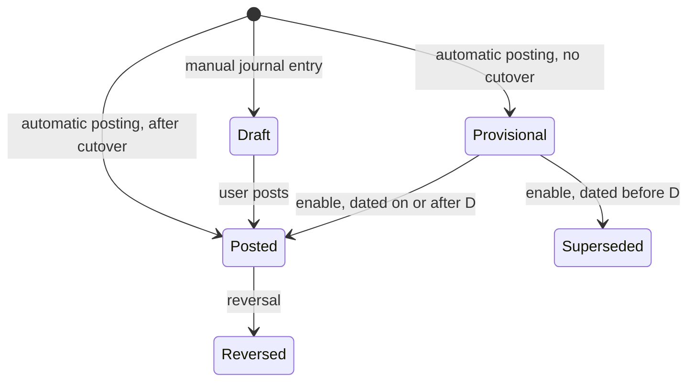

# Accounting Cutover

> Status: draft
> Author: Claude (with Brad Barbin)
> Date: 2026-10-08
> Tracking issue: crbnos/carbon#1057
> Supersedes: `.ai/specs/archived/2026-07-04-accounting-cutover-activation.md`
> Research: `.ai/research/accounting-cutover.md`
> Depends on: `packages/database/supabase/migrations/20261008211304_reset-accounting.sql` (clears the GL of every non-demo company and turns accounting off)

## TLDR

Every company posts journals from now on, whether or not it uses accounting. Before a company's cutover, its journals have the status `Provisional`, and no balance, report or sync counts them. The `accountingEnabled` flag stops gating sub-ledger work. Every company writes cost layers, asset cost, deferral schedules and intercompany rows. A one-way enable wizard takes a cutover date D at a period start. It writes one Posted opening line for each item open at D, against a Migration Clearing account. It takes the prior system's trial balance against the same account. The wizard refuses to enable until Migration Clearing totals zero. At enable, Provisional journals dated on or after D become Posted, and Provisional journals dated before D become `Superseded`. A payment against an invoice posted before D then clears that invoice's opening line. After the wizard ships, no code reads the flag. The column stays, unused.

## Overview diagram



## Problem Statement

1. `companySettings.accountingEnabled` is a switch with no checks. Internal users turned it on in companies with no opening balance and with open invoices, receipts and jobs.
2. A payment needs the invoice's posted receivable line (`post-payment-transaction.ts:494-536`). An invoice posted with accounting off has none. So `:644` refuses every payment against it with "Target is missing its original control account". The user cannot mark it paid either, because Mark Paid works only with accounting off.
3. The flag gates more than the journal. With accounting off, these never happen:
   - Sales-order shipments and job material issues do not relieve cost layers (`post-shipment:1222`, `issue:385`, `backflush_job_materials`).
   - Job completion writes no finished-goods cost layer and leaves a Make to Asset asset at cost 0 (`complete_job_to_inventory:608`).
   - Receipts skip invoice-first valuation, and purchase invoices skip purchase price variance layers (`post-receipt:1454`, `post-purchase-invoice:1203`).
   - Sales invoices write no deferral schedule rows or contract ledger entries (`post-sales-invoice:344`, `:644`).
   - Intercompany invoices write no `intercompanyTransaction` row (`post-sales-invoice:2144`).
   
   So the sub-ledgers of a company with accounting off are incomplete, and its inventory valuation is wrong.
4. The opening balance journal (`createOpeningBalanceJournal`, `accounting.service.ts:6497`) has one line per account and no document link. No payment can clear it, and the AR and AP reports do not read it.
5. The July spec closed every period before the cutover, so documents from that time had no GL at all. It solved neither problem 2 nor problem 3.

## Proposed Solution

### 1. One posting path for every company

Every posting function builds and writes its journal for every company. The company's cutover decides one thing only: the journal's status.

| Company state | Status of an automatic journal |
|---|---|
| `accountingCutoverDate IS NULL` | `Provisional` |
| `accountingCutoverDate IS NOT NULL` | `Posted` |

1. Remove every sub-ledger branch on `accountingEnabled` listed in Problem Statement item 3. Every company relieves cost layers, writes finished-goods and asset cost, writes deferral schedules, contract entries and intercompany rows.
2. Remove the journal branches on `accountingEnabled` in every posting server function and SQL function. Each one writes its journal with the status from `journalPostingStatus` (TS) or `journal_posting_status(company_id)` (SQL).
3. A Provisional journal has no accounting period: `accountingPeriodId` is null, and no posting creates a period before the cutover. So Provisional journals never lock the fiscal calendar, and a company that does not use accounting collects no periods. The enable assigns the periods (section 5).
4. The posting transaction reads `companySettings` with `FOR SHARE`. The enable transaction takes `FOR UPDATE` on the same row. So no posting can write a Provisional journal after the enable commits.
5. 16 `accountDefault` columns are nullable, and a company that changed its chart of accounts can have them empty. Account numbers and names are user-editable, so no migration can fill them safely.
   - Before cutover, a builder that needs an empty default posts that line to `retainedEarningsAccount` (NOT NULL for every company). It writes the default it wanted in the new column `journalLine.accountDefaultRole`, for example `scrapAccount`. A Provisional journal counts nowhere, so the stand-in account changes no balance. `resolveDefaultAccount` (API / Service Changes) is the one place that decides this.
   - After cutover, an empty default fails the posting, as it does today with accounting on. The enable cannot happen while a default is empty (section 3).

Manual accounting work stays unavailable before cutover: manual journal entries, depreciation runs, revenue recognition runs, intercompany eliminations and period close. The server functions refuse it, not only the UI. The revenue recognition cron (`revenue-recognition-proposal.ts`) skips companies with no cutover.

### 2. Journal statuses and who reads them

`journalEntryStatus` gets 2 values: `Provisional` and `Superseded`. Two shared constants in `@carbon/database/accounting-posting` define every read:

| Constant | Statuses | Used by |
|---|---|---|
| `GL_JOURNAL_STATUSES` | `Posted`, `Reversed` | Balances, trial balance, reports, period snapshots, tie-outs, aging, provider sync, the opening-balance gate |
| `DOCUMENT_JOURNAL_STATUSES` | `Provisional`, `Posted`, `Reversed` | Readers that follow one document's chain and filter on `<> 'Draft'` or on nothing today: void builders, GR/IR lookup, WIP sums, intercompany lookups |
| `OPEN_ITEM_JOURNAL_STATUSES` | `Provisional`, `Posted` | Readers that filter on `= 'Posted'` today and must also see a Provisional journal: payment control lookups, memo, charge and reimbursement void checks |

Before cutover a company has no Posted journal. After enable it has no Provisional journal. So a chain reader always reads the lines that govern the document. `Superseded` is in neither list.

Readers to change (from the code map, file:line in the migrations named):

| Reader | Today | Change |
|---|---|---|
| `accountTreeBalances`, `accountTreeBalancesByCompany`, `accountTreeBalancePeriodSeries`, `snapshotAccountingPeriodBalances` (`20260909173619`) | `<> 'Draft'` | `GL_JOURNAL_STATUSES` |
| `journalLinesByAccountNumber` (`20260713225803`), `journalDimensionPivot` and its lines function (`20260809204137`), `get_inventory_tie_out` (`20260925121735:1425`), the `journalLines` view (`20260811123614:178`) | `<> 'Draft'` | `GL_JOURNAL_STATUSES` |
| WIP sums: `complete_job_to_inventory` (`20261006221601:873`), `close-job/index.ts:66`, `post-production-event:206`, `:229` | no filter | `DOCUMENT_JOURNAL_STATUSES` |
| Void builders: `post-sales-invoice:2375`, `:2420`; `post-receipt:339`, `:593`; `post-purchase-invoice:115`; `post-shipment:3093`, `:4124`, `:4410`; payment void `:162` | no filter | `DOCUMENT_JOURNAL_STATUSES` |
| GR/IR lookup `post-purchase-invoice:906`; intercompany lookups `post-sales-invoice:2212`, `post-purchase-invoice:2403`, `:2448`; `post-asset-transfer:1090` | no filter or `<> 'Draft'` | `DOCUMENT_JOURNAL_STATUSES` |
| Payment control lookups `post-payment-transaction:498`, `:790`; memo void `:145`; `post-charge-void:38`; `post-reimbursement-void:63` | `= 'Posted'` | `OPEN_ITEM_JOURNAL_STATUSES` |
| `post-maintenance-event:84`; sales invoice void reader `post-sales-invoice:2375` (it also lacks a `companyId` filter, which this change adds) | no filter | `DOCUMENT_JOURNAL_STATUSES` |
| `getFiscalCalendarCommitted` (`:2622`) | all statuses | `GL_JOURNAL_STATUSES` |

`getAccountingPeriodDeletability` (`:2548`) keeps counting every journal in the period. A Provisional journal has no period (section 1), so it never blocks a delete.

The SQL readers that filter on `= 'Posted'` (`get_ar_open_by_customer`, `get_ap_open_by_supplier`, `get_ar_tie_out`, `get_ap_tie_out`) keep that filter. They already exclude the 2 new statuses. They must also accept `sourceType 'Opening Balance'` (section 4).

A new `@carbon/checks` conformance rule refuses a status filter on `journal` that does not use one of the 3 constants, in TS and in migrations. It flags `<> 'Draft'`, `!= 'Draft'` and a `journal` join with no status filter.

### 3. The enable wizard

Route `/x/accounting/activation`, linked from Settings → Accounting and from the accounting module while the company has no cutover. It has 5 steps:

1. **Readiness.** These checks must pass:
   - Every `accountDefault` account column is set and active, `migrationClearingAccount` included. The step lists each empty default with a link to Accounting → Defaults. The user picks or creates the Migration Clearing account there.
   - `fiscalYearSettings` exists. Base currency is set.
   - Cutover date D is the first day of a fiscal period. D is on or before today, and no more than 3 periods before the current period.
   - No Draft or Pending receipt, shipment, invoice, payment or memo is dated before D.
   - No job created before L is still open. L is the `createdAt` of the company's first Provisional journal. If the company has none, L is now, and every open job blocks.
   - No Posted journal with `sourceType 'Opening Balance'` exists. The unique index `journal_one_posted_opening_balance_per_company` allows one, and the enable writes it.
2. **Inventory.** For each item, the page shows the on-hand quantity at D across all locations (from `itemLedger`) and a unit cost. Cost layers (`costLedger`) have no location, so the reset works per item. The unit cost defaults to the average of the remaining cost layers, else `itemCost.unitCost`. The user edits the cost in `itemCost`. The page shows the total per inventory account.
3. **Fixed assets.** For each asset, the page shows cost and accumulated depreciation at D. The values come from the register. The user edits accumulated depreciation inline on this page, because no depreciation run happens before cutover. The register form cannot do it: it opens Draft assets only (`$fixedAssetId.register.tsx:40-45`).
4. **Trial balance.** The user enters the prior system's trial balance as of D − 1, for every account. There are 2 input methods: the existing inline Opening Balances mode on the chart of accounts, or a CSV import (`accountNumber, debit, credit`). The page shows Migration Clearing per control account: the trial balance amount, the opening total from Carbon, and the difference.
5. **Enable.** The wizard refuses to enable unless Migration Clearing totals zero within 0.01 and every step passes. The user types the company name to confirm. The page states that enable is one-way.

### 4. Opening lines

The opening journal has `sourceType 'Opening Balance'`, status Posted, and date D − 1. Each line on a control account copies the lookup keys its chain reader matches. So a later document finds the line as if the original posting had written it.

| Open item at D | Source | Line (each against Migration Clearing) | Keys copied |
|---|---|---|---|
| Open sales invoice, credit memo | The document: total minus settlements at D, at the booked exchange rate. An invoice marked Paid with no settlement counts as settled. | Receivables account, the open base amount | `documentType 'Invoice'` or `'Memo'`, `documentId`, description "Accounts Receivable" (or "IC Receivables") |
| Open purchase invoice, debit memo | The document, the same way | Payables account | `documentId`, description "Accounts Payable" (or "IC Payables") |
| Unapplied payment credit | The payment: cash minus settlements at D | Receivables or payables account | `documentType 'Payment'`, `documentId`, the on-account description |
| Customer deposit | The payment | `prepaymentAccount` | description "Customer Deposit", `documentId` |
| Received, not invoiced | The PO line: `quantityReceived − quantityInvoiced` at D × the receipt's cost layer | GR/IR account | `documentLineReference 'receipt:<poLineId>'` |
| WIP of an open job | The job's Provisional lines on the WIP account, dated before D | WIP account | `documentId` = the job |
| Inventory | Step 2: on-hand at D × unit cost | Each inventory account | item and location dimensions |
| Fixed asset | Step 3 | Asset account and accumulated depreciation account of the class | `documentId` = the asset |
| Deferred revenue | `revenueRecognitionSchedule` rows still Planned, dated on or after D | The row's credit account | `documentId` = the invoice, `documentLineId` = the line |
| Lease net investment | `rentalLeaseScheduleLine.closingNetInvestment` at D − 1 | `netInvestmentInLeasesAccount` | `documentType 'Rental Agreement'`, `documentId` |

A document partly settled before D gets 2 opening lines on its control account, not 1. The payment lookup and the AR/AP readers compute the open amount as the original control line minus every settlement, the settlements before D included. So:

1. The first line carries the document's original base amount, with the description its own posting writes ("Accounts Receivable", "Accounts Payable" or the on-account credit description).
2. The second line carries the base amount settled before D, with the opposite sign and the description "<that description> (settled before cutover)". The readers match descriptions exactly, so they ignore it.

The control account then nets to the open amount, and every settlement after D still subtracts from the original.

Received-not-invoiced follows the same rule, keyed by reference instead of description. A purchase invoice clears GR/IR by walking the PO line's `receipt:<poLineId>` journal groups in order: it skips the units already invoiced, then costs the rest from each group's amount and quantity. So per PO line open at D:

1. A `receipt:<poLineId>` line carries everything received before D, with its quantity and receipt cost.
2. A `purchase-invoice:<poLineId>` line carries the receipt cost the invoices before D cleared, with the opposite sign. The GR/IR walk does not read that reference.

The account nets to the open amount, and an invoice after D skips and costs units exactly as before.

Every other account comes from the trial balance only. Cash, equity, tax, payroll and accruals never come from the Provisional ledger. So a gap in Provisional data (for example, payroll that Carbon never saw) cannot reach the GL.

For a control account, the trial balance amount is an assertion, not a posting. The opening journal posts the Carbon opening total on the control account. The difference to the trial balance stays on Migration Clearing. A zero total on Migration Clearing proves that Carbon's open items agree with the prior system.

### 5. The enable transaction

One server function, `activate-accounting`, runs in one Kysely transaction:

1. Lock `companySettings` `FOR UPDATE`. Re-run every readiness check and every Migration Clearing total. Refuse on any failure.
2. Reset inventory as of D. For each item, close the cost layers dated before D. Insert one layer: the on-hand quantity at D at the reviewed unit cost. Keep the layers dated on or after D.
3. Re-cost every outbound movement dated on or after D against the reset layers, in date order. Rebuild the Provisional journal of each re-costed document. `recost-serial-unit` is the precedent for re-costing one unit.
4. Set every Provisional journal dated before D to `Superseded`.
5. Mark `revenueRecognitionSchedule` rows dated before D as Posted with no journal. Mark lease Interest rows dated before D the same way.
6. Make no change to the assets. `buildDepreciationRunLines` takes the cutover date as a floor: with no run posted after it, a run depreciates from D, not from `depreciationStartDate` (`accounting.utils.ts:555` today). Step 3 already put the accumulated depreciation at D on the register.
7. Post the opening journal (section 4) in the period that contains D − 1.
8. Assign periods. For each Provisional journal dated on or after D, set `accountingPeriodId` to the period that contains its date (`resolveAccountingPeriod`, mode historical). Superseded journals keep a null period.
9. Re-point the stand-in lines. For each line in a Provisional journal dated on or after D with an `accountDefaultRole`, set `accountId` to that default's account and clear the role. Then set every Provisional journal dated on or after D to Posted.
10. Close every period that ends before D with `closePreCutoverPeriods`. It runs inside this transaction, oldest first. It sets `closeStatus 'Closed'` and calls `snapshotAccountingPeriodBalances` for each period. It creates no close tasks. It cannot reuse `closeAccountingPeriod`, because that function opens its own transaction.
11. Set `accountingCutoverDate = D`, `accountingActivatedAt = now()`, `accountingActivatedBy`.
12. Write no separate audit entry. Journals and accounting periods are auditable entities (`audit.config.ts:620-640`), so the event-driven audit records steps 4 to 9 for companies with the audit log on. `companySettings` is not auditable. The `accountingActivatedAt` and `accountingActivatedBy` columns are the record of the enable.

The `check_accounting_period_open` trigger also checks a change from `Provisional` to `Posted`. Today it checks only a change from Draft to Posted (`20260713235930:59-64`), so step 8 could post into a Closed period without it.

### 6. After cutover

- **Payment against an invoice dated before D.** The lookup at `post-payment-transaction.ts:494` accepts `sourceType 'Opening Balance'` as well as Sales Invoice and Purchase Invoice. It finds the opening line. The `:644` guard stays strict.
- **Payment against an invoice dated on or after D.** It finds the promoted line. No change.
- **Void of a payment or memo dated before D.** The void builds the document's posting again with `buildPaymentJournal` or `buildMemoJournal`. It negates the result and dates it in an open period. Its receivables or payables line nets the opening line to zero for that document. It never posts to Migration Clearing. This follows the NetSuite guidance in the research.
- **Void of an invoice dated before D.** The void fails. A sales invoice gets "This invoice is from before your accounting cutover. Issue a credit memo instead." A purchase invoice gets "This invoice is from before your accounting cutover. Record a debit memo instead." The memo posts in the current period and settles against the opening line. No builder covers a whole invoice posting: the purchase invoice has none, and the sales builder leaves out cost of goods sold, asset disposal, rental purchase option and intercompany lines. Most invoices before D also have no journal, because the reset deleted it.
- **Void of an inventory document dated before D** (a receipt, shipment, inventory adjustment, inventory count or stock transfer). The void fails with "This document is from before your accounting cutover. Record a return or an inventory adjustment instead." The reset removed its cost layer. The research found no product that voids such a document (pattern 6). The returns flows that exist today (RMA, purchase return) cover the forward path.
- **Purchase invoice for a receipt dated before D.** The GR/IR lookup finds the opening line by its `documentLineReference`.
- **Job open at D.** `close-job` and `complete_job_to_inventory` sum the opening WIP line and the Posted lines after D.
- **Posting dated before D.** The closed-period trigger refuses it.
- **Base currency and fiscal start month.** A trigger refuses a change after enable (carried from the July spec).

### 7. New companies

`seed-company` sets `accountingCutoverDate` to the first day of the current period. It sets `accountingActivatedAt` and `accountingActivatedBy` too. The company posts with status Posted from its first document. It has no opening journal and no wizard.

Demo-template companies already hold Posted journals with accounting on. A migration sets their cutover to the start of the earliest period that holds a Posted journal. Tier 01 of the dataset seed sets the cutover for the company it seeds.

### 8. Retiring the flag

1. Replace every read of `accountingEnabled` with a read of `accountingCutoverDate IS NOT NULL`. That covers the UI gates (`AccountingBetaGate`, the report tie-out panels, the opening-balance button, the Stripe fee account) and the readiness of manual accounting work.
2. Delete the Mark Paid and Mark Unpaid actions in `sales-invoice+/$invoiceId.status.tsx` and `purchase-invoice+/$invoiceId.status.tsx`, and their buttons in both invoice headers. Users record payments through Payments.
3. Delete the switch in `settings+/accounting.tsx`. Show the cutover date, or a link to the wizard.
4. Keep the `companySettings.accountingEnabled` column, unused. `BACKWARD_COMPATIBILITY.md` forbids dropping a column that holds data.

### 9. Provider sync

- A Provisional or Superseded journal never syncs. Each syncer already refuses a non-Posted journal (for example `xero journal-entry.ts:544`). The posting policy also skips both statuses, so the reconciler never queues them.
- Step 8 of the enable transaction is an UPDATE, so each promoted journal fires the existing journal subscription and syncs by the existing policy.
- The opening journal does not sync (`Opening Balance` is `syncable: false`). Invoices, payments and memos keep syncing as documents, as today.

### Design Decisions

| # | Decision | Choice | Rationale |
|---|---|---|---|
| 1 | Multi-tenancy | No new tables. New columns on `companySettings` (PK = company id) and `accountDefault`. Wizard state lives in `itemCost`, `fixedAsset` and the Draft opening journal. | Each existing table is already company-scoped. A staging table would copy data that has a home. |
| 2 | Service shape | `getActivationReadiness`, `getCutoverInventory`, `getCutoverOpenItems`, `getMigrationClearing` in `accounting.service.ts`, `(client, …)` → `{ data, error }`. The write is the `activate-accounting` server function. | The enable writes across 10 tables in one transaction and shares posting builders with `@carbon/server-functions`. |
| 3 | RLS coverage | No new tables. Users cannot promote: journal UPDATE RLS admits Draft and Posted only. The server function runs as the service connection. | Promotion must not be reachable from a client. |
| 4 | Permission scoping | Wizard loader `view: "accounting"`. Actions `update: "accounting"`. Activate also needs the typed company name. | The July spec precedent. A one-way event needs friction, not a new role. |
| 5 | Form pattern | `ValidatedForm` + zod validators in `accounting.models.ts`. One route action with `intent`: `import-tb`, `save-tb`, `activate`. | `settings+/accounting.tsx` precedent. |
| 6 | Module layout | Services and UI in `apps/erp/app/modules/accounting/`. Routes in `x+/accounting+/activation*.tsx`. The server function in `packages/server-functions/src/activate-accounting/`. | One module service file. Server functions own transactional writes. |
| 7 | Backward compatibility | Enum values and nullable columns are additive. Removing the `accountingEnabled` reads changes behavior for every company with accounting off (Q2). The column stays, unused. | `BACKWARD_COMPATIBILITY.md`: schema is additive-only, and a column with data is never dropped. |
| 8 | Journal status, not a separate ledger | A status on `journal`. | Every posting path already writes `journal`. A separate table would need a second write path in 20 server functions. |
| 9 | One Migration Clearing account | A new `accountDefault.migrationClearingAccount`, seeded as an Equity posting account "Migration Clearing". The wizard shows it per control account. | SAP uses 4 accounts. One account with a per-account breakdown gives the same check with one default to configure. |
| 10 | Opening journal date | D − 1, Posted, in the period that contains D − 1. That period closes in step 9. | The July spec precedent. The opening state sits before the first live day. |
| 11 | Control-account trial balance lines | An assertion only. The difference stays on Migration Clearing. | The Odoo and NetSuite partner pattern. The control balance comes from the open items, so a payment can clear it. |
| 12 | Concurrency at enable | `FOR UPDATE` on `companySettings` in the enable. `FOR SHARE` in every posting transaction. | No posting can slip a Provisional journal in after promotion. |
| 13 | Manual accounting work before cutover | Refused on the server. | Its output would be Provisional and would never count. Depreciation and recognition before D come from the register and the schedules at D. |
| 14 | Intercompany | Intercompany invoices get opening lines like receivables and payables, with the IC descriptions. The matcher ignores an `intercompanyTransaction` row whose source line is Superseded. | Eliminations of trades before D belong to the prior system. |
| 15 | Cutover date | A fiscal period start, from 3 periods before the current period up to the current period. | Q5 and Q9, the research (SAP key date, NetSuite period start) and the July spec. The limit bounds the re-cost in one transaction. |
| 16 | Empty account defaults before cutover | A stand-in line on `retainedEarningsAccount` with `accountDefaultRole`, re-pointed at enable. No back-fill. | Accounts have no stable key (`account` has only `number`, `name`, `isSystem`), so a back-fill is a guess. A stand-in in a Provisional journal changes no balance. |

## Data Model Changes

Migration 1 (enum values must commit before first use):

```sql
ALTER TYPE "journalEntryStatus" ADD VALUE IF NOT EXISTS 'Provisional';
ALTER TYPE "journalEntryStatus" ADD VALUE IF NOT EXISTS 'Superseded';
```

Migration 2:

```sql
ALTER TABLE "companySettings"
  ADD COLUMN "accountingCutoverDate" DATE,
  ADD COLUMN "accountingActivatedAt" TIMESTAMP WITH TIME ZONE,
  ADD COLUMN "accountingActivatedBy" TEXT REFERENCES "user"("id");

ALTER TABLE "accountDefault"
  ADD COLUMN "migrationClearingAccount" TEXT;

-- One status decision for SQL posting functions.
CREATE OR REPLACE FUNCTION journal_posting_status(p_company_id TEXT)
RETURNS "journalEntryStatus" LANGUAGE sql STABLE AS $$
  SELECT CASE WHEN "accountingCutoverDate" IS NULL
    THEN 'Provisional'::"journalEntryStatus"
    ELSE 'Posted'::"journalEntryStatus" END
  FROM "companySettings" WHERE "id" = p_company_id;
$$;
```

Migration 2 also does these things:

1. Adds the nullable column `journalLine."accountDefaultRole" TEXT`. It names the `accountDefault` column a stand-in line wanted (section 1 item 4). It is null on every other line.
2. Leaves `migrationClearingAccount` and the 16 nullable `accountDefault` columns as they are. It creates no account and fills no default. Account numbers and names are user-editable, so a match by number can point a default at an unrelated account. New companies get the Migration Clearing account (3400) from the seed data.
3. Changes `check_posted_record_immutable` so that it also refuses any UPDATE or DELETE of a Superseded journal or its lines.
4. Changes `check_accounting_period_open` so that it also checks a change from Provisional to Posted.
5. Adds the July spec's config-lock trigger on `company."baseCurrencyCode"` and `fiscalYearSettings."startMonth"`, keyed on `accountingActivatedAt`.
6. Sets the cutover of each company that still has `accountingEnabled = true`. These are the demo-template companies. The cutover is the start of the earliest period with a Posted journal.
7. Replaces every SQL reader in the section 2 table with a filter on the 2 status lists.

Update `seed-data.ts` (Migration Clearing account and default), `seed-company` (section 7), and dataset tier 01. Run `pnpm db:check:datasets`.

## API / Service Changes

- `@carbon/database/accounting-posting`: `GL_JOURNAL_STATUSES`, `DOCUMENT_JOURNAL_STATUSES`, `OPEN_ITEM_JOURNAL_STATUSES`.
- `@carbon/database/journal-posting-status`: `journalPostingStatus(trx, companyId)` and `resolveDefaultAccount(defaults, role, postingStatus)`. The second returns `{ accountId, accountDefaultRole }`: the default when it is set; else, before cutover, `retainedEarningsAccount` with the role; else it throws.
- Every posting server function: remove the `accountingEnabled` branches. Write the journal with `journalPostingStatus`. Read `companySettings` `FOR SHARE`.
- `post-payment-transaction.ts:494`, `:790`: accept `sourceType 'Opening Balance'`.
- Void builders: for a payment or memo dated before the cutover, build the posting again and negate it. Refuse the void of an invoice or an inventory document dated before the cutover (section 6).
- New server function `activate-accounting` (`{ cutoverDate, confirmation }`, permission `update: accounting`).
- `accounting.service.ts`: `getActivationReadiness`, `getCutoverInventory`, `getCutoverOpenItems`, `getMigrationClearing`, `importOpeningTrialBalance`. Remove `createOpeningBalanceJournal`. The wizard replaces it.
- `revenue-recognition-proposal.ts`: skip companies with no cutover.
- `@carbon/checks`: new rule `journal-status-filter`.

## UI Changes

- New wizard `x+/accounting+/activation.tsx` with the 5 steps in section 3, and `activation.import.tsx` for the CSV trial balance.
- `settings+/accounting.tsx`: the switch goes. It shows "Accounting since {D}" or a "Set up accounting" link to the wizard.
- `SalesInvoiceHeader`, `PurchaseInvoiceHeader`: Mark Paid and Mark Unpaid go.
- Journal list (`JournalEntriesTable`): Superseded journals are hidden by default behind a "Before cutover" toggle. A document panel that links its one journal (`getSettlementRelatedItems`, the reimbursement and charge panels) shows the journal's status badge. `JournalEntryStatus` and `status-colors.ts` get labels and colors for Provisional and Superseded.
- `AccountingBetaGate` and the other gates read the cutover instead of the flag.
- Docs: rewrite `docs/content/docs/reference/accounting.mdx` for the cutover. Update `apps/erp/app/modules/accounting/AGENTS.md` and `.claude/rules/accounting-sync-handlers.md`.

## Acceptance Criteria

- [ ] A company with no cutover posts a receipt, a shipment, a sales invoice and a payment. Each writes a Provisional journal. The trial balance, balance sheet, AR aging and AR tie-out show nothing for them.
- [ ] A company with no cutover ships a sales order line. The cost layer's `remainingQuantity` goes down, and a Sale `costLedger` row exists.
- [ ] A company with no cutover completes a job to inventory. The finished goods have a cost layer at the job's cost.
- [ ] A company with no cutover and an empty `scrapAccount` scraps a nonconformance. The scrap line posts to Retained Earnings with `accountDefaultRole = 'scrapAccount'`. After the user sets `scrapAccount` and enables with D before the scrap, the line is Posted on the scrap account and its role is null.
- [ ] The readiness step lists each empty account default, `migrationClearingAccount` included.
- [ ] A company with no cutover pays an invoice that was posted before L (no journal). The payment posts. Its Provisional journal uses the default receivables account.
- [ ] Mark Paid and Mark Unpaid are absent from both invoice headers, and a POST to their old intents returns an error.
- [ ] The wizard refuses a cutover date that is not a period start, is after today, or is more than 3 periods back.
- [ ] The wizard lists one opening line for each open invoice at D, and each line equals total minus settlements at D in base currency.
- [ ] A trial balance whose AR differs from the open invoices by 5.00 shows a difference of 5.00 on the AR row. Activate stays disabled.
- [ ] After enable with D in the past:
  - Every Provisional journal dated on or after D is Posted.
  - Every Provisional journal dated before D is Superseded.
  - No Provisional journal remains.
- [ ] After enable, a shipment dated between D and the enable carries COGS at the reset unit cost, and its journal matches.
- [ ] After enable, a payment against an invoice dated before D (legacy or not) posts, and AR for that invoice nets to zero.
- [ ] After enable, a purchase invoice for a receipt dated before D clears the opening GR/IR line for that PO line.
- [ ] After enable, voiding a payment dated before D posts its reversal in the current period, and it never touches Migration Clearing.
- [ ] After enable, voiding an invoice dated before D fails with the credit memo or debit memo message. The invoice stays Posted.
- [ ] After enable, voiding a receipt dated before D fails with the cutover message. A purchase return for the same PO line posts.
- [ ] After enable:
  - A receipt dated before D fails with the period-closed error.
  - Changing `baseCurrencyCode` fails.
  - Changing `fiscalYearSettings.startMonth` fails.
- [ ] A direct SQL UPDATE of a Superseded journal fails. A direct SQL UPDATE from Provisional to Posted in a Closed period fails.
- [ ] A posting that runs while the enable transaction holds its lock waits, then posts with status Posted.
- [ ] A new company from `seed-company` posts its first receipt as Posted.
- [ ] `journal-status-filter` flags a reader with `<> 'Draft'` on journal status.
- [ ] `pnpm db:check:datasets` passes for all 4 datasets. Scoped typecheck, tests and `pnpm run lint` pass.

## Risks

| Risk | Severity | Mitigation |
|---|---|---|
| Removing the sub-ledger branches changes valuation and COGS numbers for every company with accounting off | Med | It corrects a wrong valuation. Note it in the changelog entry. Verify on the 4 demo datasets before and after. |
| A journal builder throws for a company with no accounting setup, and stops a shop-floor posting | High | Before cutover, an empty default becomes a stand-in line (section 1 item 4). A test posts every document type for a company with no cutover and an empty `scrapAccount`. |
| A stand-in line reaches a Posted journal | Med | The enable re-points every stand-in line dated on or after D before promotion. After cutover, `resolveDefaultAccount` never returns a stand-in. A test asserts no Posted line has an `accountDefaultRole`. |
| A reader outside the section 2 table counts Provisional rows | High | The `journal-status-filter` check, over TS and migrations. |
| Re-costing the window between D and enable takes too long inside one transaction | Med | D is at most 3 periods back (Q9). Measure the enable on the largest demo dataset with D 3 periods back before release. If it times out, the transaction rolls back whole and the user picks a later D. |
| Always-posting doubles the journal volume | Low | Journals are already written for every company with accounting on. Volume grows linearly with documents. |
| A customer relies on Mark Paid | Low | Payments is the documented path. The release note says so. |
| A purchase receipt void did not update `costLedger`, so the voided layer kept its remaining quantity. | Low | Fixed on 2026-10-08 (`planReceiptVoidCostLedger`, `post-receipt/void-cost-ledger.ts`). The void closes the receipt's layers, refuses when one was partly used, and restores the stock a negative line relieved. |

## Open Questions

> All questions below were resolved with Brad on 2026-10-08, before this spec was written.

- [x] **Q1. Does this spec replace the July cutover spec?** — **Answer:** Yes, completely. It carries over the one-way enable, the configuration locks, the flag retirement and the new-company path. The July spec moves to `archived/`.
- [x] **Q2. Does the full sub-ledger path run for every company?** — **Answer:** Yes. The flag decides only the journal status. Cost layers, finished-goods and asset cost, deferral schedules and intercompany rows are written for every company. The revenue recognition cron gets a cutover check.
- [x] **Q3. What happens to Mark Paid?** — **Answer:** Remove it. Users record payments through Payments.
- [x] **Q4. How are documents posted before always-posting treated?** — **Answer:** The cutover derives every opening amount from the documents, the same way for every company. There is no baseline and no history replay. The enable resets inventory to on-hand × a reviewed unit cost. The one legacy rule: the wizard refuses the cutover while a job that was open at L is still open.
- [x] **Q5. Can the cutover date D be in the past?** — **Answer:** Yes. The inventory reset applies as of D. Enable re-costs the movements between D and enable against the reset layers, and rebuilds their Provisional journals before promotion.
- [x] **Q6. What happens to Provisional journals dated before D?** — **Answer:** They keep a terminal status, `Superseded`. They are immutable and hidden by default behind a "Before cutover" toggle.
- [x] **Q7. Does a posting fail if its Provisional journal cannot be built?** — **Answer (revised 2026-10-08):** No back-fill. Account numbers and names are user-editable, so a back-fill by number can point a default at an unrelated account. Before cutover, an empty default becomes a stand-in line on Retained Earnings that records the default it wanted (`journalLine.accountDefaultRole`). The readiness step requires every default, and the enable re-points the stand-in lines before promotion. After cutover, an empty default fails the posting. The first answer (fill by number, then NOT NULL) assumed every chart kept the seeded numbers.

> Found while writing the spec (Step 7), and resolved with Brad on 2026-10-08.

- [x] **Q8. After enable, can a user void a receipt, shipment or inventory adjustment dated before D?** — **Answer:** No. The void fails and points the user to a return or an inventory adjustment. None of the 6 products with inventory in the research voids a document from before go-live (research, pattern 6). Payments and memos dated before D can still be voided. Invoices dated before D cannot (see the 2026-10-08 changelog entry).
- [x] **Q9. How far in the past can D be?** — **Answer:** Up to 3 periods before the current period. The enable stays one transaction. The limit bounds the re-cost, and a release check measures it on the largest demo dataset.

## Changelog

- 2026-10-08: Created. Replaces the July cutover spec. Research in `.ai/research/accounting-cutover.md`. Q1–Q7 resolved with Brad before writing.
- 2026-10-08: Q8 (no void of inventory documents dated before D, after research pattern 6) and Q9 (D at most 3 periods back) resolved. Depreciation start takes the cutover date as a floor. The purchase receipt void gap is recorded under Risks.
- 2026-10-08: Planning corrections from the code, in `.ai/plans/2026-10-08-accounting-cutover.md`:
  - A third status list, `OPEN_ITEM_JOURNAL_STATUSES`, for the readers that filter on `= 'Posted'`.
  - The AR/AP readers accept `sourceType 'Opening Balance'`.
  - The wizard edits accumulated depreciation inline.
  - The enable closes the pre-cutover periods inside its own transaction.
  - The audit trail is event-driven, and the `accountingEnabled` column stays.
  - Migration Clearing is account 3400. Readiness checks for a Posted Opening Balance.
  - The inventory reset is per item. L is the company's first Provisional journal.
- 2026-10-08: Received-not-invoiced opening lines carry quantity and split received (`receipt:`) from cleared (`purchase-invoice:`), for the purchase invoice's GR/IR walk (found executing Task 27). Deferred revenue opens on the schedule row's debit account.
- 2026-10-08: A document partly settled before D gets 2 opening lines (original amount, then the pre-cutover settlements under a description the readers ignore). Found executing Task 25: the readers subtract every settlement from the original control line.
- 2026-10-08: A Provisional journal has no accounting period; the enable assigns periods before promotion (found executing Task 10: periods on Provisional journals would lock the fiscal calendar).
- 2026-10-08: Q7 revised: no back-fill of account defaults; stand-in lines with `journalLine.accountDefaultRole`, required defaults at readiness, re-pointed at enable.
- 2026-10-08: Fixed the 2 bugs found while writing. The purchase receipt void now updates `costLedger`. The revenue recognition cron skips companies with `accountingEnabled = false`; this spec replaces that check with the cutover. Run record: `.ai/runs/2026-10-08-receipt-void-cost-layers-and-revrec-cron.md`.
- 2026-10-08: The void of an invoice dated before D now fails and points to a credit memo or a debit memo. No builder covers a whole invoice posting (found executing Task 29). The user chose the refusal over a new purchase invoice builder.
