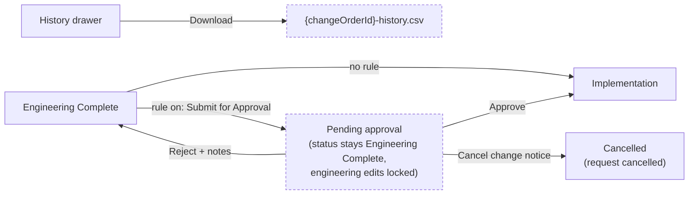

# Change Notice History Download and Approval Rules

> Status: implemented
> Author: Aashu
> Date: 2026-10-08

## TLDR

- The History drawer of a change notice gets a **Download** button. It exports the full history as a CSV file.
- Change notices become an **approval document type**. An admin sets a rule in Settings → Approval Rules.
- When a rule is on, **Engineering Complete → Implementation** needs approval. "Advance" becomes "Submit for Approval".
- While approval is pending, the change notice stays at Engineering Complete and engineering edits are locked.
- Approve moves the change notice to Implementation. Reject keeps it at Engineering Complete, with the approver's notes.
- No new change notice status. No change to other History drawers or to other approval document types.

## Overview diagram



## Problem Statement

1. **No export of change notice history.** The History drawer shows the audit log of one change notice. It shows only the newest 50 entries (`apps/erp/app/routes/api+/audit-log.ts:60`) and has no export. A quality or engineering user cannot give an auditor a record of who changed what on a change notice.
2. **No approval step for change notices.** Any user with `update` on `parts` can advance a change notice to Implementation. Purchase orders, quality documents and suppliers already have approval rules (`packages/ee/src/approvals/`). Change notices do not (`packages/notifications/src/index.ts:15` says "no approval flow in v1").

## Proposed Solution

### Part A: History download

1. `useAuditLog` and `AuditLogDrawer` get two optional props: `downloadable` (boolean) and `downloadName` (string, used in the file name). The default is off. `ChangeNoticeHeader` and the 5 item headers (part, tool, material, consumable, service) turn it on.
2. When `downloadable` is on and the feed shows at least one entry, the drawer header shows a **Download** button.
3. On click, the drawer fetches `/api/audit-log?entityType&entityId&companyId&all=true`.
4. The loader in `api+/audit-log.ts` reads `all=true`. It then pages through `getEntityAuditLog` in pages of 500, up to a cap of 10,000 entries. Without `all`, the loader keeps the current `limit: 50`.
5. The client builds one CSV row for each changed field (`buildAuditLogCsvRows`, `components/AuditLog/utils.ts`) and calls `downloadCsv` from `@carbon/files/csv`. This is the same encoder the shared Table export uses. It strips formula prefixes.
6. The file name is `{downloadName}-history-{YYYY-MM-DD}.csv`, for example `CN-000042-history-2026-10-08.csv`.

CSV columns (headers are Lingui-translated on the client):

| Column | Source |
|--------|--------|
| Date | `createdAt` (ISO 8601, UTC) |
| Changed By | `actorId` mapped to a name with `usePeople()`; `system` → "System"; unknown id → the raw id |
| Action | `operation` → Created / Updated / Deleted (same labels as the drawer) |
| Record | `getTableLabel(tableName)` (for example "Affected Item") |
| Record ID | `recordId` |
| Field | the diff key |
| Old Value | `diff[field].old` |
| New Value | `diff[field].new` |

Value rules: `null` and `undefined` become an empty cell. A string stays as it is. A number or boolean becomes its text. An object or array becomes JSON. Fields in `skipFields` are already removed by `sanitizeAuditEntries`. An entry with an empty diff gives one row with an empty Field, Old Value and New Value.

Access is the same as the drawer: `view: "settings"`, the `AUDIT_LOG` plan feature, and audit logging enabled for the company. The drawer already hides its feed in each of these cases, so the button does not show.

### Part B: Change notice approvals

#### Settings

1. Add `changeOrder` to `approvalDocumentType` (DB enum and `packages/ee/src/approvals/models.ts`). The label is "Change Notice".
2. `changeOrder` is amount-less. It is not in `approvalDocumentTypesWithAmounts`. A company has at most one change notice rule, the same as quality documents.
3. Settings → Approval Rules shows a fourth card, **Change Notices**, after Suppliers.

#### Submit (Engineering Complete → Implementation)

In `routes/x+/items+/change-notice+/$id.status.tsx`, if `fromStatus` is `Engineering Complete` and `toStatus` is `Implementation`:

1. Get the service role client.
2. If `hasPendingApproval(serviceRole, "changeOrder", id)` is true, flash "This change notice is already waiting for approval" and redirect.
3. If `isApprovalRequired(serviceRole, "changeOrder", companyId)` is false, continue with the current transition code.
4. Otherwise call `createApprovalRequest` with `documentType: "changeOrder"`, `documentId: id` and `requestedBy: userId`.
5. Trigger `notify` with `ApprovalRequested` to the rule's approvers (`getApproverUserIdsForRule`).
6. Do not change the status. Flash "Submitted for approval" and redirect.

#### Approve and reject

New route `routes/x+/items+/change-notice+/$id.approval.tsx` (action only, `update: "parts"`). It copies the quality document action (`routes/x+/quality-document+/$id.tsx:114-230`):

1. Validate `{ approvalRequestId, decision, notes }`.
2. Read the latest request for the change notice with the service role. Prove its id and `companyId` match the caller.
3. Check `canApproveRequest`. If false, flash an error.
4. Call `approveRequest` or `rejectRequest` with `getDatabaseClient()`.
5. Notify the requester with `ApprovalApproved` or `ApprovalRejected`, if the requester is not the approver.
6. If the decision is Approved, call `notifyChangeNoticeTransition` with the Implementation event. A normal advance to Implementation does the same.

Engine change in `packages/ee/src/approvals/service.ts`:

- `approveRequest`: add a `changeOrder` branch. It updates `changeOrder` to `status = 'Implementation'` where `id`, `companyId` match and `status = 'Engineering Complete'`. If no row changes, it throws, and the transaction rolls back.
- `rejectRequest`: no document change for `changeOrder` (the same as quality documents). The notes stay in `approvalRequest.decisionNotes`.

#### Pending requests when the change notice closes

- Engineering Complete → Cancelled: `$id.status.tsx` sets any pending `changeOrder` request to `Cancelled` with the service role. Any user with `update` on `parts` can cancel, the same as archiving a quality document (`quality-document+/update.tsx:144-190`). Do not use `cancelApprovalRequest`: it lets only the requester cancel (`service.ts:309`).
- Delete: `delete.$id.tsx` cancels any pending request before the delete, so no orphan request stays in approver lists.

#### Engineering edit lock while pending

Engineering edits are locked while a request is pending. Action tasks (workflow scope) stay editable.

- Server, `apps/erp/app/modules/items/items.server.ts`:
  - One helper, `getChangeNoticeEngineeringLock(changeNoticeId, status)`, returns the lock message or null: the closed / Implementation message from `canEditChangeNoticeEngineering`, else, at `Engineering Complete`, the waiting-for-approval message when `hasPendingApproval` (service role, because `approvalRequest` has no RLS policies) is true.
  - `requireChangeNoticeEditable` (scope `engineering`) and `checkRevisionLock` (`METHOD_LOCK_SOURCE` also selects `changeOrder(id)`) both call it.
  - The helper runs only when the status is `Engineering Complete`. Other statuses add no query.
- Message: "This change notice is waiting for approval. Engineering changes are locked until it is approved or rejected."
- UI: `$id.details.tsx`, `$id.$affectedId.details.tsx` and `ChangeNoticeExplorer.tsx` read `useChangeNoticeEngineeringLock` (`ui/ChangeNotice/lock-ui.tsx`), the UI half of the same helper, with a translated reason.

### Design Decisions

| Decision | Choice | Rationale |
|----------|--------|-----------|
| What "history" means | The audit-log History drawer of one change notice | No other change notice history exists. User answer, Q1. |
| Export format | CSV, one row for each changed field | Readable in a spreadsheet. The archive JSONL is for machines. User answer, Q1. |
| Where the CSV is built | Client, with `downloadCsv` | Same as the Table export precedent (`Table/components/Download.tsx`). Lingui headers and `usePeople()` names work only on the client. |
| Size of the export | All entries in the live log, cap 10,000 | The live log keeps 30 days (365 in a controlled environment). One change notice stays far below the cap. |
| Download scope | Change notices and the 5 item pages, through an opt-in prop | User answer, Q5; item pages added 2026-10-09. Other drawers can turn it on with one prop later. |
| Download access | Same as the drawer | No new access path to audit data. User answer, Q4. |
| Gated transition | Engineering Complete → Implementation | The engineering work is signed off before the shop floor acts on it. User answer, Q2. |
| Pending state | No new status; a pending request at Engineering Complete | No change to `changeOrderStatus`, the transition map or the progress bar. User answer, Q3. |
| Enum value name | `changeOrder` | Matches the DB table and the audit entity type. The UI label stays "Change Notice". |
| Amount tiers | None; at most one rule | A change notice has no money value. Same as quality documents. |
| Approve route | New `$id.approval.tsx` | The layout loader `$id.tsx` has no action today. The supplier precedent uses a separate `approval` route. |
| Approve permission | `update: "parts"` plus `canApproveRequest` | Same shape as quality documents (`update: "quality"` plus the rule check). |
| Lock scope while pending | Engineering scope only | The approver reviews the engineering content. Action tasks are workflow, not the content under review. |
| Withdraw a request | Not in v1 | The approver can reject, and the user can cancel the change notice. |
| Reopen after approval | A new advance needs a new approval | Implementation → Engineering Complete unlocks engineering edits, so the old approval no longer covers the content. |
| Card heading label | Lingui label map in the ERP card | `approvalDocumentTypeLabel` is plain English. New UI copy must be translatable. This also fixes the supplier delete-confirm name. |

## Data Model Changes

Two migrations. They add no table and no column.

- `20261008171101_change-order-audit-events.sql` (generated): sets `events: true` on `changeOrder`, `changeOrderActionTask`, `changeOrderAffectedItem` and `changeOrderSupersession`, so their changes reach the audit log.
- The approval document type migration below.

```sql
ALTER TYPE "approvalDocumentType" ADD VALUE 'changeOrder';
COMMIT;

-- Recreate "approvalRequests" from its current definition
-- (20260310005407_supplier-approvals.sql:78-109), with one new branch each:
--   documentReadableId:  WHEN ar."documentType" = 'changeOrder' THEN co."changeOrderId"
--   documentDescription: WHEN ar."documentType" = 'changeOrder' THEN co."name"
--   LEFT JOIN "changeOrder" co
--     ON ar."documentType" = 'changeOrder'
--    AND ar."documentId" = co."id"
--    AND ar."companyId" = co."companyId"
```

After the migration:

- Regenerate the generated DB types: `packages/database/src/types.ts` and `packages/database/src/swagger-docs-schema.ts`.
- Add `changeOrder` to the `except` map of `approvalRequestType` in `packages/database/src/datasets/validate.ts:251-256`. The seed does not create a change notice approval request.

## API / Service Changes

| File | Change |
|------|--------|
| `packages/ee/src/approvals/models.ts` | Add `changeOrder` to `approvalDocumentType` and `approvalDocumentTypeLabel`. |
| `packages/ee/src/approvals/service.ts` | `approveRequest`: `changeOrder` branch (compare-and-swap Engineering Complete → Implementation). `rejectRequest`: no document change. |
| `apps/erp/app/routes/api+/audit-log.ts` | `all=true` pages through all entries, up to 10,000. A failed read answers 500, so the download shows an error instead of saving an empty file. |
| `apps/erp/app/routes/x+/items+/change-notice+/$id.status.tsx` | Submit for approval (`openApprovalRequests`), after checking the stored status is still Engineering Complete. Cancel any pending request on Cancelled, and on a plain advance past the gate (the rule was turned off after the request was opened). |
| `apps/erp/app/routes/x+/items+/change-notice+/$id.approval.tsx` | New. Approve and reject action. |
| `apps/erp/app/routes/x+/items+/change-notice+/delete.$id.tsx` | Cancel the pending request before the delete. |
| `packages/ee/src/approvals/document.server.ts` | New, `@carbon/ee/approvals/document.server`: `getDocumentApprovalState`, `openApprovalRequests`, `cancelPendingApprovals`, `decideApprovalRequest`. Shared by change notices, quality documents and suppliers. |
| `apps/erp/app/routes/x+/items+/change-notice+/$id.tsx` | Loader returns `approval: DocumentApprovalState` (`getDocumentApprovalState`), only at Engineering Complete. |
| `apps/erp/app/modules/items/items.server.ts` | `getChangeNoticeEngineeringLock`, used by `requireChangeNoticeEditable` and `checkRevisionLock`. |
| `apps/erp/app/modules/items/items.models.ts` | `changeNoticeAwaitingApprovalMessage`. The form validator is the shared `approvalDecisionValidator` (`@carbon/ee/approvals`). |
| `apps/erp/app/utils/path.ts` | `path.to.changeNoticeApproval(id)`. |
| `apps/erp/app/routes/x+/settings+/approval-rules.tsx`, `approval-rules.new.tsx` | `changeOrderRules` bucket; `changeOrder` in the `?type` allow-list. |
| `packages/jobs/.../notifications/content.ts` | `changeOrder` text for the 3 approval events, with the readable id. |
| `apps/erp/app/routes/api+/link.ts` | `changeOrder` → `path.to.changeNoticeDetails(id)`; `supplier` → `path.to.supplier(id)` (it pointed at the action-only approval route). |
| `packages/notifications/src/index.ts` | Remove the "no approval flow in v1" comment. |

## UI Changes

- **History drawer** (`AuditLogDrawer.tsx`, `useAuditLog.tsx`): opt-in Download button in the header, with a loading state while the fetch runs.
- **ChangeNoticeHeader.tsx**:
  - At Engineering Complete with a rule on and no pending request: the primary button reads **Submit for Approval**.
  - With a pending request: a **Pending Approval** badge. The Advance button does not show.
  - With a pending request and `canApprove`: **Approve** and **Reject** buttons. Each opens the shared `ApprovalDecision` modal (`~/components/Modals/ApprovalDecision`, notes field).
  - At Engineering Complete, if the latest request is Rejected: an **Approval Rejected** badge. Its tooltip shows the notes and the decision date.
  - Turn on `downloadable` and pass `changeOrderId` as `downloadName`.
- **Settings → Approval Rules** (`ApprovalRules.ee.tsx`): a **Change Notices** card. It shows "New Rule" only when no rule exists.
- **ApprovalRuleCard.ee.tsx**: heading and delete-confirm name come from a Lingui label map for all 4 types.
- **Topbar `Notifications.tsx`**: approval links go by `documentType`: purchase order, quality document, supplier, change notice.
- All new copy uses Lingui (`t`, `Trans`, `msg`).

## Acceptance Criteria

Download:

- [ ] A user with `view` on `settings`, on a plan with Audit Log and with audit logging on, opens History on a change notice with 120 entries. The Download button shows. The CSV has rows for all 120 entries, not 50.
- [ ] An Updated entry that changed `status` and `dueDate` gives 2 rows, with old and new values in their own columns.
- [ ] The Changed By column shows the person's name, and "System" for system changes.
- [ ] A value that starts with `=` opens in a spreadsheet as text, not as a formula.
- [ ] The History drawer on a customer or supplier shows no Download button. The 5 item pages do show it.
- [ ] With audit logging off, the drawer shows the "not enabled" state and no Download button.

Approvals:

- [ ] Settings → Approval Rules shows a Change Notices card. An admin creates one rule with an approver. A second "New Rule" button does not show.
- [ ] With no rule, Advance to Implementation works as it does today.
- [ ] With a rule on, a user clicks Submit for Approval at Engineering Complete. The status stays Engineering Complete, a Pending Approval badge shows, and the approver gets a notification that opens the change notice.
- [ ] While pending, adding an affected item or editing a BOM line of an affected item fails with the waiting-for-approval message. Editing an action task works.
- [ ] A second submit while pending fails with "already waiting for approval".
- [ ] A user who is not an approver sees no Approve or Reject button. A direct POST to the approval route fails.
- [ ] The approver approves. The change notice moves to Implementation, the requester gets ApprovalApproved, and the Implementation stage notification goes out.
- [ ] The approver rejects with notes. The status stays Engineering Complete, the Approval Rejected badge shows the notes, edits unlock, and a new submit creates a new request.
- [ ] Cancelling or deleting a change notice with a pending request sets that request to Cancelled.
- [ ] Reopen from Implementation, then advance again: a new approval is needed.
- [ ] `pnpm db:check:datasets` passes.

## Risks

| Risk | Severity | Mitigation |
|------|----------|------------|
| History older than 30 days is not in the file (it is in the daily archives). | Low | Same window as the drawer. The archives stay downloadable in Settings → Audit Logs. |
| The pending check adds a service-role query to engineering mutations. | Low | It runs only when the status is Engineering Complete. |
| `ADD VALUE` in a transaction with later use of the value fails. | Med | Put `COMMIT;` after `ADD VALUE`, as `9034475a18` did for `supplier`. |
| An approver without `update` on `parts` cannot approve. | Low | Same shape as quality documents. The admin picks approvers who can edit parts. |
| A company with a rule has change notices pending at deploy time. | None | No request exists before the rule, and status values do not change. |

## Open Questions

> HARD STOP: Do not proceed with implementation until these are answered.

- [x] Q1. What does "download change notice history" export? — **Answer:** The History drawer of one change notice, as a CSV with all entries (not 50). Columns: when, who (name), action, record, field, old, new. One row for each changed field.
- [x] Q2. Which step needs approval? — **Answer:** Engineering Complete → Implementation, so the engineering work is signed off before the shop floor acts on it.
- [x] Q3. What does a pending change notice look like? — **Answer:** It stays at Engineering Complete with no new status. "Advance" becomes "Submit for Approval". While pending: a badge, engineering edits locked, Approve and Reject for approvers. Approve → Implementation. Reject → stays at Engineering Complete with notes.
- [x] Q4. Who can download? — **Answer:** The same users who can see the History drawer (`view` on `settings`, Audit Log plan feature, audit logging on).
- [x] Q5. Download on change notices only, or on all History drawers? — **Answer:** Change notices only, through an opt-in prop. The file covers the live log (30 days), the same as the drawer.

## Changelog

- 2026-10-08: Created. Q1–Q5 resolved with the user before writing.
- 2026-10-08: Implemented. The topbar approval link now also routes supplier requests correctly (same ternary).
- 2026-10-09: Quality documents and suppliers moved onto the same shared approval helpers (state, bulk open, bulk cancel with a requester-or-approver guard, decide), the shared modal and the shared validator. Their own context builders, modals, validators and `purchasing.server.ts` are deleted. Purchase orders keep their amount-tiered flow. Behavior change: a supplier approval request is refused when no supplier rule is enabled (it used to create a request with no approvers).
- 2026-10-09: Scope widened at the user's request: the History drawer on the 5 item pages (part, tool, material, consumable, service headers) also offers Download, file name `{readableIdWithRevision}-history-{date}.csv`. Other History drawers stay without it.
- 2026-10-09: Review refactor. The approval lifecycle moved into shared `@carbon/ee/approvals/document.server` helpers (`getDocumentApprovalState`, `openApprovalRequests`, `cancelPendingApprovals`, `decideApprovalRequest`), plus one `approvalDecisionValidator` and one `ApprovalDecision` modal. The change notice code is now wiring only. One engineering-lock helper backs both server guards, and one hook backs the UI.
- 2026-10-08: Browser test found that change notice history was always empty: the 4 change notice tables had no `events: true` in `packages/database/src/event-system/attachments.ts`, so no change reached the audit log. With the user's approval, this branch adds them (migration `20261008171101_change-order-audit-events.sql`, generated by `authz migration`). Browser walk-through passed.
- 2026-10-09: Self-review fixes. The status route checks the stored status before it opens a request, and cancels a stale pending request on a plain advance. The `all=true` audit-log read answers 500 on failure. The CSV rows come from the pure `buildAuditLogCsvRows` (unit-tested), which no longer re-filters skip fields (`sanitizeAuditEntries` already does). Supplier approval links (topbar and `api+/link.ts`) go to the supplier page.
