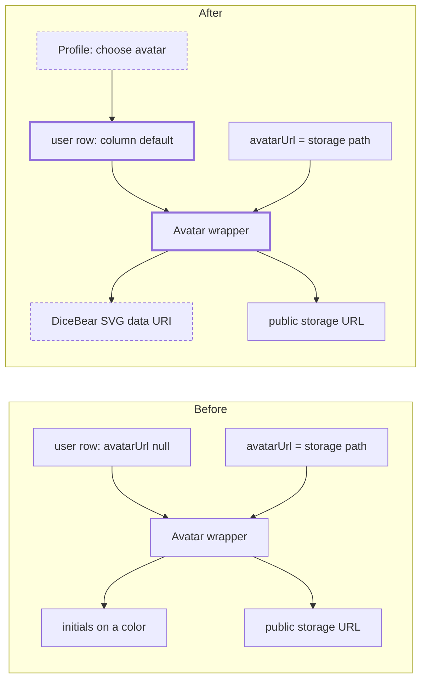

# Generated avatars (DiceBear)

> Status: in-progress
> Author: naveenkash
> Date: 2026-10-08

## TLDR

Each new user gets a random generated avatar in the DiceBear "Croodles
Neutral" style. On the profile page, a user can choose one of 10 DiceBear
styles and pick an avatar in it, or upload a photo as before. `user.avatarUrl`
holds either a storage path (an uploaded photo) or a generated-avatar value
(`dicebear:<style>:<seed>`, with an optional `:<rrggbb>` background). A column default creates the value, so
every path that inserts a `user` row gets an avatar with no app code. The
avatar renders in the browser from the bundled DiceBear library. No request
goes to a third party.

## Overview diagram



## Problem Statement

A user without an uploaded photo shows initials on a colored circle. Most users
never upload a photo, so lists of people look the same and give no visual
identity. The request is:

1. Each new user gets a random avatar automatically.
2. A user can choose a different generated avatar.
3. A user can still upload a photo, as before.
4. New users get DiceBear "Croodles Neutral".
5. The user can choose from 10 styles: Croodles Neutral, Notionists,
   Notionists Neutral, Lorelei, Lorelei Neutral, Loops, Pixel Art, Voxel Art,
   Voxel Bot and Planets.

## Proposed Solution

### How a value is stored

`user.avatarUrl` keeps its type (`TEXT`, nullable). It now holds one of 3
values:

| Value | Example | Meaning |
|-------|---------|---------|
| A storage path | `5f0c…e1.webp` | An uploaded photo in the public `avatars` bucket (no change) |
| A generated-avatar value | `dicebear:croodles-neutral:0b6f…9a` | An avatar in that style from that seed. The style is one of `GENERATED_AVATAR_STYLES` |
| A generated-avatar value with a background | `dicebear:voxel-art:0b6f…9a:1e3a8a` | The same, on that background color (lowercase hex, no `#`). Without the segment the style uses its own background |
| `NULL` | — | An existing user with no avatar. Initials show, as before |

A storage path never contains `:`, because the upload names the file
`${userId}.${ext}`. So the prefix `dicebear:` cannot collide with a path.

### Where the code lives

| Unit | Location | Job |
|------|----------|-----|
| `GENERATED_AVATAR_STYLES`, `parseGeneratedAvatar`, `isGeneratedAvatar`, `newGeneratedAvatar(style?)`, `isAllowedAvatarValue` | `packages/utils/src/avatar.ts` (exported from `@carbon/utils`) | Pure string helpers. Server and client code use them. No DiceBear import |
| `STYLE_LOADERS`, `loadGeneratedAvatarStyle`, `generatedAvatarDataUri`, `useGeneratedAvatar`, `generatedAvatarClassName` | `packages/react/src/utils/generatedAvatar.ts` | Loads the DiceBear core and each style's JSON definition as separate chunks on first use. Renders `new Avatar(style, { seed }).toDataUri()` and caches the result per value. Picks the image classes per style |
| `Avatar` | `packages/react/src/Avatar.tsx` | If `src` is a generated-avatar value, renders the data URI. Shows a plain circle while the style loads |
| `GeneratedAvatarPicker` | `apps/erp/app/modules/account/ui/Profile/GeneratedAvatarPicker.tsx` | Modal with a style `Select`, a grid of generated options, a Shuffle button and the credit for the selected style. Each option is an `Avatar` with the value as `src`, so the `@carbon/react` barrel does not change |
| `avatarSrc` + app `Avatar` wrappers | `packages/utils/src/avatar.ts`, `apps/{erp,mes,academy}/app/components/Avatar.tsx` | `avatarSrc` passes a generated-avatar value through as `src` and turns a storage path into a URL. The 3 wrappers call it |

### Rendering options

`generatedAvatarDataUri` passes the `seed` to DiceBear. If the value has a
background, it also passes `backgroundColor`. If that background is dark
(`isDarkBackground`, by WCAG contrast), the 3 styles that draw lines straight
onto the background (Croodles Neutral, Notionists Neutral, Lorelei Neutral) get
white ink, so the face stays visible. Notionists and Lorelei paint a white face
first and need no change. A background never changes the face. Rendered
avatars sit in one cache, capped at 300 and evicted least recently used,
because a drag in the color picker makes a new value at each step.

A style definition is 10 KB to 370 KB of JSON, and `Avatar` renders on every
page. So `STYLE_LOADERS` imports each style with a dynamic `import()`, and the
bundler makes each one a separate chunk. The browser fetches a style the first
time it shows an avatar in that style. The DiceBear core (about 25 KB gzipped)
loads the same way, with the first style, so a page with no generated avatar
downloads none of it.

`useGeneratedAvatar` reads the state through `useSyncExternalStore`:

| State | When | `Avatar` shows |
|-------|------|----------------|
| `loading` | The server render, and the browser until the style arrives | A plain `bg-muted` circle. The initials do not flash |
| `ready` | The style is loaded | The data URI |
| `failed` | The style chunk did not load | The initials. The next avatar that mounts tries the load again |

The 10 styles fall into 2 groups. `generatedAvatarClassName` picks the classes:

| Group | Styles | Classes on the image | Light theme | Dark theme |
|-------|--------|----------------------|-------------|------------|
| Line art | Croodles Neutral, Notionists, Notionists Neutral, Lorelei, Lorelei Neutral | `bg-white border-black/10` | Black lines on white | Black lines on white |
| Color | Loops, Pixel Art, Voxel Art, Voxel Bot, Planets | `bg-muted border-transparent` | The style's own colors | The style's own colors |

Line-art avatars stay light in both themes (user request). Pixel Art has no
background of its own, so it shows on `bg-muted`.

### Design Decisions

| Decision | Choice | Rationale |
|----------|--------|-----------|
| Source of the artwork | Bundled `@dicebear/core@10.7.0` + `@dicebear/styles@10.6.0` in `@carbon/react` | User answer. Works on self-hosted, offline and controlled-environment installs. No user data goes to a third party |
| DiceBear major version | 10, pinned exactly | Loops, Voxel Art, Voxel Bot and Planets exist only in version 10. A new major version can give a different face for the same seed, so the versions are exact, not ranges. `@dicebear/core@10` needs Node 22, which every workflow in the repo uses |
| Style list | Only ever add to `GENERATED_AVATAR_STYLES` | A removed style makes its existing values unparseable, and those avatars fall back to initials. The `Record` type of `STYLE_LOADERS` makes a style without a loader a type error |
| Where the value is stored | In `user.avatarUrl` with the `dicebear:` prefix | 26 migrations put `avatarUrl` into views and RPCs. A new column would need a change to each of them. The prefix needs none |
| How a new user gets a value | Column default on `user.avatarUrl` | One place covers all 6 insert paths: the `create_public_user` trigger, invites, console operators, `migrateUserToSso`, seed and bootstrap |
| Seed of the default | `gen_random_uuid()::text` | The request is a random avatar. A random seed does not reveal the user id. The client uses `crypto.randomUUID()` for the same format |
| Existing users | No backfill | User answer. They keep initials until they choose an avatar |
| Remove photo | Save a new random generated-avatar value | User answer. Every user who touches the profile ends with an avatar |
| Delete of the replaced photo | The profile action deletes the old upload AFTER it saves the new value. It deletes only a path that `isOwnAvatarUpload` accepts and that differs from the new value | If the save fails, `avatarUrl` still points at a file that exists. A failed delete only leaves an orphan file, so the action logs it. The same step also removes an old upload with a different file extension |
| Server check of the value | The `photo` intent accepts only a value that `isAllowedAvatarValue(userId, value)` accepts: a generated-avatar value, or `${userId}.<ext>` with no `/` | Today the action stores any string. The new check stops a user from storing a path to another user's file. Unit tests pin the helper |
| License credit | The picker shows the selected style's source, artist and license, with links | Croodles is CC BY 4.0, which requires attribution. The 9 other styles are CC0 1.0 and get the credit as a courtesy. The text comes from each style's DiceBear `meta`, so the ERP needs no DiceBear import |
| Invite upserts | Remove `avatarUrl: null` from `createUser` and `createConsoleOperator` | The upsert runs after the trigger. With `null` it overwrites the default |
| Multi-tenancy | No change | `user` is not company-scoped. No new table |
| RLS | No change | The "Users can modify themselves" UPDATE policy already covers `avatarUrl` |
| Service shape | `updateAvatar` keeps `client` first and returns `{ data, error }` | No new service function |
| Form pattern | No `ValidatedForm` | The photo intent is a `useSubmit` post today. The picker posts the same intent |
| Backward compatibility | `avatarUrl` keeps its type. Old storage paths render as before | Callers that pass `avatarUrl` as a raw `src` start to show generated avatars. Uploaded photos at those callers still fail to load, as today |

## Data Model Changes

One migration. It changes only the column default. It writes no rows.

```sql
ALTER TABLE "user"
  ALTER COLUMN "avatarUrl"
  SET DEFAULT 'dicebear:croodles-neutral:' || gen_random_uuid()::text;
```

The generated types do not change, because `avatarUrl` is already nullable and
optional on insert.

## API / Service Changes

- `apps/erp/app/routes/x+/account+/profile.tsx`, `intent=photo`: reject a
  missing `path`. Accept the path only if `isGeneratedAvatar(path)` is true or
  the path starts with `${userId}.`. Else flash "Invalid avatar path".
- `apps/erp/app/modules/users/users.server.ts`: `createUser` and `insertUser`
  take `Omit<User, "fullName" | "avatarUrl">`. The 3 invite calls and
  `createConsoleOperator` stop passing `avatarUrl: null`.

## UI Changes

Profile page, `ProfilePhotoForm` (`apps/erp/app/modules/account/ui/Profile/`):

| Control | Shows when | Action |
|---------|------------|--------|
| Avatar preview | Always | Renders the current value |
| Upload / Change | Always | No change: crop, upload, save the path |
| Choose avatar | Always | Opens a `Modal` with `GeneratedAvatarPicker`. Save submits the selected value |
| Remove | The value is an uploaded photo | Submits `newGeneratedAvatar()`. The action deletes the photo after the save |

`GeneratedAvatarPicker` opens on the style of the current value, or on Croodles
Neutral. A `Select` above the grid changes the style and deals 12 new options in
it. The options show in a 4-column grid. In the current value's style, the
first option is the current value. Shuffle replaces the other options with new
random seeds. A Background row (the ERP `ColorPicker`, empty = "Style
default", with a Reset button) sets one color for the whole grid. The
selected option has a ring. The credit line for the selected
style is under the grid.

## Acceptance Criteria

- [ ] After the migration, `INSERT INTO "user" ("id","email","firstName","lastName","about") VALUES (…)` gives a row whose `avatarUrl` starts with `dicebear:croodles-neutral:`.
- [ ] A new user from an employee invite has a `dicebear:croodles-neutral:` value after `createEmployeeAccount` returns.
- [ ] A user with a generated-avatar value sees a Croodles avatar in the ERP top-right menu, in the people lists and in the MES user menu.
- [ ] A user with an uploaded photo still sees the photo in the ERP.
- [ ] On the profile page, Choose avatar → select an option → Save shows the new avatar after the redirect.
- [ ] On the profile page, Remove on an uploaded photo deletes the file from the `avatars` bucket and shows a generated avatar.
- [ ] A post of `intent=photo` with `path=someone-else.webp` flashes "Invalid avatar path" and does not change the row.
- [ ] An existing user with `avatarUrl` `NULL` still sees initials.
- [ ] `packages/utils` unit tests cover `isGeneratedAvatar`, `parseGeneratedAvatar` and `newGeneratedAvatar`.
- [ ] `packages/react` unit tests show that `generatedAvatarDataUri` returns the same data URI for the same value and a `data:image/svg+xml` prefix.
- [ ] A `packages/react` unit test loads and renders each of the 10 styles from `@dicebear/styles`.
- [ ] A unit test of the profile action shows the save runs before the delete of the replaced upload, and a failed save deletes nothing.
- [ ] In the picker, a change of style shows 12 avatars in the new style, and Save stores a `dicebear:<style>:<seed>` value.

## Risks

| Risk | Severity | Mitigation |
|------|----------|------------|
| A list with many avatars generates many SVGs | Low | A module-level cache keys each data URI by value, so each value generates once per page load |
| A large style definition slows the first page | Low | Each style is its own chunk, fetched only when an avatar in that style shows. Notionists is the largest at 370 KB of JSON |
| The DiceBear core enlarges every page | Med | `Avatar` is in every app shell, and the core is about 25 KB gzipped. It is never imported statically: it loads with the first style (`import()`). A split bundle shows the renderer entry at 2.5 KB |
| Non-React code reads `avatarUrl` as a storage path | Low | A repo search finds no non-React reader. The Jira type and the workflow catalog list only the column name |
| An invite of an existing user overwrites the avatar | Low | `createUser` runs only on the new-user branch, and no longer sends `avatarUrl` |
| CC BY 4.0 credit missing | Med | The picker shows the credit. Self-review checks it |
| The default runs inside the GoTrue transaction | Low | `gen_random_uuid()` is built in and cannot fail |

## Open Questions

- [x] Should the avatar art come from the bundled library or the HTTP API? — **Answer:** the bundled library (user). This approves the 2 new production dependencies.
- [x] Do existing users with no avatar get a generated avatar? — **Answer:** no backfill. Only new users (user).
- [x] What does Remove do on an uploaded photo? — **Answer:** it saves a new random generated avatar (user).
- [x] Which pipeline mode? — **Answer:** fully autonomous, spec → plan → execute → self-review, no browser test (user).
- [x] Can a user set the background color? — **Answer:** yes, with a color picker; the default stays each style's own background (user).
- [x] Which styles can a user choose? — **Answer:** Croodles Neutral, Notionists, Notionists Neutral, Lorelei, Lorelei Neutral, Loops, Pixel Art, Voxel Art, Voxel Bot and Planets (user). New users keep Croodles Neutral.

## Changelog

- 2026-10-08: Spec written. All 4 questions answered by the user before writing.
- 2026-10-08: Background changed from 5 pastel colors to a color that contrasts with the theme: black on the light theme, white on the dark theme (user request). The `Avatar` component applies it with CSS.
- 2026-10-08: Self-review fixes. The action saves the new value, then deletes the replaced upload (it was the client, before the save). `isAllowedAvatarValue` and `isOwnAvatarUpload` moved into `@carbon/utils` with tests. `Avatar` retries a new `src` after an earlier one failed. The 5 picker strings are in the 13 `erp.po` catalogs.
- 2026-10-08: Style select added (user request): 10 styles. DiceBear moved from version 9 to 10, because 4 of the styles exist only in version 10. Each style loads as its own chunk. Line-art styles keep the theme invert; color styles keep their colors.
- 2026-10-08: Line-art avatars no longer invert on the light theme (user request). They are black lines on white in both themes.
- 2026-10-08: Background color picker added (user request). The value gains an optional `:<rrggbb>` segment; old values still parse. The avatar cache is now a capped LRU.
- 2026-10-08: Self-review 3 fixes. The DiceBear core loads with the first style, not on every page. `generatedAvatarClassName` and `avatarSrc` replace inline logic and have tests. The profile action has a test for the save-then-delete order. Two lessons added to `.ai/lessons.md`.
- 2026-10-08: Implemented (uncommitted). The picker lives in the ERP account module. The account reference doc (`docs/content/docs/reference/account.mdx`) describes the new Photo behavior.
