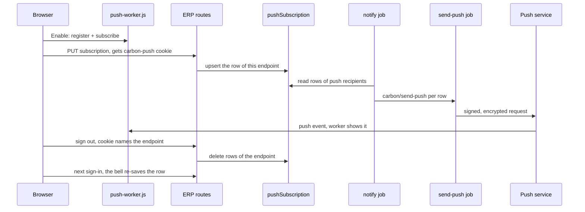
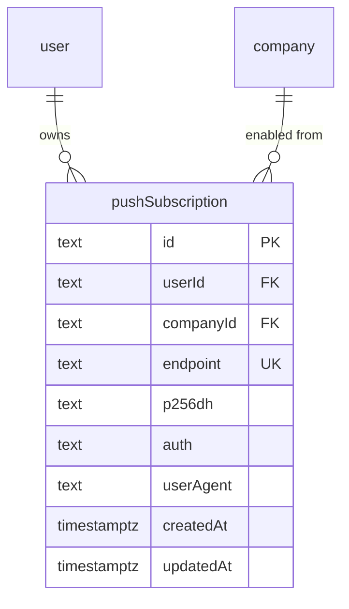

# Push notifications in the browser (Web Push)

> Status: in-progress
> Author: Claude
> Date: 2026-10-08

## TLDR

Carbon shows a notification only in the ERP bell, by email or by Slack. If no Carbon tab is open, the user sees nothing until they open the app or read their mail. This spec adds a fourth channel: **push**.

Push uses the Web Push standard to show an operating-system notification, even when every Carbon tab is closed. Browser notifications are a setting of the **browser**, not of a user. Once someone enables them in a browser, whoever is signed in there gets their own notifications, from every company they belong to. Signing out stops them at once. Like the in-app bell, push has no per-topic switch: every notification pushes.

The `notify` job sends one push for each notification it creates. The job uses the `web-push` package and one VAPID key pair for each deployment. If the deployment has no VAPID keys, Carbon hides the controls and sends no push.

## Overview diagram



## Problem Statement

1. The `notify` job (`packages/jobs/src/inngest/functions/notifications/notify.ts`) had 3 channels: in-app, email and Slack.
2. The in-app channel reaches the user only while an ERP tab is open. `useNotifications` listens on the realtime topic `user:<userId>:notification`.
3. Email is a paid feature (`EMAIL_NOTIFICATIONS`, Business and Partner plans). On other plans, a user with no ERP tab open gets no signal at all.
4. A planner who closes the browser at the end of a shift misses an approval request or a job assignment until the next login.

Before this change, no code in `apps/` or `packages/` called the Notification API, the Push API or `navigator.serviceWorker`. The file `apps/erp/public/serviceWorker.js` exists, but no code registers it.

## Proposed Solution

### How Web Push works in Carbon

1. Each deployment has one VAPID key pair in 3 env vars: `VAPID_PUBLIC_KEY`, `VAPID_PRIVATE_KEY` and `VAPID_SUBJECT`.
2. The user clicks **Enable** on the bell's "Enable browser notifications" row or on the **Browser notifications** card at Account → Notifications.
3. The browser asks for permission to show notifications.
4. The page registers the service worker `/push-worker.js` and calls `pushManager.subscribe()` with the VAPID public key.
5. The browser returns a subscription: an endpoint URL and 2 keys (`p256dh`, `auth`).
6. The page sends the subscription with `PUT /api/push-subscription`.
7. The route saves one `pushSubscription` row for this endpoint, owned by the signed-in user.
8. The route sets the signed `carbon-push` cookie, which holds the endpoint.
9. The page sets `browserNotificationsEnabled` in localStorage: browser notifications are now on for this browser.
10. Later, the `notify` job finds the push recipients and their `pushSubscription` rows, and sends one `carbon/send-push` event per row.
11. The `send-push` job signs and encrypts the payload with `web-push` and posts it to the endpoint.
12. The push service sends the payload to the browser, where `push-worker.js` shows the notification.
13. When the user clicks the notification, the worker focuses an open Carbon tab or opens a new one at the notification's link.

### Sign-out and the next sign-in

1. Every sign-out path calls `clearAuthCookies` (`@carbon/auth`): the explicit sign-out, a forced sign-out and an expired session on the login page.
2. `clearAuthCookies` reads the `carbon-push` cookie, deletes every row of that endpoint and clears the cookie. Pushes for the user who left stop at once.
3. The browser keeps its permission, its subscription and the `browserNotificationsEnabled` flag.
4. When the next user signs in, `useRestoreBrowserNotifications` runs from the always-mounted bell, once per tab and user.
5. If permission is granted and the flag is set, it saves the browser's subscription for the user signed in now, with no prompt.
6. The new user only ever gets their own notifications: `notify` sends a push to the owner of the row and nobody else.

### Which notifications push

Push mirrors in-app. If the VAPID env vars are set (`isPushConfigured()`), every recipient of the in-app row gets a push in each browser where notifications are on. There is no topic filter and no event filter. So `IntegrationSync`, which fires again on each sync sweep while failures last, also pushes each time.

`notify` reads subscriptions by `userId` only. The step `resolve-recipients` already limits the recipients to members of the notification's company. So a user gets the push of every company they belong to, and a company switch does not silence the browser.

A digest from `notify` (more than one item) sends one push with the digest's `description`. The cron job `notification-digest` sends no push, because it only rolls up rows that `notify` already delivered.

### Payload

| Field | Value |
|---|---|
| `title` | `getNotificationEmailHeading(event)`, for example "Job assigned to you". A workflow notification uses its author's subject (the `description`). |
| `body` | the notification `description`, for example "Job J00105 assigned to you". A workflow notification uses its author's message, with each `[label](url)` reduced to its label. |
| `url` | `buildNotificationLink(event, documentId, companyId, documentType)`; `/api/link` switches the company first |
| `tag` | `` `${event}:${primaryDocumentId}` ``; the worker closes an older notification with the same tag before it shows the new one |

`web-push` encrypts the payload end to end (`aes128gcm`). The push service cannot read it.

### Design Decisions

| Decision | Choice | Rationale |
|----------|--------|-----------|
| Plan gating | None. Push is free on all plans. | Agreed with the user. Push is another view of the in-app notification, and the bell is free. |
| Library | `web-push` in `@carbon/jobs` | Agreed with the user. It does VAPID signing and payload encryption, which are easy to get wrong by hand. |
| Apps | ERP only | Agreed with the user. MES has no notification UI. |
| Channel name | "push" in code; "browser notifications" in the UI | "Browser notifications" is the word a user understands. |
| Per-topic switch | None. Push is not a `NotificationDestination` or a `NotificationPreferenceChannel`. | Agreed with the user: push mirrors in-app, which has no switch either. |
| Setting scope | A setting of the browser, not of a user | Agreed with the user. A shared computer gives each signed-in person their own notifications without a new opt-in. Browser permission is per site and browser too. |
| Subscription rows | One row per endpoint (`UNIQUE ("endpoint")`), owned by the signed-in user. `companyId` is the company the user enabled it from. | One browser has one endpoint, so one owner at a time. `companyId` keeps tenant attribution and the RLS member check. |
| Companies | The user gets the push of every company they belong to | Agreed with the user. `resolve-recipients` already drops non-members. |
| Table shape | `id` from `xid()`, single-column PK, no audit columns | Same shape as `notificationPreference` and `userModulePreference`: a user-owned preference row. |
| RLS | Owner and company member, the same rule as `notificationPreference` | The user reads and writes only their own rows. The jobs and the sign-out cleanup use the service role. |
| Same browser, new user | On save, the route deletes the rows of OTHER users with the same endpoint (service role) | Only the user signed in now may own the browser's row. |
| Sign out | `clearAuthCookies` deletes the rows of the endpoint in the signed `carbon-push` cookie | Agreed with the user: signing out stops pushes on every path, not only the Sign Out button. |
| Next sign-in | `useRestoreBrowserNotifications` saves the browser for the new user with no prompt, while `browserNotificationsEnabled` is set | Agreed with the user. The setting belongs to the browser. |
| Status check | `GET /api/push-subscription?endpoint=` is read-only | Opening a page never claims the browser. Only **Enable** and the sign-in restore save a row. |
| The soft ask | The bell's inbox shows "Enable browser notifications" while nobody has enabled them in this browser | The native prompt opens only from a click, so a user who is not interested says no to Carbon, not to the browser. A browser "Block" is close to permanent. |
| Prompt snooze | **Not now** hides the row for 30 days in this browser; a second **Not now** or a **Disable** hides it for good | The row must not nag. Account → Notifications always keeps the setting. |
| Disable | Off for this browser, for everyone who uses it | The setting belongs to the browser. |
| Which events push | Every notification, like in-app | Agreed with the user. In-app-only events push too, including the repeated `IntegrationSync` alert. |
| Digests | One push per `notify` call; no push from the digest cron | Agreed with the user. The cron only regroups delivered rows. |
| Missing VAPID keys | No push channel, no card, no bell row | Agreed with the user. A self-hosted install without keys keeps working. |
| Dead subscription | `send-push` deletes the row on HTTP 404 or 410 | Agreed with the user. Both codes mean that the subscription is gone for good. |
| Retries | Retry on 429 and 5xx; no retry on other 4xx | A 4xx other than 404, 410 and 429 is a bad request, and a retry fails again. |
| Delivery options | `TTL` = 86 400 s (1 day), `urgency` = `normal` | A notification older than 1 day is old news. The bell still has it. |
| Fan-out shape | `notify` sends one `carbon/send-push` event per subscription row | Same pattern as `carbon/send-email` and `carbon/send-slack`. Each browser retries on its own. |
| Service worker | New file `apps/erp/public/push-worker.js`, scope `/`; the old `serviceWorker.js` stays unregistered | The old file caches logos and avatars, and that behavior was never live. |
| Worker updates | `skipWaiting()` on install and `clients.claim()` on activate | The worker caches nothing, so a new version can take over at once. |
| Repeated pushes | The worker never passes `tag` to `showNotification`. It closes older notifications with the same `data.tag`, then shows the new one under a fresh identifier. | The browser gives the tag to macOS as the identifier, and macOS replaces a notification with the same identifier silently. `renotify` does not help. |
| Rotated subscription | The worker handles `pushsubscriptionchange`. It subscribes again and sends the new subscription with the old endpoint. | A browser can rotate the subscription at any time. Without this step, push stops with no signal. |
| Focused tab | The worker always shows the notification | Chrome requires a visible notification for each push (`userVisibleOnly: true`). |
| VAPID public key in the browser | The settings loader and the app shell loader (`pushPublicKey`) return it. It is not in `window.env`. | The server already knows if all 3 vars are set, and returns `null` when they are not. |
| MCP exposure | The new service functions have no `@mcp` tag | A browser subscription is meaningless to an API caller (`conventions-services.md`). |
| Env group | New group `push` in `FEATURES`, with all 3 vars `needed` | `validateEnv` then warns when push is half-configured. |

## Data Model Changes

1. A new table, `pushSubscription`, one row per endpoint (migration `20261008002726`).
2. A wider CHECK on `notificationPreference.channel`: `('email', 'slack', 'push')`. No code writes `push` since the per-topic switch was removed; the value stays allowed and unused.
3. A new rule in `packages/database/src/authz/manifest.ts`, and the generated authz migration `20261008002814`. No migration holds a `CREATE POLICY`.



The table:

```sql
CREATE TABLE "pushSubscription" (
  "id" TEXT NOT NULL DEFAULT xid(),
  "userId" TEXT NOT NULL,
  "companyId" TEXT NOT NULL,
  "endpoint" TEXT NOT NULL,
  "p256dh" TEXT NOT NULL,
  "auth" TEXT NOT NULL,
  "userAgent" TEXT,
  "createdAt" TIMESTAMPTZ NOT NULL DEFAULT now(),
  "updatedAt" TIMESTAMPTZ NOT NULL DEFAULT now(),

  CONSTRAINT "pushSubscription_pkey" PRIMARY KEY ("id"),
  CONSTRAINT "pushSubscription_userId_fkey" FOREIGN KEY ("userId") REFERENCES "user"("id") ON DELETE CASCADE ON UPDATE CASCADE,
  CONSTRAINT "pushSubscription_companyId_fkey" FOREIGN KEY ("companyId") REFERENCES "company"("id") ON DELETE CASCADE ON UPDATE CASCADE,
  CONSTRAINT "pushSubscription_endpoint_key" UNIQUE ("endpoint")
);

ALTER TABLE "pushSubscription" ENABLE ROW LEVEL SECURITY;

CREATE INDEX "pushSubscription_userId_companyId_idx"
  ON "pushSubscription" ("userId", "companyId");
CREATE INDEX "pushSubscription_companyId_idx"
  ON "pushSubscription" ("companyId");
```

Manifest rule (same as `notificationPreference`):

```ts
pushSubscription: policies({
  select: and(owner("userId"), member("companyId")),
  insert: and(owner("userId"), member("companyId")),
  update: { using: owner("userId"), check: and(owner("userId"), member("companyId")) },
  delete: and(owner("userId"), member("companyId"))
}),
```

The table holds no business data, so the demo datasets need no change. `wipe.ts` finds tables by their `companyId` column. `pnpm db:check:backups` passes.

## API / Service Changes

### `@carbon/notifications`

No change to the destinations or the preference channels. Push is neither a `NotificationDestination` nor a `NotificationPreferenceChannel`: it mirrors in-app.

### `@carbon/env`

1. Add `VAPID_PUBLIC_KEY` (`needed`), `VAPID_PRIVATE_KEY` (`secret`, `needed`) and `VAPID_SUBJECT` (`needed`; its `type` requires `mailto:` or `https://`) in the new group `push`.
2. Export the 3 values and `isPushConfigured()`. It returns true only when all 3 are set.

### `@carbon/lib`

1. Add the event `"carbon/send-push"` to `Events` with `data: { subscriptionId, userId, companyId, title, body, url, tag }`. `userId` is the recipient, and `companyId` is the notification's company.
2. Add `"send-push": "carbon/send-push"` to the `trigger` map.

### `@carbon/auth`

1. `session.server.ts` exports `pushEndpointCookie`: the signed, `httpOnly` cookie `carbon-push`, on the session cookie's domain, with a 400-day `maxAge`.
2. `clearAuthCookies` reads the cookie. If it holds an endpoint, it deletes every `pushSubscription` row of that endpoint with the service role, then clears the cookie.
3. The service-role client loads inside that cleanup, not at module load, so importing the session module builds no Supabase client.
4. If the delete fails, sign-out still succeeds and the error goes to the log. The next 404 or 410 removes the row.

### `@carbon/jobs`

1. Add `web-push` (and `@types/web-push` as a dev dependency).
2. Change `notify.ts`:
   1. Compute `wantsPush`: `isPushConfigured()`. The step `filter-recipients-by-preference` stays as it was: it filters email and Slack only.
   2. Add the step `resolve-push-subscriptions`. It reads the `pushSubscription` rows of every recipient (`userIds`, the same list as the in-app rows), and builds one `carbon/send-push` event per row, with the row's `userId`.
   3. Send the events with `step.sendEvent("fan-out-push", …)`.
3. Add `send-push.ts` (function id `send-push`, 3 retries):
   1. Read the row by `subscriptionId` and `userId` with the service role. If no row matches, return: the browser was disabled, signed out or handed to another user since the fan-out.
   2. Call `webpush.sendNotification` with the VAPID details, `TTL: 86400` and `urgency: "normal"`.
   3. If the status is 404 or 410, delete the row and return.
   4. If the status is 429 or 5xx, throw, so that Inngest retries.
   5. For any other error, throw `NonRetriableError`.
   6. Put the status code on the step output, so the run record shows it.
4. Register `sendPushFunction` in `packages/jobs/src/inngest/index.ts`.
5. Put the error-to-action mapping in the pure function `pushDeliveryOutcome(statusCode)`, with a unit test.

### ERP

1. `account.models.ts`:
   1. Add `pushSubscriptionValidator`: `{ endpoint: url, keys: { p256dh, auth }, oldEndpoint?: url }`, and `pushSubscriptionEndpointValidator`: `{ endpoint: url }`.
2. `account.service.ts`, with no `@mcp` tag:
   1. `getPushSubscription(client, { userId, endpoint })`
   2. `upsertPushSubscription(client, { userId, companyId, endpoint, p256dh, auth, userAgent })`, `onConflict: "endpoint"`
   3. `deletePushSubscription(client, { userId, endpoint })`
3. The resource route `apps/erp/app/routes/api+/push-subscription.ts`, gated by `requirePermissions(request, {})`. If push is not configured, `GET` returns `{ enabled: false }` and every write returns 404.
   1. `GET ?endpoint=`: return `{ enabled }` for the signed-in user. If the row exists, set the `carbon-push` cookie again, so a row saved before the cookie existed still ends at sign-out.
   2. `PUT`: validate the body. If `oldEndpoint` is set, delete that row. Delete the rows of other users with the same endpoint (service role). Upsert the row. Set the `carbon-push` cookie.
   3. `DELETE`: delete the row of this user and endpoint. Clear the cookie.
4. The app shell loader (`x+/_layout.tsx`) returns `pushPublicKey`, which is `null` when push is not configured.

## UI Changes

### `apps/erp/public/push-worker.js` (new)

1. `install`: `skipWaiting()`. `activate`: `clients.claim()`.
2. `push`: parse the JSON payload. If it has a `tag`, close the shown notifications whose `data.tag` matches. Call `showNotification(title, { body, icon: "/carbon-mark-dark.png", data: { url, tag } })`.
3. `notificationclick`: close the notification. Find a window client on the same origin, then focus it and navigate it to `data.url`. If no client exists, call `clients.openWindow(data.url)`.
4. `pushsubscriptionchange`: take `event.newSubscription`, else the registration's current subscription, else subscribe again with the old subscription's key. If none exists, stop. `PUT /api/push-subscription` the result, with `oldEndpoint` only when an old subscription exists.

The icon is `/carbon-mark-dark.png`, the file that the ERP's `site.webmanifest` names.

### `apps/erp/app/utils/push.ts` (new)

1. `urlBase64ToUint8Array`: converts the base64url public key for `pushManager.subscribe()`.
2. The bell row's snooze: `parsePromptDismissal`, `isPromptSnoozed`, `nextPromptDismissal`, `readPromptDismissal` and `dismissBrowserNotificationsPrompt`. They keep `browserNotificationsPrompt` in localStorage, per browser.
3. The browser setting: `rememberBrowserNotifications(on)` and `areBrowserNotificationsEnabled()` keep `browserNotificationsEnabled` in localStorage.
4. `restoreStep` decides what a page load does: `remember`, `save` or `skip`.
5. `push.test.ts` covers the key conversion, the snooze rules and `restoreStep`.

### `apps/erp/app/hooks/usePushSubscription.ts` (new)

`usePushSubscription({ publicKey })` returns one state and 2 actions:

| State | Meaning |
|---|---|
| `unsupported` | No `serviceWorker`, `PushManager` or `Notification` in `window`. Safari on iPhone or iPad without "Add to Home Screen" is in this state. |
| `denied` | `Notification.permission === "denied"` |
| `off` | The browser has no subscription, or the signed-in user has no row for it (`GET` status check) |
| `on` | The browser has a subscription and the signed-in user owns its row |

Actions:

1. `turnOn()`: request permission, register `/push-worker.js`, subscribe with `userVisibleOnly: true`, `PUT` the subscription, then set `browserNotificationsEnabled`.
2. `turnOff()`: `DELETE` the row, unsubscribe in the browser, then clear `browserNotificationsEnabled`.

`useRestoreBrowserNotifications({ publicKey, userId })` runs once per tab and user, only when permission is `granted`:

1. If the browser has a subscription and the user owns its row, set `browserNotificationsEnabled` and stop.
2. If `browserNotificationsEnabled` is not set, stop.
3. Otherwise subscribe if the browser has no subscription, then `PUT` it for the user signed in now.

### The bell (`Layout/Topbar/Notifications.tsx`, `EnableBrowserNotifications.tsx`)

1. The bell calls `useRestoreBrowserNotifications`. The bell is always mounted, so every page load in a tab reaches it.
2. The inbox tab shows a row above the list or the empty state. Its title is "Enable browser notifications", and its text is "Get your Carbon notifications as they happen." Its buttons are **Enable** and **Not now**.
3. The row shows only when all 4 conditions are true:
   1. Push is configured.
   2. Permission is not `denied`.
   3. `browserNotificationsEnabled` is not set.
   4. The prompt is not snoozed.
4. The row hides itself when its status check says the user is already on.

### Account → Notifications (`x+/account+/notifications.tsx`)

1. The loader returns `push: { publicKey } | null`. The value is `null` when `isPushConfigured()` is false.
2. If `push` is not null, the card **Browser notifications** sits above the topic table:
   - `off`: the text "Get your Carbon notifications as they happen." and the button **Enable**.
   - `on`: the text "Browser notifications are on for this browser." and the button **Disable**.
   - `denied`: the text "Notifications are blocked for Carbon in this browser's site settings."
   - `unsupported`: the text "This browser does not support push notifications. On iPhone or iPad, add Carbon to the Home Screen first."
3. **Disable** also snoozes the bell row for good.
4. The topic table keeps only its Email and Slack columns: push has no per-topic switch.
5. All new strings use Lingui macros, and `/translate` filled the 12 other locales.

### Other

No change to MES or to `useNotifications`. `AvatarMenu.tsx` is unchanged: sign-out cleanup lives in `@carbon/auth`.

## Acceptance Criteria

- [ ] With the 3 VAPID env vars set, a user clicks **Enable** at Account → Notifications and allows the prompt. The card says "Browser notifications are on for this browser".
- [ ] After **Enable**, the database has exactly 1 `pushSubscription` row for that endpoint, owned by the user. The browser has the `carbon-push` cookie.
- [ ] A second notification about the same job shows a second banner, not a silent replacement.
- [ ] With every Carbon tab closed and the browser still running, assigning a job to the user shows "Job assigned to you". A click opens the job.
- [ ] A user who belongs to 2 companies gets the push of a job assigned in each company, whichever company is open.
- [ ] The topic table has no Browser column. Every notification, of every topic, pushes to each enabled browser of its recipient.
- [ ] An `IntegrationSync` notification creates an in-app row and also pushes, like every in-app notification.
- [ ] After sign-out, the endpoint has no row and the next assignment to the previous user sends no push to that browser.
- [ ] Another user signs in to that browser. The browser gets that user's notifications with no prompt, and none of the previous user's.
- [ ] **Disable** deletes the row and clears `browserNotificationsEnabled`. The next user to sign in gets no push and no bell row.
- [ ] The bell shows "Enable browser notifications" only while nobody has enabled them in this browser. **Not now** hides it for 30 days.
- [ ] With no VAPID env vars, Account → Notifications shows no card, and the bell shows no row. `notify` sends no `carbon/send-push` event and does not fail.
- [ ] `pushDeliveryOutcome` has unit tests for 201, 404, 410, 413, 429 and 503. `push.test.ts` covers the snooze rules.
- [ ] `notificationPreferenceValidator` accepts only `email` and `slack`.
- [ ] Scoped typecheck passes for `@carbon/auth`, `@carbon/jobs`, `@carbon/notifications`, `@carbon/env`, `@carbon/lib`, `erp` and `docs`. Biome passes. `migration.test.ts` passes.

## Risks

| Risk | Severity | Mitigation |
|------|----------|------------|
| A session that ends without any sign-out path (nobody opens Carbon in that browser again) keeps the row, so pushes continue | Med | The user sees only their own notifications. The next visit reaches the login page, and `clearAuthCookies` deletes the row. |
| The login loader now deletes push rows on a GET when the stored session is invalid, against the GET-write rule in `packages/auth/AGENTS.md` | Low | The write only cleans up a session that is already dead. |
| Changing the VAPID key pair breaks every subscription, and the sign-in restore can re-save an old one | Med | Generate the pair once (env description). Pushes signed with the new key fail with 403. A later fix can compare `subscription.options.applicationServerKey` with the current key and subscribe again. |
| If the user revokes the permission in the browser, `browserNotificationsEnabled` stays set and the bell row stays hidden | Low | Account → Notifications still offers **Enable**. |
| Safari can refuse `pushManager.subscribe()` without a user click, which the restore needs only when the browser lost its subscription | Low | The restore logs the error. **Enable** still works. |
| Safari on iPhone or iPad supports push only for a Home Screen web app | Low | The `unsupported` text says so. The manifest already has `display: standalone`. |
| A recurring reminder (weekly training) pushes every cycle; email has a delivery cap, push does not | Low | The same notification is also in the bell each week. |
| Company backups include `pushSubscription` rows | Low | A restored row with a dead endpoint returns 404 or 410, and `send-push` deletes it. |
| A strict CSP later blocks the worker | Low | The strict policy already allows `worker-src 'self'` (`packages/auth/src/lib/security.ts`). |
| A large group notification sends many push events | Low | One event per browser, the same scale as the email fan-out. Inngest queues the events. |
| `web-push` is a new production dependency | Low | The user approved it. It is the reference library of the Web Push standard. |

## Open Questions

- [x] Should push need a paid plan? — **Answer (user):** No. Push is free on all plans.
- [x] Which library sends the push? — **Answer (user):** `web-push` in `@carbon/jobs`.
- [x] Which apps get push? — **Answer (user):** ERP only.
- [x] How does a user opt in? — **Answer (user):** At Account → Notifications. A "Browser" switch per topic came first; the user later removed it, so push mirrors in-app. Later the user also added the bell's "Enable browser notifications" row, with the copy of option A.
- [x] Do digests push? — **Answer (user):** One push per notification at creation. No digest for push.
- [x] What happens without VAPID keys? — **Answer (user):** Carbon skips the channel and hides the controls.
- [x] What happens to a dead subscription? — **Answer (user):** Carbon deletes it on 404 or 410.
- [x] Is a subscription per user or per user and company? — **Answer (user, replaces the first autonomous answer "per user and company"):** The signed-in user gets the notifications of every company they belong to. One row per browser endpoint.
- [x] What happens on sign-out? — **Answer (user):** Signing out stops the notifications in that browser, on every sign-out path.
- [x] Is the setting per user or per browser? — **Answer (user):** Per browser. Once enabled, whoever signs in gets their own notifications.
- [x] Which events push? — **Answer (user, replaces the first autonomous answer "destinations with Push, Email or Slack"):** Every notification, exactly like in-app, including in-app-only events.
- [x] How does the user check that push works? — **Autonomous at first:** a "Send a test notification" button. **Answer (user, later):** remove it; a real notification is the check.
- [x] What happens when the browser rotates a subscription? — **Autonomous:** `push-worker.js` handles `pushsubscriptionchange` and sends the new subscription.
- [x] Should Carbon register the existing `serviceWorker.js`? — **Autonomous:** No. A new `push-worker.js` holds only the push handlers.
- [x] Should Carbon skip the push when a Carbon tab has focus? — **Autonomous:** No. Chrome requires a visible notification for each push.

## Changelog

- 2026-10-08: Created by the autonomous `/feature` run (`.ai/runs/2026-10-08-web-push-notifications.md`). The user answered 7 questions before the run. The run resolved the other 7 itself and marks them **Autonomous** above.
- 2026-10-08: Implemented on `naveenkash/carbon-browser-notifications`. The test POST route sets `tag` to `carbon-test`, so a second test replaces the first.
- 2026-10-08: Two changes after testing:
  1. `push-worker.js` no longer passes `tag` to `showNotification`. Edge gives the tag to macOS as the notification's identifier, and macOS replaces a notification with the same identifier silently, so no banner appears. The worker closes older notifications with the same `data.tag` itself, then shows the new notification under a fresh identifier.
  2. The bell's inbox tab shows an "Enable browser notifications" row (`EnableBrowserNotifications.tsx`). It is the soft ask: the native prompt opens only from its **Enable** click. The settings card is now titled "Browser notifications", with **Enable** and **Disable** buttons.
- 2026-10-08: A subscription now belongs to the browser and the user signed into it, not to one company.
  1. `endpoint` became unique: one row per browser. A second migration did this at first; before release it was folded into `20261008002726`.
  2. `notify` reads subscriptions by `userId` only, so a user gets the push of every company they belong to.
  3. Signing out stops pushes on every path, through the `carbon-push` cookie and `clearAuthCookies` (`@carbon/auth`). The change removes the client-side unsubscribe from `AvatarMenu`.
  4. Opening a page never claims the browser: the hook reads `GET /api/push-subscription?endpoint=`.
- 2026-10-08: Browser notifications became a setting of the browser (`browserNotificationsEnabled`). `useRestoreBrowserNotifications` saves the browser for each user who signs in. **Not now** and **Disable** snooze the bell row per browser.
- 2026-10-08: The spec body was rewritten to match the shipped design. The earlier sections described the per-company rows, the "This device" card and the AvatarMenu unsubscribe.
- 2026-10-08: Two changes from self-review:
  1. `VAPID_SUBJECT` now has a `type` in `packages/env/src/schema.ts`. `validateEnv` reports a subject that does not start with `mailto:` or `https://` at startup, not on each send.
  2. `restoreStep` (`apps/erp/app/utils/push.ts`) holds the decision of `useRestoreBrowserNotifications`: `remember`, `save` or `skip`. `push.test.ts` covers the 3 cases.
- 2026-10-08: From the third self-review:
  1. `carbon/send-push` carries the recipient's `userId`, and `send-push` sends only when the row still belongs to that user. The guarantee "only the recipient's browser" is now a check, not a result of how ids are assigned.
  2. The 2 unreleased migrations are one: `20261008002726` creates `pushSubscription` with `UNIQUE ("endpoint")`.
- 2026-10-08: From the CodeRabbit review of PR #1867:
  1. `pushsubscriptionchange` no longer gives up when `oldSubscription` is null. The Push API makes both subscriptions nullable.
  2. `endBrowserPush` builds the service-role client inside its `try`, so sign-out still clears its cookies when the client cannot be built.
  3. A workflow push takes its author's subject as the title and their message as the body.
  4. `packages/database/AGENTS.md` documents the user-owned preference rows (`notificationPreference`, `userModulePreference`, `pushSubscription`) as an exception to the table template.
- 2026-10-08: Push mirrors in-app, at the user's request. The per-topic **Browser** switch is gone. Push is no longer a `NotificationDestination` or a `NotificationPreferenceChannel`, and `wantsPushDelivery` is removed. `notify` pushes to every recipient of the in-app row, so in-app-only events such as `IntegrationSync` push too. The `notificationPreference` CHECK still allows `push`, unused.
- 2026-10-08: The "Send a test notification" button is removed, at the user's request: the card's `on` state shows only **Disable**, `usePushSubscription` has no `sendTest`, and `/api/push-subscription` has no `POST` branch.

