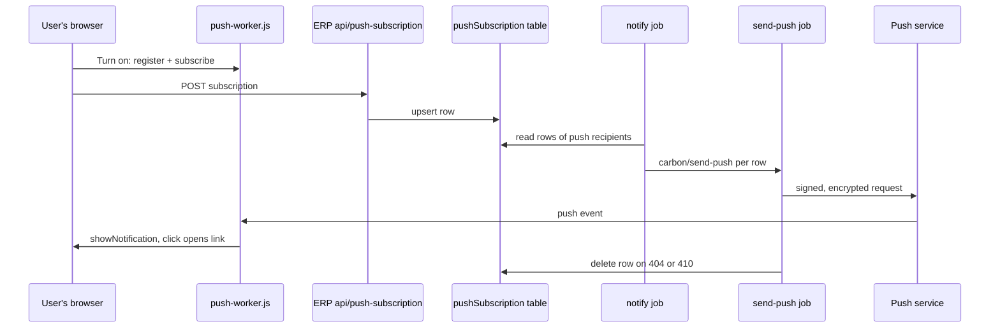
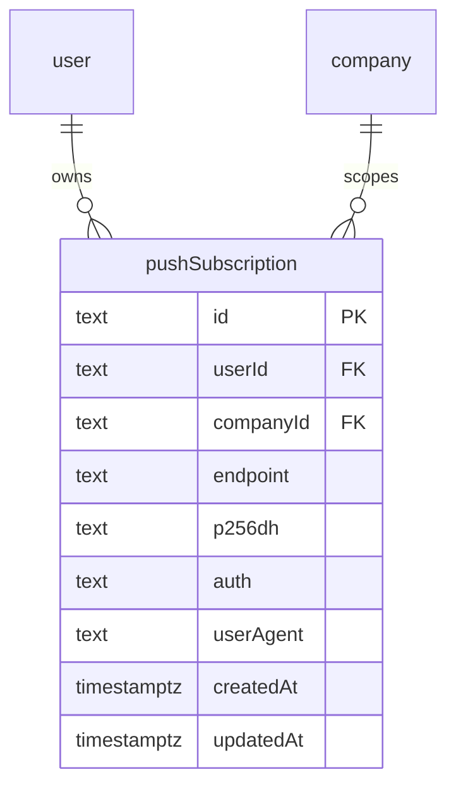

# Push notifications in the browser (Web Push)

> Status: in-progress
> Author: Claude
> Date: 2026-10-08

## TLDR

Carbon shows a notification only in the ERP bell, by email or by Slack. If no Carbon tab is open, the user sees nothing until they open the app or read their mail. This spec adds a fourth channel: **push**.

Push uses the Web Push standard to show an operating-system notification on the user's device, even when the browser is closed. The user turns on push for each device at Account → Notifications. Then a "Browser" switch per topic controls which topics push.

The `notify` job sends one push for each notification it creates. The job uses the `web-push` package and one VAPID key pair for each deployment. If the deployment has no VAPID keys, Carbon hides the controls and sends no push.

## Overview diagram



## Problem Statement

1. The `notify` job (`packages/jobs/src/inngest/functions/notifications/notify.ts`) has 3 channels: in-app, email and Slack.
2. The in-app channel reaches the user only while an ERP tab is open. `useNotifications` listens on the realtime topic `user:<userId>:notification`.
3. Email is a paid feature (`EMAIL_NOTIFICATIONS`, Business and Partner plans). On other plans, a user with no ERP tab open gets no signal at all.
4. A planner who closes the browser at the end of a shift misses an approval request or a job assignment until the next login.

No code in `apps/` or `packages/` calls the Notification API, the Push API or `navigator.serviceWorker`. The file `apps/erp/public/serviceWorker.js` exists, but no code registers it.

## Proposed Solution

### How Web Push works in Carbon

1. Each deployment has one VAPID key pair in 3 env vars: `VAPID_PUBLIC_KEY`, `VAPID_PRIVATE_KEY` and `VAPID_SUBJECT`.
2. The user clicks "Turn on" at Account → Notifications.
3. The browser asks for permission to show notifications.
4. The page registers the service worker `/push-worker.js`.
5. The page calls `pushManager.subscribe()` with the VAPID public key.
6. The browser returns a subscription: an endpoint URL and 2 keys (`p256dh`, `auth`).
7. The page posts the subscription to `/api/push-subscription`.
8. The route stores the subscription as one `pushSubscription` row for the user and the current company.
9. Later, the `notify` job finds the push recipients and their `pushSubscription` rows.
10. The job sends one `carbon/send-push` event for each row.
11. The `send-push` job signs and encrypts the payload with `web-push` and posts it to the endpoint.
12. The push service sends the payload to the device, where `push-worker.js` shows the notification.
13. When the user clicks the notification, the worker focuses an open Carbon tab or opens a new one at the notification's link.

### Which notifications push

The `notify` job sends a push when 3 conditions are true:

1. The VAPID env vars are set (`isPushConfigured()`).
2. The event's destinations include `Push`, `Email` or `Slack`. Push follows the other external channels. So `IntegrationSync`, an in-app-only event that fires again on each sweep, sends no push.
3. The recipient has no `notificationPreference` row with `channel = 'push'`, `enabled = false` for the topic.

A digest from `notify` (more than one item) sends one push with the digest's `description`. The cron job `notification-digest` sends no push, because it only rolls up rows that `notify` already delivered.

### Payload

| Field | Value |
|---|---|
| `title` | `getNotificationEmailHeading(event)`, for example "Job assigned to you" |
| `body` | the notification `description`, for example "Job J00105 assigned to you" |
| `url` | `buildNotificationLink(event, documentId, companyId, documentType)`; `/api/link` switches the company first |
| `tag` | `` `${event}:${primaryDocumentId}` ``, so a new push about the same document replaces the old one |

`web-push` encrypts the payload end to end (`aes128gcm`). The push service cannot read it.

### Design Decisions

| Decision | Choice | Rationale |
|----------|--------|-----------|
| Plan gating | None. Push is free on all plans. | Agreed with the user. Push is another view of the in-app notification, and the bell is free. |
| Library | `web-push` in `@carbon/jobs` | Agreed with the user. It does VAPID signing and payload encryption, which are easy to get wrong by hand. |
| Apps | ERP only | Agreed with the user. MES has no notification UI. |
| Channel name | `push` in data and code; the column label in the UI is "Browser" | One term in code. "Browser" is the word a user understands. |
| Subscription scope | One row per (user, company, endpoint) | This follows the multi-tenancy convention and `notificationPreference`, and the bell is also per company. A user turns on push again after switching company. |
| Table shape | `id` from `xid()`, single-column PK, no audit columns | Same shape as `notificationPreference` and `userModulePreference`: a user-owned preference row. |
| RLS | Owner and company member, the same rule as `notificationPreference` | The user reads and writes only their own rows. The jobs use the service role. |
| Same browser, new user | On subscribe, the route deletes the rows of OTHER users with the same endpoint (service role) | One browser has one endpoint. Without this step, user A's notifications reach user B on a shared computer. |
| Sign out | The "Sign Out" item in `AvatarMenu` unsubscribes the browser before the form posts | The device stops getting pushes for the user who left. The next push to that endpoint returns 410, and `send-push` deletes the row. |
| Which events push | Destinations include `Push`, `Email` or `Slack` | No per-event list to maintain. In-app-only events stay quiet. |
| Digests | One push per `notify` call; no push from the digest cron | Agreed with the user. The cron only regroups delivered rows. |
| Missing VAPID keys | No push channel, no device control, no "Browser" column | Agreed with the user. A self-hosted install without keys keeps working. |
| Dead subscription | `send-push` deletes the row on HTTP 404 or 410 | Agreed with the user. Both codes mean that the subscription is gone for good. |
| Retries | Retry on 429 and 5xx; no retry on other 4xx | A 4xx other than 404, 410 and 429 is a bad request, and a retry fails again. |
| Delivery options | `TTL` = 86 400 s (1 day), `urgency` = `normal` | A notification older than 1 day is old news. The bell still has it. |
| Fan-out shape | `notify` sends one `carbon/send-push` event per subscription row | Same pattern as `carbon/send-email` and `carbon/send-slack`. Each device retries on its own. |
| Service worker | New file `apps/erp/public/push-worker.js`, scope `/`; the old `serviceWorker.js` stays unregistered | The old file caches logos and avatars, and that behavior was never live. Registering it would start that behavior with no review. |
| Rotated subscription | The worker handles `pushsubscriptionchange`. It subscribes again and posts the new subscription with the old endpoint. | A browser can rotate the subscription at any time. Without this step, push stops with no signal. |
| Focused tab | The worker always shows the notification | Chrome requires a visible notification for each push (`userVisibleOnly: true`). |
| Test button | "Send a test notification" posts a `carbon/send-push` for this device's row | It is the only way to check the full path without a real assignment. |
| VAPID public key in the browser | The loader of the settings route returns it. It is not in `window.env`. | Only one page needs it, and the server already knows if all 3 vars are set. |
| MCP exposure | The new service functions have no `@mcp` tag | A device subscription is meaningless to an API caller (`conventions-services.md`). |
| Env group | New group `push` in `FEATURES`, with all 3 vars `needed` | `validateEnv` then warns when push is half-configured. |

## Data Model Changes

1. A new table, `pushSubscription`.
2. A wider CHECK on `notificationPreference.channel`: `('email', 'slack', 'push')`.
3. A new rule in `packages/database/src/authz/manifest.ts`, and a generated authz migration (`pnpm --filter @carbon/database authz migration <name>`). The migration file holds no `CREATE POLICY`.



```sql
CREATE TABLE "pushSubscription" (
  "id" TEXT NOT NULL DEFAULT xid(),
  "userId" TEXT NOT NULL,
  "companyId" TEXT NOT NULL,
  "endpoint" TEXT NOT NULL,
  "p256dh" TEXT NOT NULL,
  "auth" TEXT NOT NULL,
  "userAgent" TEXT,
  "createdAt" TIMESTAMPTZ NOT NULL DEFAULT now(),
  "updatedAt" TIMESTAMPTZ NOT NULL DEFAULT now(),

  CONSTRAINT "pushSubscription_pkey" PRIMARY KEY ("id"),
  CONSTRAINT "pushSubscription_userId_fkey" FOREIGN KEY ("userId") REFERENCES "user"("id") ON DELETE CASCADE ON UPDATE CASCADE,
  CONSTRAINT "pushSubscription_companyId_fkey" FOREIGN KEY ("companyId") REFERENCES "company"("id") ON DELETE CASCADE ON UPDATE CASCADE,
  CONSTRAINT "pushSubscription_endpoint_companyId_key" UNIQUE ("endpoint", "companyId")
);

ALTER TABLE "pushSubscription" ENABLE ROW LEVEL SECURITY;

CREATE INDEX "pushSubscription_userId_companyId_idx"
  ON "pushSubscription" ("userId", "companyId");

ALTER TABLE "notificationPreference"
  DROP CONSTRAINT "notificationPreference_channel_check",
  ADD CONSTRAINT "notificationPreference_channel_check"
    CHECK ("channel" IN ('email', 'slack', 'push'));
```

Manifest rule (same as `notificationPreference`):

```ts
pushSubscription: policies({
  select: and(owner("userId"), member("companyId")),
  insert: and(owner("userId"), member("companyId")),
  update: { using: owner("userId"), check: and(owner("userId"), member("companyId")) },
  delete: and(owner("userId"), member("companyId"))
}),
```

The table holds no business data, so the company backup and the demo datasets need no change. `wipe.ts` finds tables by their `companyId` column. Check `pnpm db:check:backups` after the migration.

## API / Service Changes

### `@carbon/notifications`

1. Add `NotificationDestination.Push = "push"`.
2. Change `NotificationPreferenceChannel` to `"email" | "slack" | "push"`.
3. Change `getNotificationTopicChannels`: the default topics return `["email", "slack", "push"]`. `Changelog` stays `["email"]`.

### `@carbon/env`

1. Add `VAPID_PUBLIC_KEY` (`needed`), `VAPID_PRIVATE_KEY` (`secret`, `needed`) and `VAPID_SUBJECT` (`needed`, a `mailto:` or `https:` URL) in the new group `push`.
2. Export the 3 values and `isPushConfigured()`. It returns true only when all 3 are set.

### `@carbon/lib`

1. Add the event `"carbon/send-push"` to `Events` with `data: { subscriptionId, companyId, title, body, url, tag }`.
2. Add `"send-push": "carbon/send-push"` to the `trigger` map.

### `@carbon/jobs`

1. Add `web-push` (and `@types/web-push` as a dev dependency).
2. Change `notify.ts`:
   1. Compute `wantsPush`: `isPushConfigured()` and destinations include `Push`, `Email` or `Slack`.
   2. Add `push` to the step `filter-recipients-by-preference`. It returns `pushRecipientIds`.
   3. Add the step `resolve-push-subscriptions`. It reads the `pushSubscription` rows with `userId` in `pushRecipientIds` and `companyId = payload.companyId`, and builds one `carbon/send-push` event per row.
   4. Send the events with `step.sendEvent("fan-out-push", …)`.
3. Add `send-push.ts` (function id `send-push`, 3 retries):
   1. Read the row by `subscriptionId` with the service role. If no row exists, return.
   2. Call `webpush.sendNotification` with the VAPID details, `TTL: 86400` and `urgency: "normal"`.
   3. If the status is 404 or 410, delete the row and return.
   4. If the status is 429 or 5xx, throw, so that Inngest retries.
   5. For any other error, throw `NonRetriableError`.
   6. Put the status code on the step output, so the run record shows it.
4. Register `sendPushFunction` in `packages/jobs/src/inngest/index.ts`.
5. Put the error-to-action mapping in a pure function, `pushDeliveryOutcome(statusCode)`, with a unit test.

### ERP

1. `account.models.ts`:
   1. Widen `notificationPreferenceValidator.channel` to `["email", "slack", "push"]`.
   2. Add `pushSubscriptionValidator`: `{ endpoint: url, keys: { p256dh, auth }, oldEndpoint?: url }`.
2. `account.service.ts`, with no `@mcp` tag:
   1. `upsertPushSubscription(client, { userId, companyId, endpoint, p256dh, auth, userAgent })`
   2. `deletePushSubscription(client, { userId, companyId, endpoint })`
   3. `getPushSubscription(client, { userId, companyId, endpoint })`
3. New resource route `apps/erp/app/routes/api+/push-subscription.ts`, gated by `requirePermissions(request, {})`. If `isPushConfigured()` is false, it returns 404. Its action reads JSON:
   1. `PUT`: validate the body. If `oldEndpoint` is set, delete that row. Delete the rows of other users with the same endpoint (service role). Upsert the row.
   2. `DELETE`: delete the row of this user, company and endpoint.
   3. `POST` with `intent = "test"`: read the row for this endpoint. Call `trigger("send-push", …)` with a test title and the settings link.

## UI Changes

### `apps/erp/public/push-worker.js` (new)

1. `push`: parse the JSON payload. Call `self.registration.showNotification(title, { body, tag, icon: "/carbon-mark-dark.png", data: { url } })`.
2. `notificationclick`: close the notification. Find a window client on the same origin, then focus it and navigate it to `data.url`. If no client exists, call `clients.openWindow(data.url)`.
3. `pushsubscriptionchange`: subscribe again with `event.oldSubscription.options.applicationServerKey`. Then `PUT /api/push-subscription` with the new subscription and `oldEndpoint`, and `credentials: "same-origin"`.

The icon is `/carbon-mark-dark.png`, the file that the ERP's `site.webmanifest` names.

### `apps/erp/app/hooks/usePushSubscription.ts` (new)

The hook returns one state and 3 actions:

| State | Meaning |
|---|---|
| `unsupported` | No `serviceWorker`, `PushManager` or `Notification` in `window`. Safari on iPhone or iPad without "Add to Home Screen" is in this state. |
| `denied` | `Notification.permission === "denied"` |
| `off` | The browser has no subscription, or the server has no row for it |
| `on` | The browser has a subscription and the server has its row |

Actions:

1. `turnOn()`: request permission, register `/push-worker.js`, subscribe with `userVisibleOnly: true`, then `PUT` the subscription.
2. `turnOff()`: unsubscribe in the browser, then `DELETE` the row.
3. `sendTest()`: `POST` the intent `test`.

The hook converts the base64url public key to a `Uint8Array` with a small helper. That helper has a unit test.

### Account → Notifications (`x+/account+/notifications.tsx`)

1. The loader returns `push: { publicKey } | null`. The value is `null` when `isPushConfigured()` is false.
2. If `push` is not null, a new card "This device" sits above the topic table:
   - `off`: the text "Get notifications on this device, even when Carbon is closed." and the button **Turn on**.
   - `on`: the text "Push notifications are on for this device." and the buttons **Send a test notification** and **Turn off**.
   - `denied`: the text "Notifications are blocked for Carbon in this browser's site settings."
   - `unsupported`: the text "This browser does not support push notifications. On iPhone or iPad, add Carbon to the Home Screen first."
3. If `push` is not null, the topic table gets a **Browser** column with a switch per topic, next to Email and Slack.
4. The card description names push when push is configured.
5. All new strings use Lingui macros. Run `/translate` for the catalogs.

### Sign Out (`apps/erp/app/components/AvatarMenu.tsx`)

1. Before the logout form posts, look up the current push subscription and unsubscribe it.
2. Do not wait more than 1 second for the unsubscribe. If it fails or times out, sign out anyway.

### Other

No change to MES, to the bell, or to `useNotifications`.

## Acceptance Criteria

- [ ] With the 3 VAPID env vars set, a user opens Account → Notifications, clicks **Turn on**, allows the prompt, and sees "Push notifications are on for this device".
- [ ] After **Turn on**, the database has exactly 1 `pushSubscription` row for that user, company and endpoint.
- [ ] **Send a test notification** shows an operating-system notification within 10 seconds. A click opens Account → Notifications.
- [ ] With every Carbon tab closed and the browser still running, assigning a job to the user shows "Job assigned to you" with the job's description. A click opens the job.
- [ ] A user who turns off the **Browser** switch for Jobs gets no push for a job assignment, but still gets the in-app row.
- [ ] An `IntegrationSync` notification creates an in-app row and sends no push.
- [ ] **Turn off** deletes the row, and the next assignment sends no push to that device.
- [ ] **Sign Out** unsubscribes the browser. The next push to that endpoint returns 410, and `send-push` deletes the row.
- [ ] When user B turns on push in the same browser after user A, user A's row for that endpoint is gone.
- [ ] With no VAPID env vars, the page shows no "This device" card and no Browser column. `notify` sends no `carbon/send-push` event and does not fail.
- [ ] `pushDeliveryOutcome` has unit tests for 201, 404, 410, 413, 429 and 503.
- [ ] `notificationPreference` accepts `channel = 'push'` and refuses `channel = 'sms'`.
- [ ] Scoped typecheck passes for `@carbon/jobs`, `@carbon/notifications`, `@carbon/env`, `@carbon/lib` and `erp`. Biome passes. `migration.test.ts` passes.

## Risks

| Risk | Severity | Mitigation |
|------|----------|------------|
| A session that expires (no Sign Out click) leaves the device subscribed for that user | Med | The user sees only their own notifications on their own device. Each push opens through `/api/link`, which asks for login. Document the limit. |
| Safari on iPhone or iPad supports push only for a Home Screen web app | Low | The `unsupported` text says so. The manifest already has `display: standalone`. |
| Changing the VAPID key pair breaks every subscription | Med | Document in the env description: "Generate once. A new pair needs each user to turn push on again." Pushes signed with the new key fail with 403, and the row stays. A later re-subscribe replaces it. |
| A strict CSP later blocks the worker | Low | The strict policy already allows `worker-src 'self'` (`packages/auth/src/lib/security.ts`). |
| A large group notification sends many push events | Low | One event per device, the same scale as the email fan-out. Inngest queues the events. |
| `web-push` is a new production dependency | Low | The user approved it. It is the reference library of the Web Push standard. |

## Open Questions

- [x] Should push need a paid plan? — **Answer (user):** No. Push is free on all plans.
- [x] Which library sends the push? — **Answer (user):** `web-push` in `@carbon/jobs`.
- [x] Which apps get push? — **Answer (user):** ERP only.
- [x] How does a user opt in? — **Answer (user):** Per device at Account → Notifications, plus a "Browser" switch per topic in `notificationPreference`.
- [x] Do digests push? — **Answer (user):** One push per notification at creation. No digest for push.
- [x] What happens without VAPID keys? — **Answer (user):** Carbon skips the channel and hides the controls.
- [x] What happens to a dead subscription? — **Answer (user):** Carbon deletes it on 404 or 410.
- [x] Is a subscription per user or per user and company? — **Autonomous:** Per user and company. This follows the multi-tenancy convention, `notificationPreference` and the per-company bell. A per-user table without `companyId` is Ask-First territory.
- [x] Which events push? — **Autonomous:** Each event whose destinations include `Push`, `Email` or `Slack`. In-app-only events, such as `IntegrationSync`, stay quiet.
- [x] What happens on a shared computer? — **Autonomous:** Sign Out unsubscribes the browser. A new subscribe deletes other users' rows with the same endpoint.
- [x] How does the user check that push works? — **Autonomous:** A "Send a test notification" button.
- [x] What happens when the browser rotates a subscription? — **Autonomous:** `push-worker.js` handles `pushsubscriptionchange` and posts the new subscription.
- [x] Should Carbon register the existing `serviceWorker.js`? — **Autonomous:** No. A new `push-worker.js` holds only the push handlers.
- [x] Should Carbon skip the push when a Carbon tab has focus? — **Autonomous:** No. Chrome requires a visible notification for each push.

## Changelog

- 2026-10-08: Created by the autonomous `/feature` run (`.ai/runs/2026-10-08-web-push-notifications.md`). The user answered 7 questions before the run. The run resolved the other 7 itself and marks them **Autonomous** above.
- 2026-10-08: Implemented on `naveenkash/carbon-browser-notifications`. The code follows the spec, with 2 small differences:
  1. The test POST route sets `tag` to `carbon-test`, so a second test replaces the first.
  2. The Sign Out handler waits at most 1 000 ms for the unsubscribe (`SIGN_OUT_UNSUBSCRIBE_MS`).
- 2026-10-08: Two changes after testing:
  1. `push-worker.js` no longer passes `tag` to `showNotification`. Edge gives the tag to macOS as the notification's identifier, and macOS replaces a notification with the same identifier silently, so no banner appears. The worker closes older notifications with the same `data.tag` itself, then shows the new notification under a fresh identifier.
  2. The bell's inbox tab shows an "Enable browser notifications" row (`EnableBrowserNotifications.tsx`). It is the soft ask: the native prompt opens only from its **Enable** click. The row shows only when push is configured and `Notification.permission` is `default`. **Not now** hides it for 30 days in this browser, and a second **Not now** hides it for good. The app shell loader sends `pushPublicKey` for it. The settings card is now titled "Browser notifications", with **Enable** and **Disable** buttons.
- 2026-10-08: A subscription now belongs to the browser and the user signed into it, not to one company.
  1. Migration `20261008104657` keeps one row per endpoint and makes `endpoint` unique. `companyId` stays as the company the user enabled it from.
  2. `notify` reads subscriptions by `userId` only. `resolve-recipients` already limits recipients to members of the notification's company, so a user gets the push of every company they belong to. A company switch no longer silences the browser.
  3. Signing out stops pushes on every path. The PUT route sets a signed `carbon-push` cookie with the endpoint. `clearAuthCookies` (`@carbon/auth`) deletes that endpoint's rows and clears the cookie. Explicit sign-out, forced sign-out and an expired session on the login page all go through it. The client-side unsubscribe in `AvatarMenu` is removed.
  4. Opening a page never claims the browser: the hook reads `GET /api/push-subscription?endpoint=`.
  5. Browser notifications are a setting of the browser, not of a user. **Enable** sets `browserNotificationsEnabled` in localStorage, and **Disable** clears it for everyone on that browser. `useRestoreBrowserNotifications` runs from the always-mounted bell, once per tab and user. If permission is granted and the flag is set but the signed-in user has no row (sign-out deleted it), it saves the browser's subscription for that user with no prompt. If the browser has no subscription, it subscribes first. The bell row shows only while nobody has enabled notifications in this browser. **Not now** and **Disable** snooze it per browser.

