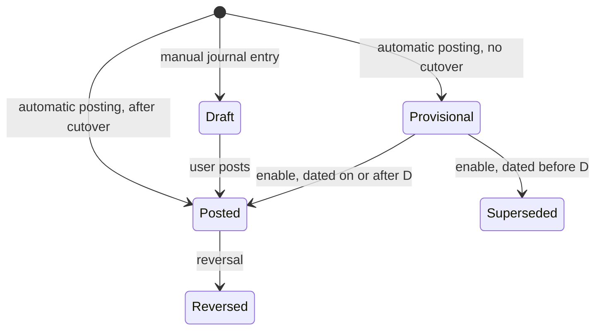

# Accounting Cutover

> Status: implemented
> Author: Claude (with Brad Barbin)
> Date: 2026-10-08
> Tracking issue: crbnos/carbon#1057
> Supersedes: `.ai/specs/archived/2026-07-04-accounting-cutover-activation.md`
> Research: `.ai/research/accounting-cutover.md`
> Depends on: `packages/database/supabase/migrations/20261008211304_reset-accounting.sql` (clears the GL of every non-demo company and turns accounting off)

## TLDR

Every company posts journals from now on, whether or not it uses accounting. Before a company's cutover, its journals have the status `Provisional`, and no balance, report or sync counts them. The `accountingEnabled` flag stops gating sub-ledger work. Every company writes cost layers, asset cost, deferral schedules and intercompany rows. After the wizard ships, no code reads the flag. The column stays, unused.

A one-way enable wizard takes a cutover date D at a period start. The enable writes one Posted opening line for each item open at D, against a Migration Clearing account. The wizard takes the prior system's trial balance against the same account. It refuses to enable until Migration Clearing totals zero. At the enable, Provisional journals dated on or after D become Posted, and Provisional journals dated before D become `Superseded`. A payment against an invoice posted before D then clears that invoice's opening line.

## Overview diagram



## Problem Statement

1. `companySettings.accountingEnabled` is a switch with no checks. Internal users turned it on in companies with no opening balance and with open invoices, receipts and jobs.
2. A payment needs the invoice's posted receivable line (`post-payment-transaction.ts:494-536`). An invoice posted with accounting off has none. So `:644` refuses every payment against it with "Target is missing its original control account". The user cannot mark it paid either, because Mark Paid works only with accounting off.
3. The flag gates more than the journal. With accounting off, these never happen:
   - Sales-order shipments and job material issues do not relieve cost layers (`post-shipment:1222`, `issue:385`, `backflush_job_materials`).
   - Job completion writes no finished-goods cost layer and leaves a Make to Asset asset at cost 0 (`complete_job_to_inventory:608`).
   - Receipts skip invoice-first valuation, and purchase invoices skip purchase price variance layers (`post-receipt:1454`, `post-purchase-invoice:1203`).
   - Sales invoices write no deferral schedule rows or contract ledger entries (`post-sales-invoice:344`, `:644`).
   - Intercompany invoices write no `intercompanyTransaction` row (`post-sales-invoice:2144`).
   
   So the sub-ledgers of a company with accounting off are incomplete, and its inventory valuation is wrong.
4. The opening balance journal (`createOpeningBalanceJournal`, `accounting.service.ts:6497`) has one line per account and no document link. No payment can clear it, and the AR and AP reports do not read it.
5. The July spec closed every period before the cutover, so documents from that time had no GL at all. It solved neither problem 2 nor problem 3.

## Proposed Solution

### 1. One posting path for every company

Every posting function builds and writes its journal for every company. The company's cutover decides one thing only: the journal's status.

| Company state | Status of an automatic journal |
|---|---|
| `accountingCutoverDate IS NULL` | `Provisional` |
| `accountingCutoverDate IS NOT NULL` | `Posted` |

1. Remove every sub-ledger branch on `accountingEnabled` listed in Problem Statement item 3. Every company relieves cost layers, writes finished-goods and asset cost, writes deferral schedules, contract entries and intercompany rows.
2. Remove the journal branches on `accountingEnabled` in every posting server function and SQL function. Each one writes its journal with the status from `journalPostingStatus` (TS) or `journal_posting_status(company_id)` (SQL).
3. A Provisional journal has no accounting period: `accountingPeriodId` is null, and no posting creates a period before the cutover. So Provisional journals never lock the fiscal calendar, and a company that does not use accounting collects no periods. The enable assigns the periods (section 5).
4. The posting transaction reads `companySettings` with `FOR SHARE` (`journalPostingStatus`, and `journal_posting_status` in SQL). The enable transaction takes `FOR UPDATE` on the same row. So no posting can write a Provisional journal after the enable commits. A posting that read the status before its transaction reads it again inside (`assertPostingStatusUnchanged`). If the status changed, the posting refuses with "Accounting was just set up. Post the document again."
5. The account columns of `accountDefault` in `OPTIONAL_DEFAULT_ROLES` are nullable, and a company that changed its chart of accounts can have them empty. Account numbers and names are user-editable, so no migration can fill them safely. `resolveDefaultAccount` (API / Service Changes) is the one place that decides what an empty default does:
   - If the default has a fallback in `DEFAULT_FALLBACKS` (for example `scrapAccount` → `inventoryAdjustmentVarianceAccount`), the line uses the fallback, before and after the cutover.
   - If the default has no fallback, and the company has no cutover, the builder posts that line to `retainedEarningsAccount` (NOT NULL for every company). This is a stand-in line. It writes the default it wanted in the new column `journalLine.accountDefaultRole`, for example `salesShippingRevenueAccount`. A Provisional journal counts nowhere, so the stand-in account changes no balance.
   - If the default has no fallback, and the company has a cutover, the posting fails with `MissingAccountDefaultError` (status 400). The message names the default by its label. The enable cannot happen while such a default is empty (section 3).
   - A revenue recognition schedule row never takes a stand-in. The sales invoice refuses an empty deferral, contract or rental default in every company state (`sales-invoice-stand-ins.ts`).

Manual accounting work stays unavailable before cutover: manual journal entries, depreciation runs, revenue recognition runs, intercompany eliminations and period close. The server functions refuse it, not only the UI. The revenue recognition cron (`revenue-recognition-proposal.ts`) skips companies with no cutover.

### 2. Journal statuses and who reads them

`journalEntryStatus` gets 2 values: `Provisional` and `Superseded`. Four shared constants in `@carbon/database/accounting-posting` define every read:

| Constant | Statuses | Used by |
|---|---|---|
| `GL_JOURNAL_STATUSES` | `Posted`, `Reversed` | Balances, trial balance, reports, period snapshots, tie-outs, aging, provider sync, the opening-balance gate |
| `DOCUMENT_JOURNAL_STATUSES` | `Provisional`, `Posted`, `Reversed` | Readers that follow one document's chain and filtered on `<> 'Draft'` or on nothing before this change: void builders, GR/IR lookup, WIP sums, intercompany lookups |
| `OPEN_ITEM_JOURNAL_STATUSES` | `Provisional`, `Posted` | Readers that filtered on `= 'Posted'` before this change and must also see a Provisional journal: payment control lookups, memo, charge and reimbursement void checks |
| `PRE_CUTOVER_JOURNAL_STATUSES` | `Provisional`, `Superseded` | Only the readiness check that finds L (section 3). No balance or chain reader uses it. |

Before cutover a company has no Posted journal. After the enable it has no Provisional journal. So a chain reader always reads the lines that govern the document. `Superseded` is in none of the first 3 lists.

Readers changed (file:line from the code map before this change):

| Reader | Before | After |
|---|---|---|
| `accountTreeBalances`, `accountTreeBalancesByCompany`, `accountTreeBalancePeriodSeries`, `snapshotAccountingPeriodBalances` (`20260909173619`) | `<> 'Draft'` | `GL_JOURNAL_STATUSES` |
| `journalLinesByAccountNumber` (`20260713225803`), `journalDimensionPivot` and its lines function (`20260809204137`), `get_inventory_tie_out` (`20260925121735:1425`), the `journalLines` view (`20260811123614:178`) | `<> 'Draft'` | `GL_JOURNAL_STATUSES` |
| WIP sums: `complete_job_to_inventory` (`20261006221601:873`), `close-job/index.ts:66`, `post-production-event:206`, `:229` | no filter | `DOCUMENT_JOURNAL_STATUSES` |
| Void builders: `post-sales-invoice:2375`, `:2420`; `post-receipt:339`, `:593`; `post-purchase-invoice:115`; `post-shipment:3093`, `:4124`, `:4410`; payment void `:162` | no filter | `DOCUMENT_JOURNAL_STATUSES` |
| GR/IR lookup `post-purchase-invoice:906`; intercompany lookups `post-sales-invoice:2212`, `post-purchase-invoice:2403`, `:2448`; `post-asset-transfer:1090` | no filter or `<> 'Draft'` | `DOCUMENT_JOURNAL_STATUSES` |
| Payment control lookups `post-payment-transaction:498`, `:790`; memo void `:145`; `post-charge-void:38`; `post-reimbursement-void:63` | `= 'Posted'` | `OPEN_ITEM_JOURNAL_STATUSES` |
| `post-maintenance-event:84`; sales invoice void reader `post-sales-invoice:2375` (it also lacks a `companyId` filter, which this change adds) | no filter | `DOCUMENT_JOURNAL_STATUSES` |
| `getFiscalCalendarCommitted` (`:2622`) | all statuses | `GL_JOURNAL_STATUSES` |

`getAccountingPeriodDeletability` (`:2548`) keeps counting every journal in the period. A Provisional journal has no period (section 1), so it never blocks a delete.

The SQL readers that filter on `= 'Posted'` (`get_ar_open_by_customer`, `get_ap_open_by_supplier`, `get_ar_tie_out`, `get_ap_tie_out`) keep that filter. They already exclude the 2 new statuses. They also accept `sourceType 'Opening Balance'` (section 4, migration `20261009014620`).

A new `@carbon/checks` conformance rule, `journal-status-filter`, refuses a filter that excludes only Draft in a statement that reads `journal`. Its message names the first 3 constants. It works like this:

- It scans the migrations from `20261009005144` on, and the TypeScript roots of the conformance checks. It skips test and fixture files.
- It reads one statement at a time: the text between two `;` characters, with comments blanked.
- In SQL it flags `status <> 'Draft'`, `!= 'Draft'`, `NOT IN (… 'Draft'` and `IS DISTINCT FROM 'Draft'`. In TS it flags the same filters in the Supabase and Kysely builders (`.neq`, `"<>"`, `"not in"`, `.not(…)`).
- In a TS file it also reads the SQL text inside `sql` templates and query strings.
- It sees a qualified or aliased status (`journal.status`, `j.status`). It skips a qualified status of another table (`invoice.status`) in a statement that joins `journal`, and it never takes `journalLine` for `journal`.
- It does not flag a `journal` read with no status filter. A query built across several statements escapes it.

### 3. The enable wizard

Route `/x/accounting/activation`, linked from Settings → Accounting and from the accounting module while the company has no cutover. `activation._index.tsx` redirects to the first step. Each step is a child route of `activation.tsx`:

1. **Readiness** (`activation.readiness.tsx`). `getActivationReadiness` runs 6 checks. All 6 must pass:
   - Every account column in `ACCOUNT_DEFAULT_COLUMNS` holds an active account, `migrationClearingAccount` included. A column with a fallback in `DEFAULT_FALLBACKS` may stay empty, because every posting uses the fallback. Migration Clearing must be an Equity account that is not a group. The step lists each empty default with a link to Accounting → Defaults. The user picks or creates the Migration Clearing account there.
   - `fiscalYearSettings` exists. Base currency is set.
   - D is the first day of a calendar month (a period). D is not after today in the company time zone. D is at most 3 periods before the current period (`CUTOVER_MAX_PERIODS_BACK`).
   - No Draft or Pending receipt, shipment, sales invoice or purchase invoice, and no Draft payment or memo, is dated before D.
   - No open job took cost before L: no `Job Consumption` or `Job Receipt` item ledger row, production event or production quantity of the job was created before L. L is the `createdAt` of the company's first Provisional or Superseded journal. If the company has none, L is now. Such activity wrote no journal, so the job's WIP lines are short of its cost. A job with no activity before L (a Draft, Planned or Ready job) has nothing missing and does not block.
   - No Posted journal with `sourceType 'Opening Balance'` exists. The unique index `journal_one_posted_opening_balance_per_company` allows one, and the enable writes it.

   A failed check returns reason codes, and the wizard translates them.
2. **Inventory** (`activation.inventory.tsx`). For each item, the page shows the on-hand quantity at D across all locations (from `itemLedger`), the unit cost and the value. Cost layers (`costLedger`) have no location, so the reset works per item. The unit cost depends on the costing method:

   | Costing method | Unit cost at D | Editable on this page |
   |---|---|---|
   | Average | `itemCost.unitCost` | Yes, with the `update: "parts"` permission. The edit writes `itemCost`. |
   | FIFO, LIFO | The value of the layers dated before D that the stock at D sits in (`unitCostAtCutover`) | No |
   | Standard | `itemCost.standardCost` | No |

   The server computes the value per inventory account and the total (`getCutoverInventoryValuation`). The opening journal uses the same values. A difference from the prior system goes on a non-control row of the trial balance.
3. **Fixed assets** (`activation.fixed-assets.tsx`). For each registered asset (not Draft) acquired before D, the page shows cost and accumulated depreciation at D − 1. The values come from the register. The user edits accumulated depreciation inline on this page (intent `save-asset`), because no depreciation run happens before cutover. The register form cannot do it: it opens Draft assets only (`$fixedAssetId.register.tsx`).
4. **Trial balance** (`activation.trial-balance.tsx`). The user enters the prior system's trial balance as of D − 1, for every account. The route keeps it as a Draft `Opening Balance` journal. There are 2 input methods: the inline editor on this page (intent `save-tb`), or a CSV import (intent `import-tb`, columns `accountNumber, debit, credit`). The pure parser `parseTrialBalanceCsv` refuses an amount with a comma, because it cannot tell a decimal comma from a thousands separator. The page shows Migration Clearing per control account: the trial balance amount, the opening total from Carbon, and the difference.
5. **Enable** (`activation.enable.tsx`). The page lists the legacy documents that the enable will journal (section 5a). The wizard refuses to enable unless Migration Clearing totals zero within 0.01 and every check passes. The user types the company name to confirm. The page states that the enable is one-way.

### 4. Opening lines

The opening journal has `sourceType 'Opening Balance'`, status Posted, and date D − 1. `buildOpeningJournalLines` (`@carbon/database/accounting-cutover`) builds the lines. Each line on a control account copies the lookup keys its chain reader matches. So a later document finds the line as if the original posting had written it. No opening line carries a dimension.

| Open item at D | Source | Line | Keys copied |
|---|---|---|---|
| Open sales invoice, credit memo | The document: total minus settlements at D, at the booked exchange rate. An invoice marked Paid with no settlement counts as settled. | Receivables account, or `intercompanyReceivablesAccount` for an intercompany sales invoice | `documentType 'Invoice'` or `'Memo'`, `documentId`, description "Accounts Receivable" (or "IC Receivables" for an intercompany sales invoice) |
| Open purchase invoice, debit memo | The document, the same way | Payables account, or `intercompanyPayablesAccount` for an intercompany purchase invoice | `documentType 'Invoice'` or `'Memo'`, `documentId`, description "Accounts Payable" (the purchase posting writes no IC description) |
| Open employee reimbursement | The reimbursement: its amount in base at its rate, minus what payouts Posted before D applied. A reimbursement counts while it is Posted and its posting date, else its reimbursement date, is before D. | The reimbursement's `payableAccountId`, else `employeeReimbursementsPayableAccount`, else the payables account | `documentType 'Reimbursement'`, `documentId`, description "Employee reimbursement payable" |
| Unapplied payment credit | The payment and its settlements: base cash less what the payment's own applications released, less what later payments drew from it before D | The account of the payment's own control line. For a legacy payment (no journal), the receivables or payables account | `documentType 'Payment'`, `documentId`, the description of the payment's own line. For a legacy payment, the on-account description |
| Customer deposit | The payment, the same way | The account of the payment's own line, else `prepaymentAccount` | `documentType 'Payment'`, `documentId`, description "Customer Deposit" |
| Received, not invoiced | The PO line: the quantity received before D × the receipt cost | GR/IR account | `documentLineReference 'receipt:<poLineId>'`, the quantity, description "Goods Received Not Invoiced" |
| Invoiced, not received | The PO line: the quantity invoiced before D minus the quantity received before D × the accrual unit cost of the invoices before D (their GR/IR accrual lines; for an invoice with no journal, the invoice line's base cost) | GR/IR account, a debit, `accrual` true | `documentLineReference 'purchase-invoice:<poLineId>'`, the quantity, description "GR/IR Clearing" |
| WIP | Each job with a WIP balance: its lines on the WIP account, dated before D | WIP account | `documentId` = the job, description "WIP Account" |
| Inventory | The inventory step: on-hand at D × unit cost, summed per inventory account | One line per inventory account | None. Description "Inventory" |
| Fixed asset | The fixed assets step, summed per class account. A Draft asset gets no line. | One line per asset account ("Fixed Asset Cost") and one per accumulated depreciation account ("Accumulated Depreciation") | None |
| Deferred revenue | The `Deferral` rows of `revenueRecognitionSchedule`, dated on or after D, of an invoice posted before D. A row counts while it is Planned, or Posted by a run whose journal the reset deleted. | The row's debit account. If that account is `retainedEarningsAccount`, `deferredRevenueAccount` | `documentType 'Invoice'`, `documentId` = the invoice, `documentLineReference 'sales-invoice:<lineId>'`, description "Deferred Revenue" |
| Lease net investment | Per rental agreement, the `closingNetInvestment` of each lease line at D − 1 | `netInvestmentInLeasesAccount` | `documentType 'Rental Agreement'`, `documentId` = the agreement |

Each control account also gets one "Migration Clearing" line for the open items on it, with `documentLineReference` = the control account id. Each trial balance row on a non-control account gets an "Opening Balance" line and a "Migration Clearing" line. `buildOpeningJournalLines` signs each line by its account class. It refuses a Migration Clearing account that is not Equity, and lines that do not balance.

A document partly settled before D gets 2 opening lines on its control account, not 1. The payment lookup and the AR/AP readers compute the open amount as the original control line minus every settlement, the settlements before D included. So:

1. The first line carries the document's original base amount, with the description its own posting writes ("Accounts Receivable", "Accounts Payable" or the on-account credit description).
2. The second line carries the base amount settled before D, with the opposite sign and the description "<that description> (settled before cutover)". The readers match descriptions exactly, so they ignore it.

The control account then nets to the open amount, and every settlement after D still subtracts from the original.

Received-not-invoiced follows the same rule, keyed by reference instead of description. A purchase invoice clears GR/IR by walking the PO line's `receipt:<poLineId>` journal groups in order. It skips the units already invoiced. Then it costs the rest from each group's amount and quantity. So per PO line open at D:

1. A `receipt:<poLineId>` line carries everything received before D, with its quantity and receipt cost.
2. A `purchase-invoice:<poLineId>` line ("GR/IR Clearing") carries the receipt cost the invoices before D cleared, with the opposite sign. The GR/IR walk does not read that reference.

The account nets to the open amount, and an invoice after D skips and costs units exactly as before.

Invoiced-not-received is the other side. A purchase invoice for units not yet received accrues them on GR/IR with `accrual` true, and a receipt costs the units invoiced before it at the average cost of the PO line's accrual lines. The enable supersedes the invoice's journal, so the opening journal carries that accrual for the open quantity. A receipt after D then finds it and clears it at the invoice's cost. When a receipt finds no accrual for units invoiced before it, it costs them at PO cost and logs a warning.

Every other account comes from the trial balance only. Cash, equity, tax, payroll and accruals never come from the Provisional ledger. So a gap in Provisional data (for example, payroll that Carbon never saw) cannot reach the GL.

For a control account, the trial balance amount is an assertion, not a posting. The opening journal posts the Carbon opening total on the control account. The difference to the trial balance stays on Migration Clearing. A zero total on Migration Clearing proves that Carbon's open items agree with the prior system.

### 5. The enable transaction

One server function, `activate-accounting`, runs in one Kysely transaction:

1. Lock `companySettings` `FOR UPDATE`. Check the typed company name. Re-run every readiness check and every Migration Clearing total. Refuse on any failure.
1a. Write the journals of the legacy documents dated on or after D (section 5a).
2. Reset inventory as of D. For each item, close the cost layers dated before D. Insert one layer: the on-hand quantity at D at the unit cost of the inventory step. Keep the layers dated on or after D.
3. Re-cost every outbound movement of a FIFO or LIFO item dated on or after D against the reset layers, in posting order (`resetAndRecostInventory`, `recost.ts`). For each re-costed document, post the cost difference as a Provisional "Cutover recost" journal between the 2 accounts of the document's own journal. Standard and Average items take their cost from `itemCost`, so their movements keep their cost. A serial recost keeps its cost, because its offset account is not stored.
4. Set every Provisional journal dated before D to `Superseded`.
5. Set every Planned `revenueRecognitionSchedule` row dated before D to Posted with no journal. A lease `Interest` row is a row of this table, so the same UPDATE covers it.
6. Make no change to the assets. `buildDepreciationRunLines` takes D − 1 as a floor (`depreciationFloor`, `accounting.utils.ts`): with no run posted after it, a run depreciates from D, not from `depreciationStartDate`. The fixed assets step already put the accumulated depreciation at D − 1 on the register.
7. Delete the Draft trial balance. Post the opening journal (section 4) in the period that contains D − 1. If the company has no open item and an empty trial balance, post no opening journal.
8. Assign periods. For each Provisional journal dated on or after D, set `accountingPeriodId` to the period that contains its date (`assignPeriods`, `resolveAccountingPeriod` in mode historical). Superseded journals keep a null period.
9. Re-point the stand-in lines (`repointStandInLines`), then promote (`promoteJournals`):
   1. Take each line that has an `accountDefaultRole`, in a Provisional journal dated on or after D.
   2. Set its `accountId` to that default's account, or to its fallback. Clear the role.
   3. Move each intercompany elimination line with its journal line.
   4. Set every Provisional journal dated on or after D to Posted.
10. Close every period that ends before D, oldest first, inside this transaction. Set `closeStatus 'Closed'` and call `snapshotAccountingPeriodBalances` for each period. Create no close tasks. Do not call `closeAccountingPeriod`, because it opens its own transaction.
10a. Make the period that holds today Active (`getCurrentAccountingPeriod`), as the first posting would. D is never after today, so step 10 never closes this period.
11. Set `accountingCutoverDate = D`, `accountingActivatedAt = now()`, `accountingActivatedBy`.
12. Write no separate audit entry. Journals and accounting periods are auditable entities (`audit.config.ts`), so the event-driven audit records steps 4 to 10 for companies with the audit log on. `companySettings` is not auditable. The `accountingActivatedAt` and `accountingActivatedBy` columns are the record of the enable.

The `check_accounting_period_open` trigger also checks a change from `Provisional` to `Posted`. Before this change it checked only a change from Draft to Posted (`20260713235930:59-64`). Without the new check, step 9 could post into a Closed period.

### 5a. Legacy documents dated on or after D

**The gap.** A legacy document is a posted document with no journal. Before always-posting, a company with accounting off wrote no journal, and the reset deleted every journal of the others. The opening journal covers documents open on D − 1, and promotion covers Provisional journals dated on or after D. A legacy document dated on or after D is in neither. Its amounts never reach the GL, and a payment against it fails with "Target is missing its original control account". Any existing company can have such documents, because D can be up to 3 periods back.

**The rule.** The enable writes the missing journals in step 1a, the legacy backfill. For each legacy document dated on or after D, it writes the journal the document's posting writes today, as `Provisional`, dated the document's posting date. The later steps then treat it like every other Provisional journal: re-cost, period, stand-in re-point, promotion. A legacy document dated before D needs nothing: the opening journal covers it.

**Detection.** `@carbon/database/legacy-documents` finds the legacy documents. The wizard's enable step counts them with the same reads. A document is legacy when 3 conditions hold. It is posted (not Draft, not Voided). It is dated on or after D. No `journalLine` with its document keys sits in a journal of any status. A voided legacy document gets no journal: its post and its void net to zero.

**Zero value.** The detection leaves out each document that the builders write no journal for. So every document it finds gets a journal, and the next detection does not find it again. The detection leaves out these documents:

- a sales invoice with only comment lines, or with no amount and no direct line that moved stock;
- a purchase invoice with only comment lines;
- a purchase order receipt line with no received quantity;
- a sales return receipt with no cost;
- a sales order shipment with no stocked item;
- an inbound adjustment at zero cost;
- a depreciation line with no book amount.

An outbound movement is the exception the other way. Its builder writes the journal pair at zero cost too, as `post-adjustment` and `post-shipment` do for a live posting. The re-cost (section 5, step 3) then finds a pair to adjust.

**Inputs.** Every journal uses today's `accountDefault` and today's item settings, in base currency at the document's own exchange rate. Carbon does not store the historical values. Each journal balances, so the books stay consistent.

| Family | Source of the lines |
|---|---|
| Sales invoice | `buildSalesPostingLines` for receivables, revenue, shipping and tax. A contract, rental or fixed-asset line books plain revenue on the sales account. |
| Purchase invoice | `calculatePurchasePostingAmounts`. A received PO line clears GR/IR at its receipt cost, with the price difference on the purchase variance account. An unreceived PO line accrues GR/IR. A G/L line books its own account. A stock line with no PO books inventory. |
| Memo, payment | `rebuildMemoJournal`, `rebuildPaymentJournal`. A payment takes its processor fee from the integration mapping. A contract or rental credit memo books as a plain memo on the sales account, because its contract and deferral legs came from rows that are not journal lines. |
| Charge, reimbursement | `buildChargeJournal`, `buildReimbursementJournal`, from the stored rows. |
| Movement with a cost row | Receipts, return receipts, return shipments, adjustments, scrap, counts, non-conformance scrap and maintenance parts stored their cost on `costLedger`. The journal books that cost between inventory and the account the posting uses. |
| Movement with no cost row | A sales shipment, a direct sales invoice line and a job material issue relieved no layer. The enable writes the missing outbound cost row at today's unit cost. A job output writes the missing finished-goods layer at the cost of the job's material issued in the window. The re-cost step (section 5, step 3) then values FIFO and LIFO items against the layers. |
| Asset and revenue runs | Depreciation, disposal and revenue recognition journals existed and the reset deleted them. The enable writes them again for run lines and disposals dated on or after D, from the stored run lines. |

**Order.** `journalLegacyDocuments` (`activate-accounting/legacy/index.ts`) writes in this order:

1. The missing cost rows of the movements that stored none.
2. Invoices, memos, charges and reimbursements.
3. Payments, in posting order, because a payment reads the control line of what it settles.
4. Movements, before the inventory reset.
5. Depreciation runs, scrap disposals and revenue recognition runs.

**Not rebuilt.** These have no stored basis, and the enable writes nothing for them:
- labor and machine absorption of a legacy job (the rate is not stored);
- the offset of a legacy serial recost or asset cost adjustment (the account is not stored);
- an asset registration or transfer (the asset register and the opening fixed asset lines cover it).

The wizard's enable step lists each family that the enable will journal, with the number of documents, so a reviewer can find them.

**Provider sync.** The reset deleted the journals and their sync records, but not the provider's copies. So each journal that the backfill writes gets an `Excluded` sync operation with code `CUTOVER_REBUILT`, for each accounting integration of the company (section 9).

**The repair after the enable.** 2 kinds of company have a cutover and can still hold legacy documents. The first is a company enabled before step 1a existed. The second is a demo-template company: the migration set its cutover, and no enable ran. The `journal-legacy-documents` server function (permission `update: "accounting"`) writes their missing journals:

1. Lock `companySettings` `FOR UPDATE`. Refuse if the company has no cutover.
2. Run `journalLegacyDocuments`, the same code as step 1a.
3. Assign periods, re-point the stand-in lines and promote, for the written journals only (by id).
4. Make the period that holds today Active.

If a written journal falls in a Closed or Locked period, the repair refuses before it writes anything. The repair runs no re-cost. So an outbound movement of a FIFO or LIFO item with no cost row relieves the layers that are open now.

Two callers run the repair:

| Caller | Behavior |
|---|---|
| Settings → Accounting | If the company has a cutover and a legacy document exists (one `EXISTS` query), the page shows a warning and the "Write missing journals" button (intent `journal-legacy`). The page streams the count of documents. |
| `scripts/one-off/journal-legacy-documents.ts` | Runs the repair for each company with a cutover and a legacy document, one transaction per company. It runs as the user who enabled accounting, else an Admin. It skips a company with no such user. `classifyRepairFailure` (`journal-legacy-documents/companies.ts`) also skips a company whose refusal has a status below 500, for example a `MissingAccountDefaultError` or a closed period. The script lists each skipped company. Any other error fails the company. |

The script's exit code tells the deploy what to do:

| Exit code | When | Deploy |
|---|---|---|
| 0 | Every company was repaired or skipped | Records the script as run |
| 1 | A company failed, or the script threw | Fails |
| 75 | No database URL (`SUPABASE_DB_URL`) | Defers the script and continues |

### 6. After cutover

- **Payment against an invoice dated before D.** The control lookup (`readTargetControlLines`, `post-payment/journal-input.ts`) accepts `sourceType 'Opening Balance'` as well as the document's own source type. It finds the opening line. The lookup matches descriptions exactly, so it skips the "(settled before cutover)" lines. The "Target is missing its original control account" guard stays strict.
- **Payment against an invoice dated on or after D.** It finds the promoted line. No change.
- **Void of a payment or memo dated before D.** The void builds the document's posting again with `rebuildPaymentJournal` or `rebuildMemoJournal`. It negates the result and dates it today. Its receivables or payables line nets the opening line to zero for that document. It never posts to Migration Clearing. This follows the NetSuite guidance in the research.
- **Void of a credit memo dated before D that credits a contract or a rental agreement.** The void fails with "This credit memo is from before your accounting cutover and credits a contract or a rental agreement. Invoice the customer for the amount instead." (`MEMO_CREDIT_VOID_BEFORE_CUTOVER_ERROR`).
- **Void of an invoice dated before D.** The void fails. A sales invoice gets "This invoice is from before your accounting cutover. Issue a credit memo instead." A purchase invoice gets "This invoice is from before your accounting cutover. Record a debit memo instead." The memo posts in the current period and settles against the opening line. No builder covers a whole invoice posting. The purchase invoice has none. The sales builder leaves out cost of goods sold, asset disposal, rental purchase option and intercompany lines. Most invoices before D also have no journal, because the reset deleted it.
- **Void of a charge or a reimbursement dated before D.** The void fails with "This charge is from before your accounting cutover. Record a journal entry to correct it instead." (`CHARGE_VOID_BEFORE_CUTOVER_ERROR`), or the same text for a reimbursement (`REIMBURSEMENT_VOID_BEFORE_CUTOVER_ERROR`). The enable superseded its journal, so a reversal of its own lines would undo nothing.
- **Void of a receipt or a shipment dated before D.** The void fails with "This document is from before your accounting cutover. Record a return or an inventory adjustment instead." (`INVENTORY_VOID_BEFORE_CUTOVER_ERROR`). The shipment refusal covers every shipment source, the outbound transfer included. The reset removed the cost layer. The research found no product that voids such a document (pattern 6). The returns flows that exist today (RMA, purchase return) cover the forward path. An inventory adjustment, an inventory count and a stock transfer have no void.
- **A time entry whose journal is Superseded.** `post-production-event` and `post-maintenance-event` refuse to post or edit it again (`TIME_ENTRY_BEFORE_CUTOVER_ERROR`).
- **Purchase invoice for a receipt dated before D.** The GR/IR lookup finds the opening line by its `documentLineReference`.
- **Job open at D.** `close-job` and `complete_job_to_inventory` sum the opening WIP line and the Posted lines after D.
- **Posting dated before D.** The closed-period trigger refuses it.
- **Base currency and fiscal start month.** A trigger (`check_accounting_config_locked`) refuses a change after the enable (carried from the July spec).

`refuseVoidBeforeCutover` (`server-functions/src/lib/cutover-void.ts`) makes the invoice, charge, reimbursement, receipt and shipment refusals. It compares the document's posting date with D.

### 7. New companies

`seed-company` sets `accountingCutoverDate` to the first day of the current month, if the company has no cutover. It sets `accountingActivatedAt` and `accountingActivatedBy` too. The company posts with status Posted from its first document. It has no opening journal and no wizard.

Demo-template companies are the companies with a `JE-SEED-%` journal, the test the reset uses to spare them. The cutover migration sets their cutover to the start of the earliest period that holds a Posted journal.

Tier 01 of the dataset seed writes the cutover on every apply: the first day of the earliest seeded period. It overwrites a cutover that the company already has, because `seed-company` stamps the current month before onboarding applies the template. `applyDatasetTiers` sets `app.dataset_apply` (`SET LOCAL`) in the apply's transaction. `check_accounting_config_locked` lets a cutover change through only under that flag, and never for the `anon` or `authenticated` role.

### 8. Retiring the flag

1. Replace every read of `accountingEnabled` with a read of `accountingCutoverDate IS NOT NULL`. That covers the UI gates (`AccountingBetaGate`, the report tie-out panels, the Stripe fee account) and the readiness of manual accounting work. In the ERP, `hasAccountingCutover` (`accounting.utils.ts`) is the one function that makes this test.
2. Delete the Mark Paid and Mark Unpaid actions in `sales-invoice+/$invoiceId.status.tsx` and `purchase-invoice+/$invoiceId.status.tsx`, and their buttons in both invoice headers. Users record payments through Payments.
3. Delete the switch in `settings+/accounting.tsx`. Show the cutover date, or a link to the wizard.
4. Keep the `companySettings.accountingEnabled` column, unused. `BACKWARD_COMPATIBILITY.md` forbids dropping a column that holds data.

### 9. Provider sync

- A Provisional or Superseded journal never syncs. Each syncer already refuses a non-Posted journal (for example `xero journal-entry.ts:544`). The sync jobs (the outbound sweep, the reconciliation and the journal backfill) read `GL_JOURNAL_STATUSES`, so they never queue either status.
- Step 9 of the enable transaction promotes with an UPDATE. So each promoted journal fires the existing journal subscription and syncs by the existing policy. The exception is a journal that the enable or the repair wrote again for a legacy document (section 5a). It gets an `Excluded` sync operation (code `CUTOVER_REBUILT`) for each accounting integration. A user sends it from Sync Activity if the provider does not hold it.
- The opening journal does not sync (`Opening Balance` is `syncable: false`). Invoices, payments and memos keep syncing as documents, as today.

### Design Decisions

| # | Decision | Choice | Rationale |
|---|---|---|---|
| 1 | Multi-tenancy | No new tables. New columns on `companySettings` (PK = company id) and `accountDefault`. Wizard state lives in `itemCost`, `fixedAsset` and the Draft opening journal. | Each existing table is already company-scoped. A staging table would copy data that has a home. |
| 2 | Service shape | The reads live in `@carbon/database/accounting-cutover-reads`, one module per wizard step under `packages/database/src/accounting-cutover/`: `getActivationReadiness`, `getCutoverInventory`, `getCutoverFixedAssets`, `getCutoverOpenItems`, `getMigrationClearing`. Each takes a Kysely handle or a transaction and returns its value. The 2 wizard writes before the enable are `saveOpeningTrialBalance` and `updateCutoverAccumulatedDepreciation`. The enable is the `activate-accounting` server function. | The wizard loaders and the enable transaction run the same reads. So the enable checks exactly what the wizard showed, under its lock. |
| 3 | RLS coverage | No new tables. Users cannot promote: journal UPDATE RLS admits Draft and Posted only. The server function runs as the service connection. | Promotion must not be reachable from a client. |
| 4 | Permission scoping | Wizard loader `view: "accounting"`. Actions `update: "accounting"`. Activate also needs the typed company name. | The July spec precedent. A one-way event needs friction, not a new role. |
| 5 | Form pattern | `ValidatedForm` + zod validators in `accounting.models.ts`. Each step route has its own action. The trial balance step takes the intents `save-tb` and `import-tb`. The fixed assets step takes `save-asset`. The enable step takes the confirmation form (`activateAccountingValidator`). | `settings+/accounting.tsx` precedent. |
| 6 | Module layout | Reads in `packages/database/src/accounting-cutover/`. UI in `apps/erp/app/modules/accounting/ui/Activation/`. Routes in `x+/accounting+/activation*.tsx`. The server function in `packages/server-functions/src/activate-accounting/`. | The enable transaction and the wizard share the reads. Server functions own transactional writes. |
| 7 | Backward compatibility | Enum values and nullable columns are additive. Removing the `accountingEnabled` reads changes behavior for every company with accounting off (Q2). The column stays, unused. | `BACKWARD_COMPATIBILITY.md`: schema is additive-only, and a column with data is never dropped. |
| 8 | Journal status, not a separate ledger | A status on `journal`. | Every posting path already writes `journal`. A separate table would need a second write path in 20 server functions. |
| 9 | One Migration Clearing account | A new `accountDefault.migrationClearingAccount`, seeded as an Equity posting account "Migration Clearing". The wizard shows it per control account. | SAP uses 4 accounts. One account with a per-account breakdown gives the same check with one default to configure. |
| 10 | Opening journal date | D − 1, Posted, in the period that contains D − 1. That period closes in step 10. | The July spec precedent. The opening state sits before the first live day. |
| 11 | Control-account trial balance lines | An assertion only. The difference stays on Migration Clearing. | The Odoo and NetSuite partner pattern. The control balance comes from the open items, so a payment can clear it. |
| 12 | Concurrency at the enable | `FOR UPDATE` on `companySettings` in the enable. `FOR SHARE` in every posting transaction. | No posting can slip a Provisional journal in after promotion. |
| 13 | Manual accounting work before cutover | Refused on the server. | Its output would be Provisional and would never count. Depreciation and recognition before D come from the register and the schedules at D. |
| 14 | Intercompany | Intercompany invoices get opening lines like receivables and payables, on the intercompany control accounts, with the descriptions their own postings write. The matcher ignores an `intercompanyTransaction` row whose source line is Superseded. <!-- UNVERIFIED: no Superseded filter found in matchIntercompanyTransactions or generate_intercompany_matches at HEAD --> | Eliminations of trades before D belong to the prior system. |
| 15 | Cutover date | The first day of a period, from 3 periods before the current period up to the current period. | Q5 and Q9, the research (SAP key date, NetSuite period start) and the July spec. The limit bounds the re-cost in one transaction. |
| 16 | Empty account defaults | A default with a fallback (`DEFAULT_FALLBACKS`) uses the fallback before and after the cutover. A default with no fallback takes a stand-in line on `retainedEarningsAccount` with `accountDefaultRole` before the cutover, re-pointed at the enable. After the cutover it fails the posting. A schedule row never takes a stand-in. No back-fill. | Accounts have no stable key (`account` has only `number`, `name`, `isSystem`), so a back-fill is a guess. A stand-in in a Provisional journal changes no balance. |

## Data Model Changes

Migration 1 (enum values must commit before first use):

```sql
ALTER TYPE "journalEntryStatus" ADD VALUE IF NOT EXISTS 'Provisional';
ALTER TYPE "journalEntryStatus" ADD VALUE IF NOT EXISTS 'Superseded';
```

Migration 2:

```sql
ALTER TABLE "companySettings"
  ADD COLUMN "accountingCutoverDate" DATE,
  ADD COLUMN "accountingActivatedAt" TIMESTAMP WITH TIME ZONE,
  ADD COLUMN "accountingActivatedBy" TEXT REFERENCES "user"("id");

ALTER TABLE "accountDefault"
  ADD COLUMN "migrationClearingAccount" TEXT;

-- One status decision for SQL posting functions.
CREATE OR REPLACE FUNCTION journal_posting_status(p_company_id TEXT)
RETURNS "journalEntryStatus" LANGUAGE sql STABLE AS $$
  SELECT CASE WHEN "accountingCutoverDate" IS NULL
    THEN 'Provisional'::"journalEntryStatus"
    ELSE 'Posted'::"journalEntryStatus" END
  FROM "companySettings" WHERE "id" = p_company_id;
$$;
```

Migration 2 also does these things:

1. Adds the nullable column `journalLine."accountDefaultRole" TEXT`. It names the `accountDefault` column a stand-in line wanted (section 1 item 5). It is null on every other line.
2. Leaves `migrationClearingAccount` and the other 16 nullable `accountDefault` account columns as they are. It creates no account and fills no default. Account numbers and names are user-editable, so a match by number can point a default at an unrelated account. New companies get the Migration Clearing account (3400) from the seed data.
3. Changes `check_posted_record_immutable` so that it also refuses any UPDATE or DELETE of a Superseded journal or its lines.
4. Changes `check_accounting_period_open` so that it also checks a change from Provisional to Posted.
5. Adds the July spec's config-lock trigger on `company."baseCurrencyCode"` and `fiscalYearSettings."startMonth"`, keyed on `accountingActivatedAt`.
6. Sets the cutover of each demo-template company: a company with a `JE-SEED-%` journal, the test the reset uses to spare it. The cutover is the start of the earliest period with a Posted journal. (Only the dev CLI set `accountingEnabled`, so a template applied through onboarding or Settings → Demo Data had it false.)
7. Replaces every SQL reader in the section 2 table with a filter on the status lists.

Later migrations of the same change:

| Migration | Change |
|---|---|
| `20261009060609_legacy-journal-attach` | The draft guards of `charge` and `reimbursement` let a Posted row with no journal get its journal (section 5a). |
| `20261009145057_accounting-cutover-guards` | `check_accounting_config_locked` lets a dataset apply move a set cutover (section 7). `journal_posting_status` reads `companySettings` `FOR SHARE`. The attach of a legacy journal accepts only a journal of the same company with a line for that document. |
| `20261009145218_journal-cutover-statuses-rls` | Journal RLS lets a user insert or update only a Draft or Posted journal. A user inserts a line only in a Draft or Posted journal. So no client can write a Provisional or Superseded journal or its lines. |

Update `seed-data.ts` (Migration Clearing account and default), `seed-company` (section 7), and dataset tier 01. Run `pnpm db:check:datasets`.

## API / Service Changes

- `@carbon/database/accounting-posting`: `GL_JOURNAL_STATUSES`, `DOCUMENT_JOURNAL_STATUSES`, `OPEN_ITEM_JOURNAL_STATUSES`, `PRE_CUTOVER_JOURNAL_STATUSES`.
- `@carbon/database/journal-posting-status`:
  - `journalPostingStatus(trx, companyId)` reads the cutover `FOR SHARE` and returns `Provisional` or `Posted`.
  - `assertPostingStatusUnchanged(trx, companyId, expected)` refuses a posting whose status changed inside its transaction (section 1 item 4).
  - `resolveDefaultAccount(defaults, role, postingStatus)` returns `{ accountId, accountDefaultRole }`. It returns the default when it is set, else its fallback (`DEFAULT_FALLBACKS`). Else, before the cutover, it returns `retainedEarningsAccount` with the role. Else it throws `MissingAccountDefaultError` (status 400).
- `@carbon/database/accounting-cutover`: the pure planners (`buildOpeningJournalLines`, `planInventoryReset`, `unitCostAtCutover`, `recostOutbound`) and the shared constants.
- `@carbon/database/accounting-cutover-reads`: the wizard reads and the 2 wizard writes (Design Decision 2). The routes import them directly. The accounting module does not re-export them.
- `@carbon/database/legacy-documents`: the legacy detection (section 5a).
- Every posting server function: remove the `accountingEnabled` branches. Write the journal with `journalPostingStatus`. Read `companySettings` `FOR SHARE`.
- `post-payment/journal-input.ts`: the control lookups accept `sourceType 'Opening Balance'`.
- Void builders: for a payment or memo dated before the cutover, build the posting again and negate it. Refuse the other voids dated before the cutover (section 6).
- New server function `activate-accounting` (`{ cutoverDate, confirmation }`, permission `update: accounting`).
- New server function `journal-legacy-documents` (`{}`, permission `update: accounting`): the repair after the enable (section 5a).
- `accounting.service.ts`: remove `createOpeningBalanceJournal`. The wizard replaces it.
- `revenue-recognition-proposal.ts`: skip companies with no cutover.
- `@carbon/checks`: new rule `journal-status-filter`.

## UI Changes

- New wizard: the layout `x+/accounting+/activation.tsx` and the redirect `activation._index.tsx`. Each step has one route (section 3): `activation.readiness.tsx`, `activation.inventory.tsx`, `activation.fixed-assets.tsx`, `activation.trial-balance.tsx` (with the CSV import) and `activation.enable.tsx`. The components live in `modules/accounting/ui/Activation/`.
- `settings+/accounting.tsx`: the switch goes. It shows "Accounting since {D}" or a "Set up accounting" link to the wizard. It also shows the "Write missing journals" button when legacy documents exist (section 5a).
- Chart of accounts: the Opening Balances mode (`createOpeningBalanceJournal`, `OpeningBalancePostModal`) goes. The trial balance step replaces it.
- `SalesInvoiceHeader`, `PurchaseInvoiceHeader`: Mark Paid and Mark Unpaid go.
- Journal list: `getJournalEntries` hides Superseded journals unless a status filter is set. The table's status filter lists Superseded with the label "Before cutover". A document panel that links its one journal (`getSettlementRelatedItems`, the reimbursement and charge panels) shows the journal's status badge. `JournalEntryStatus` and `status-colors.ts` get labels and colors for Provisional and Superseded.
- `AccountingBetaGate` and the other gates read the cutover instead of the flag.
- Docs: rewrite `docs/content/docs/reference/accounting.mdx` for the cutover. Update `apps/erp/app/modules/accounting/AGENTS.md` and `.claude/rules/accounting-sync-handlers.md`.

## Acceptance Criteria

Each ticked criterion names the test that proves it. Each open criterion says what is missing. Paths are under `packages/server-functions/src/` unless they say otherwise.

- [ ] A company with no cutover posts a receipt, a shipment, a sales invoice and a payment. Each writes a Provisional journal. The trial balance, balance sheet, AR aging and AR tie-out show nothing for them. *Open: `always-post.test.ts` proves the Provisional journals and zero account balances. No test reads the AR aging or the AR tie-out.*
- [ ] A company with no cutover ships a sales order line. The cost layer's `remainingQuantity` goes down, and a Sale `costLedger` row exists. *Open: `always-post.test.ts` proves the Sale row. No test reads the layer's `remainingQuantity`.*
- [x] A company with no cutover completes a job to inventory. The finished goods have a cost layer at the job's cost. *`packages/database/supabase/tests/job-completion-received-quantity.test.sql`.*
- [ ] A company with no cutover and an empty `scrapAccount` scraps a nonconformance. The scrap line posts to Retained Earnings with `accountDefaultRole = 'scrapAccount'`. After the user sets `scrapAccount` and enables with D before the scrap, the line is Posted on the scrap account and its role is null. *Open, and no longer correct: `scrapAccount` falls back to `inventoryAdjustmentVarianceAccount` (section 1 item 5). `always-post-inventory.test.ts` proves the fallback. `always-post-invoice.test.ts` and `activate-accounting.test.ts` prove the stand-in and its re-point for `salesShippingRevenueAccount`.*
- [ ] The readiness step lists each empty account default, `migrationClearingAccount` included. *Open: `activate-accounting/reads.test.ts` and `always-post-cutover.test.ts` prove `migrationClearingAccount` and `laborAbsorptionAccount`. No test empties each default. Readiness leaves out a default with a fallback.*
- [x] A company with no cutover pays an invoice that was posted before L (no journal). The payment posts. Its Provisional journal uses the default receivables account. *`post-payment/post-payment-transaction.test.ts`.*
- [ ] Mark Paid and Mark Unpaid are absent from both invoice headers, and a POST to their old intents returns an error. *Open: the status routes and the buttons are gone. No test checks it.*
- [x] The wizard refuses a cutover date that is not a period start, is after today, or is more than 3 periods back. *`activate-accounting/reads.test.ts`, `cutoverDateReason`.*
- [ ] The wizard lists one opening line for each open invoice at D. Each line equals total minus settlements at D, in base currency. *Open: `activate-accounting/reads.test.ts` proves the amount in USD at rate 1. No test converts a foreign currency.*
- [ ] A trial balance whose AR differs from the open invoices by 5.00 shows a difference of 5.00 on the AR row. Activate stays disabled. *Open: `packages/database/src/accounting-cutover.test.ts` and `activate-accounting/reads.test.ts` prove the 5.00 difference. No test checks the disabled button.*
- [x] After the enable with D in the past:
  - Every Provisional journal dated on or after D is Posted.
  - Every Provisional journal dated before D is Superseded.
  - No Provisional journal remains.

  *`activate-accounting/activate-accounting.test.ts`.*
- [x] After the enable, a shipment dated between D and the enable carries COGS at the reset unit cost, and its journal matches. *`activate-accounting/activate-accounting.test.ts`.*
- [ ] After the enable, a payment against an invoice dated before D (legacy or not) posts. AR for that invoice nets to zero. *Open: `activate-accounting.test.ts` proves it for an invoice with a journal. No test pays a legacy invoice dated before D.*
- [ ] After the enable, a purchase invoice for a receipt dated before D clears the opening GR/IR line for that PO line. *Open: tests cover only the pure planner (`accounting-cutover.test.ts`) and receipts dated on or after D.*
- [x] After the enable, voiding a payment dated before D posts its reversal in the current period, and it never touches Migration Clearing. *`activate-accounting/pre-cutover-voids.test.ts`.*
- [x] After the enable, voiding an invoice dated before D fails with the credit memo or debit memo message. The invoice stays Posted. *`activate-accounting/pre-cutover-voids.test.ts` (sales), `always-post-cutover.test.ts` (purchase).*
- [ ] After the enable, voiding a receipt dated before D fails with the cutover message. A purchase return for the same PO line posts. *Open: `pre-cutover-voids.test.ts` proves the refusal. No test posts the purchase return after the enable.*
- [ ] After the enable:
  - A receipt dated before D fails with the period-closed error.
  - Changing `baseCurrencyCode` fails.
  - Changing `fiscalYearSettings.startMonth` fails.

  *Open: `packages/database/supabase/tests/accounting-cutover-guards.test.sql` proves the base currency lock only.*
- [ ] A direct SQL UPDATE of a Superseded journal fails. A direct SQL UPDATE from Provisional to Posted in a Closed period fails. *Open: the triggers exist (`20261009004448_accounting-cutover.sql`). No test runs either UPDATE.*
- [ ] A posting that runs while the enable transaction holds its lock waits, then posts with status Posted. *Open: no test runs 2 concurrent transactions. A posting that read Provisional before its transaction refuses instead (section 1 item 4, `always-post-cutover.test.ts`).*
- [ ] A new company from `seed-company` posts its first receipt as Posted. *Open: `seed-company` sets the cutover. No test posts the receipt.*
- [x] `journal-status-filter` flags a reader with `<> 'Draft'` on journal status. *`packages/checks/src/conformance/journal-status-filter.test.ts`.*
- [ ] `pnpm db:check:datasets` passes for all 4 datasets. Scoped typecheck, tests and `pnpm run lint` pass. *Open: `.ai/plans/2026-10-08-accounting-cutover.md` records a green run on 2026-10-09, before the 4 review-fix commits. No record covers HEAD.*

## Risks

| Risk | Severity | Mitigation |
|---|---|---|
| Removing the sub-ledger branches changes valuation and COGS numbers for every company with accounting off | Med | It corrects a wrong valuation. Note it in the changelog entry. Verify on the 4 demo datasets before and after. |
| A journal builder throws for a company with no accounting setup, and stops a shop-floor posting | High | Before cutover, an empty default uses its fallback or becomes a stand-in line (section 1 item 5). The `always-post*.test.ts` files post each document family for a company with no cutover, with an empty fallback default (`scrapAccount`) and empty no-fallback defaults (`laborAbsorptionAccount`, `salesShippingRevenueAccount`). |
| A stand-in line reaches a Posted journal | Med | The enable re-points every stand-in line dated on or after D before promotion. After cutover, `resolveDefaultAccount` never returns a stand-in. `activate-accounting.test.ts` asserts no Posted line has an `accountDefaultRole`. |
| A reader outside the section 2 table counts Provisional rows | High | The `journal-status-filter` check, over TS and migrations. |
| Re-costing the window between D and enable takes too long inside one transaction | Med | D is at most 3 periods back (Q9). Measure the enable on the largest demo dataset with D 3 periods back before release. If it times out, the transaction rolls back whole and the user picks a later D. |
| Always-posting doubles the journal volume | Low | Journals are already written for every company with accounting on. Volume grows linearly with documents. |
| A customer relies on Mark Paid | Low | Payments is the documented path. The release note says so. |
| A legacy journal uses today's accounts and costs, not the ones the document saw | Low | The historical values are not stored. Each rebuilt journal balances, and the re-cost values FIFO and LIFO items against the layers. Section 5a lists what is not rebuilt. |
| A legacy invoice books a rental or contract line as plain revenue, and the rebuilt recognition run books the same revenue again | Low | Rentals and contracts shipped on 2026-10-07, one day before the reset, so few legacy documents exist. Review revenue for such a company after the enable. |
| A journal that the backfill or the repair wrote again is pushed to an accounting provider that already holds the original | Med | Each journal that the backfill or the repair writes gets an `Excluded` sync operation (`CUTOVER_REBUILT`), documents and runs alike. So no sync path picks it up. A user can still send one from Sync Activity. |
| An asset shipped before the reset and invoiced after it leaves the disposal clearing account short by its net book value | Low | The legacy shipment wrote no asset journal, and the invoice clears that account. Review the disposal clearing account after the enable if such a sale exists. |
| A company's own data (a closed period, an empty account default) refuses the legacy repair during the deploy | Med | `scripts/one-off/journal-legacy-documents.ts` skips a company whose refusal has a status below 500, lists it, and exits 0. Settings → Accounting offers the same repair once the data is fixed. Any other failure exits 1, so the deploy fails and the next deploy runs the script again. With no database URL the script exits 75, and the deploy defers it. |
| A purchase receipt void did not update `costLedger`, so the voided layer kept its remaining quantity. | Low | Fixed on 2026-10-08 (`planReceiptVoidCostLedger`, `post-receipt/void-cost-ledger.ts`). The void closes the receipt's layers, refuses when one was partly used, and restores the stock a negative line relieved. |

## Open Questions

> Brad resolved all questions below on 2026-10-08, before the spec existed.

- [x] **Q1. Does this spec replace the July cutover spec?** — **Answer:** Yes, completely. It carries over the one-way enable, the configuration locks, the flag retirement and the new-company path. The July spec moves to `archived/`.
- [x] **Q2. Does the full sub-ledger path run for every company?** — **Answer:** Yes. The flag decides only the journal status. Every company writes cost layers, finished-goods and asset cost, deferral schedules and intercompany rows. The revenue recognition cron gets a cutover check.
- [x] **Q3. What happens to Mark Paid?** — **Answer:** Remove it. Users record payments through Payments.
- [x] **Q4. How are documents posted before always-posting treated?** — **Answer:** The cutover derives every opening amount from the documents, the same way for every company. There is no baseline and no history replay. The enable resets inventory to on-hand × a reviewed unit cost. The one legacy rule: the wizard refuses the cutover while an open job took cost before L.
- [x] **Q5. Can the cutover date D be in the past?** — **Answer:** Yes. The inventory reset applies as of D. The enable re-costs the movements between D and the enable against the reset layers. It posts each cost difference as a Provisional journal before promotion (section 5, step 3).
- [x] **Q6. What happens to Provisional journals dated before D?** — **Answer:** They keep a terminal status, `Superseded`. They are immutable. The journal list hides them unless a status filter asks for them. The filter shows the status as "Before cutover".
- [x] **Q7. Does a posting fail if its Provisional journal cannot be built?** — **Answer (revised 2026-10-08):** No back-fill. Account numbers and names are user-editable, so a back-fill by number can point a default at an unrelated account. Before cutover, an empty default with no fallback becomes a stand-in line on Retained Earnings that records the default it wanted (`journalLine.accountDefaultRole`). The readiness step requires each such default, and the enable re-points the stand-in lines before promotion. After cutover, the empty default fails the posting. (Revised again on 2026-10-09: a default with a fallback uses the fallback in both states, section 1 item 5.)

> Found while writing the spec (Step 7), and resolved with Brad on 2026-10-08.

- [x] **Q8. After the enable, can a user void a receipt, shipment or inventory adjustment dated before D?** — **Answer:** No. The receipt and shipment voids fail and point the user to a return or an inventory adjustment. An inventory adjustment has no void. None of the 6 products with inventory in the research voids a document from before go-live (research, pattern 6). A user can still void a payment or a memo dated before D. A user cannot void an invoice, a charge, a reimbursement, or a contract or rental credit memo dated before D (section 6).
- [x] **Q9. How far in the past can D be?** — **Answer:** Up to 3 periods before the current period. The enable stays one transaction. The limit bounds the re-cost, and a release check measures it on the largest demo dataset.

## Changelog

- 2026-10-08: Created. Replaces the July cutover spec. Research in `.ai/research/accounting-cutover.md`. Q1–Q7 resolved with Brad before writing.
- 2026-10-08: Q8 (no void of inventory documents dated before D, after research pattern 6) and Q9 (D at most 3 periods back) resolved. Depreciation start takes the cutover date as a floor. Risks records the purchase receipt void gap.
- 2026-10-08: Planning corrections from the code, in `.ai/plans/2026-10-08-accounting-cutover.md`:
  - A third status list, `OPEN_ITEM_JOURNAL_STATUSES`, for the readers that filter on `= 'Posted'`.
  - The AR/AP readers accept `sourceType 'Opening Balance'`.
  - The wizard edits accumulated depreciation inline.
  - The enable closes the pre-cutover periods inside its own transaction.
  - The audit trail is event-driven, and the `accountingEnabled` column stays.
  - Migration Clearing is account 3400. Readiness checks for a Posted Opening Balance.
  - The inventory reset is per item. L is the company's first Provisional journal.
- 2026-10-08: Received-not-invoiced opening lines carry quantity and split received (`receipt:`) from cleared (`purchase-invoice:`), for the purchase invoice's GR/IR walk (found executing Task 27). Deferred revenue opens on the schedule row's debit account.
- 2026-10-08: A document partly settled before D gets 2 opening lines (original amount, then the pre-cutover settlements under a description the readers ignore). Found executing Task 25: the readers subtract every settlement from the original control line.
- 2026-10-08: A Provisional journal has no accounting period. The enable assigns periods before promotion. Found executing Task 10: periods on Provisional journals would lock the fiscal calendar.
- 2026-10-08: Q7 revised: no back-fill of account defaults; stand-in lines with `journalLine.accountDefaultRole`, required defaults at readiness, re-pointed at the enable.
- 2026-10-08: Fixed the 2 bugs found while writing. The purchase receipt void now updates `costLedger`. The revenue recognition cron skips companies with `accountingEnabled = false`; this spec replaces that check with the cutover. Run record: `.ai/runs/2026-10-08-receipt-void-cost-layers-and-revrec-cron.md`.
- 2026-10-08: The void of an invoice dated before D now fails and points to a credit memo or a debit memo. No builder covers a whole invoice posting (found executing Task 29). The user chose the refusal over a new purchase invoice builder.
- 2026-10-09: Section 5a. The enable writes the journals of legacy documents dated on or after D. Found in the browser test: a legacy invoice dated after D reached neither the opening journal nor promotion. The user refused both a readiness refusal and a manual reset.
- 2026-10-09: The inventory step edits the unit cost of an Average item only. A FIFO or LIFO item opens at the value its layers held at the cutover, and a Standard item at its standard cost. A difference from the prior system goes on a non-control row of the trial balance. Chosen over a stored override, which needs a schema change.
- 2026-10-09: Implemented. Gates and 2 browser runs passed (`.ai/playbooks/accounting-setup-wizard.md`). Status set to implemented.
- 2026-10-09: The one-off legacy repair skips a company whose data refuses it, instead of failing the deploy.
- 2026-10-09: Review fixes, the schema and the reads (38602af774). The migration finds demo-template companies by the `JE-SEED-%` test, and a dataset apply may move a set cutover (`app.dataset_apply`). `journal_posting_status` reads `companySettings` FOR SHARE. Migration Clearing must be an Equity account, and the opening journal must balance. A legacy payment's unapplied credit opens from the payment and its settlements. RLS keeps users off Provisional and Superseded journals and their lines.
- 2026-10-09: Review fixes, the posting paths and the enable (b9f897608c). A default with a fallback uses it in both states, and a schedule row never takes a stand-in. `MissingAccountDefaultError` is a 400 with a readable label. `assertPostingStatusUnchanged` replaces the inline status re-reads. One cost-relief engine drives COGS, the backfill and the re-cost. The legacy detection leaves out zero-value documents. The repair skips only refusals below status 500, and a one-off script defers with exit 75.
- 2026-10-09: Review fixes, the wizard and the accounting module (f1fe2b6c81). `hasAccountingCutover` is the one cutover test in the ERP. The routes import the reads from `@carbon/database/accounting-cutover-reads`. The trial balance CSV import is a tested pure parser that refuses an ambiguous amount. The server computes the inventory totals. A cost is read-only without `update: parts`.
- 2026-10-09: Review fixes, the status check and the last gaps (188a710e24). `journal-status-filter` checks one statement at a time and sees qualified, aliased and raw SQL status filters. Every journal that the backfill or the repair writes stays out of provider sync. Settings finds legacy documents with one `EXISTS` query, and readiness returns reason codes. An outbound adjustment writes its journal pair at zero cost too.
- 2026-10-09: The spec follows HEAD. Section 5 gets step 10a. Sections 3, 4, 5a, 6, 7, the APIs, the UI and the Risks follow the code. Each ticked Acceptance Criterion names the test that proves it.
- 2026-10-09: The legacy-jobs check blocks only an open job that took cost before L (an item ledger row, production event or production quantity created before L), not every open job created before L. A Draft or Planned job blocked the cutover with nothing missing from its WIP.
