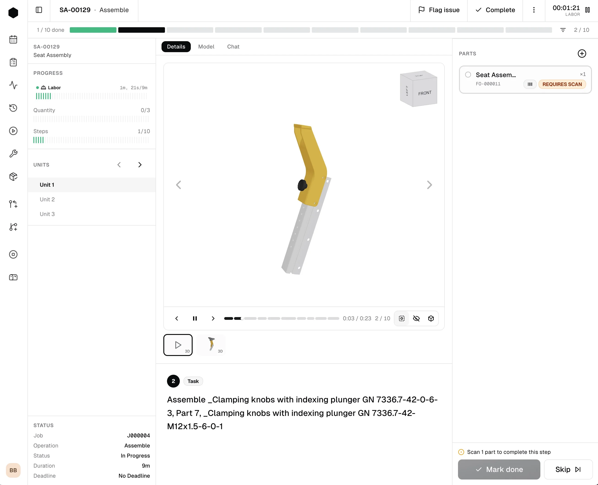
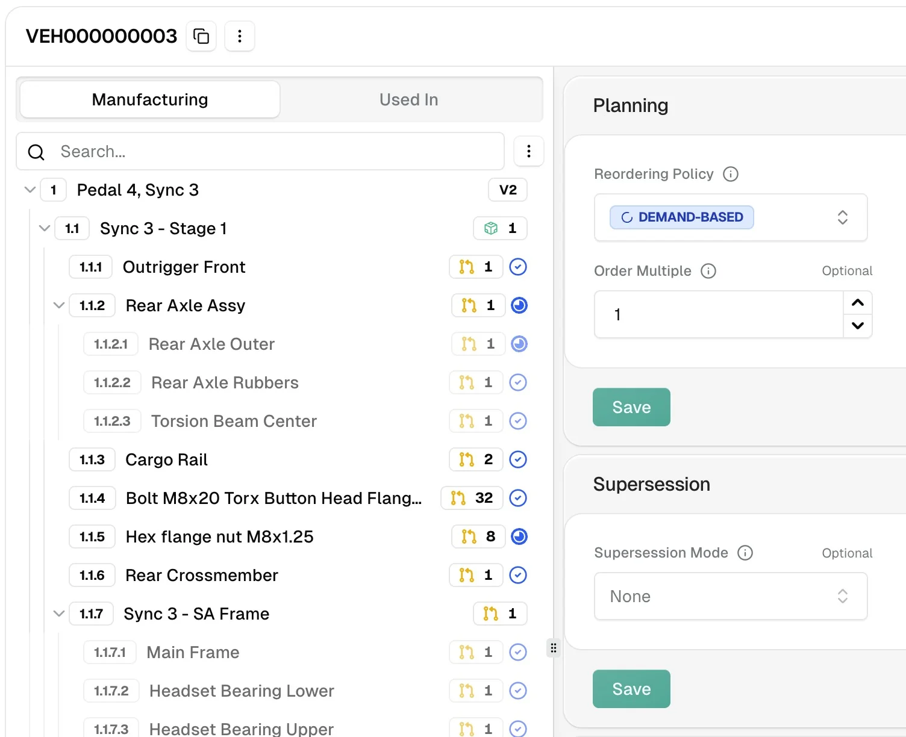
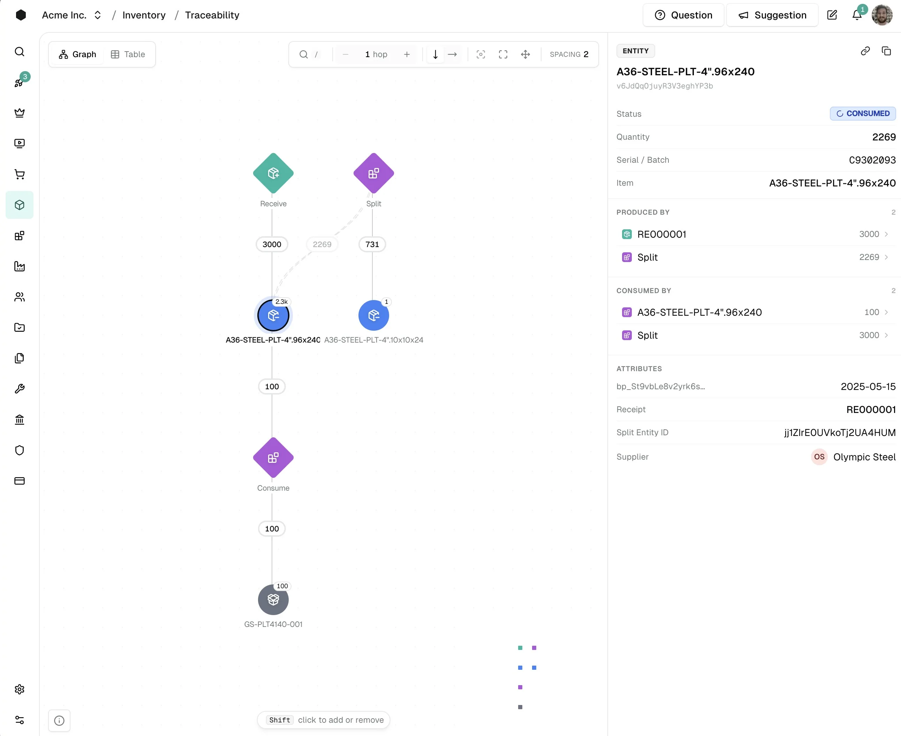
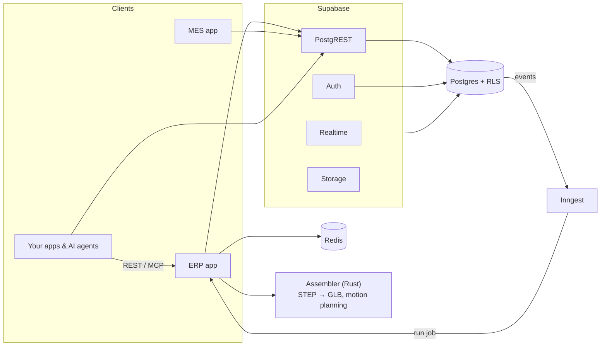

<div align="center">
  <a href="https://carbon.ms">
    <picture>
      <source media="(prefers-color-scheme: dark)" srcset=".github/assets/readme/carbon-word-dark.svg" />
      
    </picture>
  </a>

  <h3>The open-source manufacturing ERP, MES &amp; QMS</h3>

  <p>
    Quote, plan, buy, build, inspect and ship on one live model of your factory,<br />
    from a ten-person prototype shop to a rate-production line.
  </p>

  <p>
    <a href="https://app.carbon.ms"><strong>Start free</strong></a> ·
    <a href="https://docs.carbon.ms/docs/platform/self-hosting"><strong>Self-host</strong></a> ·
    <a href="https://docs.carbon.ms"><strong>Docs</strong></a> ·
    <a href="https://docs.carbon.ms/api-reference"><strong>API</strong></a> ·
    <a href="https://docs.carbon.ms/mcp"><strong>MCP</strong></a> ·
    <a href="https://discord.gg/yGUJWhNqzy"><strong>Discord</strong></a> ·
    <a href="https://github.com/orgs/crbnos/projects/1/views/1"><strong>Roadmap</strong></a>
  </p>

  <p>
    <a href="https://github.com/crbnos/carbon/stargazers"></a>
    <a href="https://discord.gg/yGUJWhNqzy"></a>
    <a href="https://github.com/crbnos/carbon/actions/workflows/check.yml"></a>
    <a href="https://github.com/crbnos/carbon/pulse"></a>
    <a href="https://github.com/crbnos/carbon/graphs/contributors"></a>
    <a href="LICENSE"></a>
    <a href="https://x.com/carbon_ms"></a>
  </p>

  <p>
    
    
    
    
    
    
  </p>
</div>

<br />



<table>
  <tr>
    <td width="50%">
      <picture>
        <source media="(prefers-color-scheme: dark)" srcset=".github/assets/readme/bom-dark.webp" />
        
      </picture>
      <p align="center"><sub><b>Unfork your BOM.</b> Multi-level BOMs, revisions and rule-driven configuration.</sub></p>
    </td>
    <td width="50%">
      <picture>
        <source media="(prefers-color-scheme: dark)" srcset=".github/assets/readme/traceability-dark.webp" />
        
      </picture>
      <p align="center"><sub><b>Traceability is the default.</b> Full lot and serial genealogy, forwards and back.</sub></p>
    </td>
  </tr>
</table>

<br />

## Contents

- [Why Carbon](#why-carbon)
- [Features](#features)
- [Get Carbon](#get-carbon)
- [API & MCP](#api--mcp)
- [Architecture](#architecture)
- [Tech Stack](#tech-stack)
- [Monorepo](#monorepo)
- [Local Development](#local-development)
- [Commands](#commands)
- [Contributing](#contributing)
- [License](#license)

<br />

## Why Carbon

Legacy ERPs were built for accountants in the 1990s. We built Carbon after years of running manufacturing on off-the-shelf systems and finding that:

- Modern, API-first tooling didn't exist
- Vendor lock-in bordered on extortion
- There is no "perfect ERP", because every manufacturer is unique

So Carbon puts ERP, MRP, MES and QMS on **one Postgres schema you can read, own and extend**. Every stage, from CAD to cash, writes to the same record: no handoffs, no re-keying, no reconciliation.

Carbon is an open-source alternative to [NetSuite](https://carbon.ms/compare/netsuite), [Epicor](https://carbon.ms/compare/epicor), [SAP Business One](https://carbon.ms/compare/sap-business-one), [Plex](https://carbon.ms/compare/plex), [Odoo](https://carbon.ms/compare/odoo) and [ERPNext](https://carbon.ms/compare/erpnext), built for discrete manufacturing: complex assembly, contract manufacturing, configure-to-order and high-mix, low-volume production. See [all comparisons](https://carbon.ms/compare).

<br />

## Features

|                              |                                                                                  |
| ---------------------------- | -------------------------------------------------------------------------------- |
| **ERP**                      | Sales (quotes, orders, RMAs), purchasing, inventory, items, invoicing            |
| **MRP & Planning**           | Material requirements planning, demand forecasts, finite capacity scheduling     |
| **MES**                      | Digital travelers, 3D assembly instructions, barcode/QR tracking, live labor     |
| **QMS**                      | Inspections, FAI, non-conformances, CAPA, gauge calibration, risk register       |
| **Traceability**             | Serial and lot genealogy, forwards and back                                      |
| **Engineering**              | Nested BoMs, revisions, change orders, item supersession, product configurator   |
| **Accounting**               | GL, journals, multi-entity and multi-currency, Xero / QuickBooks sync            |
| **Workflows**                | No-code automation rules with full run history                                   |
| **Maintenance & Assets**     | Scheduled maintenance, fixed assets, kanban replenishment                        |
| **API, Webhooks & MCP**      | A REST endpoint for every table, plus a built-in MCP server for AI agents        |
| **Custom Fields**            | Extend any record                                                                |
| **Integrations**             | Onshape, SolidWorks, Paperless Parts, Linear, Jira, Slack, Ramp, Stripe, Zebra   |

See the [full roadmap](https://github.com/orgs/crbnos/projects/1/views/1) for what's next.

**Technical highlights**

- Full-stack type safety, from the database to the UI
- Row-level security, multi-tenant by design
- Role- and attribute-based access control (Employee, Customer, Supplier)
- Realtime database subscriptions
- Unified auth and permissions across apps
- Dependency graph for operations
- Rust geometry service: STEP → GLB and assembly motion planning

<br />

## Get Carbon

| | |
| --- | --- |
| **Carbon Cloud** | The fastest way to start. [Create a company](https://app.carbon.ms), no call required. |
| **Self-hosted** | Run the whole stack on a single VPS, your own AWS account, or air-gapped. See the [self-hosting guide](https://docs.carbon.ms/docs/platform/self-hosting). |
| **Develop locally** | Hack on the source: follow [Local Development](#local-development). |

<br />

## API & MCP

Carbon is API-first. One API key unlocks three surfaces:

| Surface | What it is |
| --- | --- |
| [**Carbon API**](https://docs.carbon.ms/api) | The service layer, the same code the app runs, at `POST /api/v1/{module}/{operation}`, with an OpenAPI spec and [client SDKs](https://docs.carbon.ms/api/sdks) |
| [**MCP server**](https://docs.carbon.ms/api/mcp) | Every Carbon API operation as a tool for Claude, ChatGPT, Cursor and other agents, permission-scoped to the key or OAuth identity |
| [**Data API**](https://docs.carbon.ms/api/data) | Direct REST access to every table and view, governed by the same row-level security as the app |

Create a key under **Settings → API Keys**, then call the Data API:

```ts
import { createClient } from "@supabase/supabase-js";

const carbon = createClient("https://rest.carbon.ms", process.env.CARBON_API_KEY!); // crbn_…

const { data, error } = await carbon.from("salesOrder").select("id, salesOrderId, status");
```

Self-hosted, call PostgREST directly at `<SUPABASE_URL>/rest/v1` and send the key as a `carbon-key` header. See [API keys](https://docs.carbon.ms/docs/building/api-keys).

<br />

## Architecture

ERP and MES are React Router apps over a single Postgres database. Permissions (row-level security), computed totals and change events live in the database itself; background work runs through Inngest, which calls back into the ERP to execute jobs. The [architecture guide](https://docs.carbon.ms/docs/building/architecture) follows one click all the way down.



<br />

## Tech Stack

| Layer      | Technology                                                                              |
| ---------- | --------------------------------------------------------------------------------------- |
| Framework  | [React Router](https://reactrouter.com)                                                  |
| Language   | [TypeScript](https://www.typescriptlang.org/), [Rust](https://www.rust-lang.org)         |
| UI         | [Tailwind](https://tailwindcss.com), [Radix UI](https://radix-ui.com), [React Aria](https://react-spectrum.adobe.com/react-aria/) |
| Database   | [Postgres](https://www.postgresql.org) via [Supabase](https://supabase.com), [Kysely](https://kysely.dev) |
| Auth       | [Supabase Auth](https://supabase.com/auth)                                               |
| Jobs       | [Inngest](https://inngest.com)                                                           |
| Cache      | [Redis](https://redis.io)                                                                |
| 3D / CAD   | [three.js](https://threejs.org), OpenCASCADE and FCL (in the Rust assembler)             |
| i18n       | [Lingui](https://lingui.dev)                                                             |
| Email      | SMTP ([Nodemailer](https://nodemailer.com))                                              |
| Hosting    | [AWS](https://aws.amazon.com) via [SST](https://sst.dev), or self-hosted with Docker     |

<br />

## Monorepo

A [pnpm](https://pnpm.io) + [Turborepo](https://turbo.build) monorepo:

```
carbon
├── apps         # applications
├── packages     # shared code
└── docs         # docs.carbon.ms
```

### `/apps`

| App         | Description                                                     |
| ----------- | --------------------------------------------------------------- |
| `erp`       | ERP: sales, purchasing, inventory, planning, quality, accounting |
| `mes`       | MES: the shop floor app, run on tablets next to the machines    |
| `assembler` | Rust geometry service: STEP → GLB and assembly motion planning  |
| `academy`   | Training                                                        |
| `starter`   | Example app built on the API                                    |

### `/packages`

| Package                | Description                                                              |
| ---------------------- | ------------------------------------------------------------------------ |
| `@carbon/database`     | Schema, migrations, generated types, Supabase and Kysely clients         |
| `@carbon/auth`         | Authentication, RBAC, sessions, API keys and OAuth                       |
| `@carbon/react`        | Shared UI components (Radix, React Aria, Tailwind)                       |
| `@carbon/form`         | `ValidatedForm` and field components for zod + FormData                  |
| `@carbon/jobs`         | Inngest background jobs, integrations and workflows                      |
| `@carbon/planning`     | MRP and scheduling engines                                               |
| `@carbon/documents`    | PDFs, email templates, ZPL labels, QR and barcodes                       |
| `@carbon/printing`     | Printer routing and label print queue                                    |
| `@carbon/viewer`       | 3D models and animated assembly instructions (react-three-fiber)         |
| `@carbon/files`        | File handling: images, HEIC, CAD formats                                 |
| `@carbon/locale`       | Lingui i18n runtime for ERP and MES                                      |
| `@carbon/kv`           | Redis client and rate limiting                                           |
| `@carbon/utils`        | Pure shared utilities (dates, precision, BOM, formatting)                |
| `@carbon/ee`           | Enterprise features and integrations (commercial license)                |
| `@carbon/config`       | Shared vitest, tsconfig and tailwind configuration                       |

<br />

## Local Development

**Prerequisites:** [Docker](https://docs.docker.com/get-docker/), [Node.js](https://nodejs.org) 22 and [pnpm](https://pnpm.io) (via Corepack). On Windows, use WSL or Git Bash.

```bash
git clone https://github.com/crbnos/carbon.git && cd carbon
corepack enable && pnpm install
cp .env.example .env
pnpm dev
```

`pnpm dev` boots the whole backend in Docker (Postgres, Supabase, Inngest, Redis, a mail catcher), applies migrations, generates types and starts the apps:

| Surface      | URL                      |
| ------------ | ------------------------ |
| ERP          | http://localhost:3000    |
| MES          | http://localhost:3001    |
| Supabase API | http://localhost:54321   |

Sign in as `test@carbon.ms`: the dev stack seeds that user and skips the magic link. To fill a company with a full demo story (items, BOMs, orders, jobs, inspections, journals), seed one of the industry datasets (`satellite`, `robotics`, `precision`, `motor`):

```bash
pnpm db:seed:dev -- --email test@carbon.ms --dataset satellite
```

No external accounts are needed to run locally. Email, Google/Microsoft sign-in, Stripe, PostHog and AI providers are all optional and configured in `.env`; see [environment variables](https://docs.carbon.ms/docs/platform/self-hosting/environment-variables).

### Worktrees and the `crbn` CLI

`pnpm dev` is shorthand for `crbn up --no-portless`. Run `source ./setup.sh` once to put `crbn` on your `PATH` and you get a separate, isolated stack per git worktree, so several branches can run side by side, each on its own HTTPS `.dev` URLs via [portless](https://github.com/vercel-labs/portless):

```bash
crbn checkout -b feat/my-thing   # new branch + worktree off HEAD
crbn up                          # boot this worktree's stack at erp.<branch>.dev
crbn checkout 760                # check out PR #760 into its own worktree
crbn status | down | reset       # ports and health, stop, wipe and reboot
```

The full command reference is in the [local development guide](https://docs.carbon.ms/docs/building/local-development).

<details>
<summary><h3>Optional: the <code>assembler</code> geometry service</h3></summary>

`assembler` is a Rust service (STEP → GLB + assembly motion planning) over C++ FCL and OpenCASCADE. ERP/MES run fine without it — set it up only if you need the 3D `/convert` and `/plan` endpoints.

1. **Toolchain + native build deps** (macOS):

   ```bash
   curl --proto '=https' --tlsv1.2 -sSf https://sh.rustup.rs | sh   # Rust, if not already installed
   brew install fcl cmake ninja draco                               # collision libs (+ libccd/eigen/octomap), build tools, Draco mesh compression
   ```

   On Linux, install the equivalents from your package manager: `libfcl-dev libccd-dev libeigen3-dev liboctomap-dev libdraco-dev cmake ninja-build` plus a C/C++ toolchain.

   `./setup.sh` already installs Draco on macOS. If yours lives outside the Homebrew keg (`/opt/homebrew/opt/draco` on arm64), point `draco-bridge`'s build at it with `DRACO_PREFIX=/path/to/draco cargo build`.

2. **Build OCCT once** — a patched static OpenCASCADE, cached in `~/.cache/carbon-occt`. Slow (~15–30 min) but one-time per machine; re-running is a no-op once cached:

   ```bash
   ./apps/assembler/scripts/build-occt.sh
   ```

3. **Build the service** — seconds once OCCT is cached (`build.rs` finds it automatically):

   ```bash
   cargo build --release -p assembler
   ```

`crbn up` spawns the binary when it's present. Verify it's up with `curl -sf "$ASSEMBLER_SERVICE_URL/health"` (the URL is in your worktree's `.env.local`) or by watching the `asm |` lines in the `crbn up` output. Without the binary the rest of the stack still runs — only `/convert` and `/plan` are unavailable.

</details>

<details>
<summary><h3>Restoring a production snapshot</h3></summary>

To restore a production database snapshot locally, use `crbn restore`. It handles both plain-text `.backup` and custom-format `.dump` archives, drops and rebuilds the public schema, realigns internal sequences, resets storage metadata, then applies any migrations the backup predates and regenerates types.

1. Export a backup from your production Supabase project (`pg_dump` or Supabase Dashboard → Database → Backups).
2. Run it from your worktree root:

   ```bash
   crbn restore /path/to/db_cluster.backup
   # …or for .dump archives:
   crbn restore /path/to/postgres_YYYYMMDD.dump
   ```

   It prompts before replacing the database. The stack must already be running (`crbn up`) — a restore rewrites the `auth` and `storage` schemas, which GoTrue and Storage build through their own migrations when those containers boot, so `crbn restore` refuses rather than restore into an uninitialized stack.

   To also get local admin access, pass your production email — your account is upgraded to Admin in the companies it already belongs to and the password is reset locally:

   ```bash
   crbn restore /path/to/backup.backup --admin-email you@example.com
   # Optional: set a custom local password (default: localpass)
   crbn restore /path/to/backup.backup --admin-email you@example.com --admin-password mypass
   ```

   Useful flags: `--no-scrub-emails` keeps real addresses (see the warning below), `--mode prod` restores exactly as-is without localizing config/webhooks/integrations, `--no-migrate` / `--no-regen` skip the trailing steps, `--yes` skips the prompt.

   > **Emails are scrubbed by default** — every address is rewritten to `@example.test` (your `--admin-email` is preserved so you can still log in). If you pass `--no-scrub-emails`, real production addresses will be present in the local DB; ensure local email sending is disabled or pointed at a sandbox (e.g. Mailpit) before triggering any email flows.
   >
   > **Note:** `storage.objects` is truncated by default, so a restore does not populate local file storage — kept rows would reference files that only exist in the source environment's backend. Pass `--keep-storage-objects` to retain the metadata (and the backup's buckets) anyway; downloads will still 404, but the rows are there for work that needs realistic storage volume.

The underlying script, `scripts/restore-database.sh`, can still be invoked directly — it takes the same options as environment variables (`SCRUB_EMAILS`, `ADMIN_EMAIL`, `ADMIN_PASSWORD`, `RESTORE_MODE`), but note it defaults to **not** scrubbing emails and leaves the trailing `pnpm db:migrate` / `pnpm db:types` to you.

</details>

<br />

## Commands

| Command                            | Description                                                  |
| ---------------------------------- | ------------------------------------------------------------ |
| `pnpm dev`                         | Boot the stack and apps on localhost                         |
| `pnpm db:migrate:new <name>`       | Create a database migration                                  |
| `pnpm db:migrate`                  | Apply pending migrations                                     |
| `pnpm generate:types`              | Regenerate database types after a migration                  |
| `pnpm db:seed:dev -- --dataset <key>` | Seed a demo company                                       |
| `pnpm lint` / `pnpm test`          | Biome lint / unit tests                                      |
| `pnpm exec turbo run typecheck --filter=<pkg>` | Typecheck one package                            |
| `pnpm --filter <pkg> <cmd>`        | Run a command in one workspace                               |

This project uses [Biome](https://biomejs.dev/) for formatting and linting; install the [VS Code extension](https://marketplace.visualstudio.com/items?itemName=biomejs.biome) for format-on-save.

<br />

## Contributing

We welcome contributions of all sizes. Read [CONTRIBUTING.md](.github/CONTRIBUTING.md) to get started, and say hi in [Discord](https://discord.gg/yGUJWhNqzy). Good first issues are labelled [`good first issue`](https://github.com/crbnos/carbon/labels/good%20first%20issue). Found a vulnerability? Please follow [SECURITY.md](.github/SECURITY.md) instead of opening a public issue.

<a href="https://github.com/crbnos/carbon/graphs/contributors">
  
</a>

### Star history

<a href="https://star-history.com/#crbnos/carbon&Date">
  <picture>
    <source media="(prefers-color-scheme: dark)" srcset="https://api.star-history.com/svg?repos=crbnos/carbon&type=Date&theme=dark" />
    
  </picture>
</a>

<br />

## License

Carbon is open core. Everything in this repository is licensed under [AGPLv3](LICENSE), except the Enterprise files (`packages/ee` and any file whose name contains `.ee.`), which are under the [Carbon Commercial License](packages/ee/LICENSE). See [Licensing](https://docs.carbon.ms/docs/platform/licensing) for what that means in practice.

<br />

<div align="center">
  <sub>
    Built by the <a href="https://carbon.ms">Carbon</a> team ·
    <a href="https://discord.gg/yGUJWhNqzy">Join the Discord</a>
  </sub>
</div>
